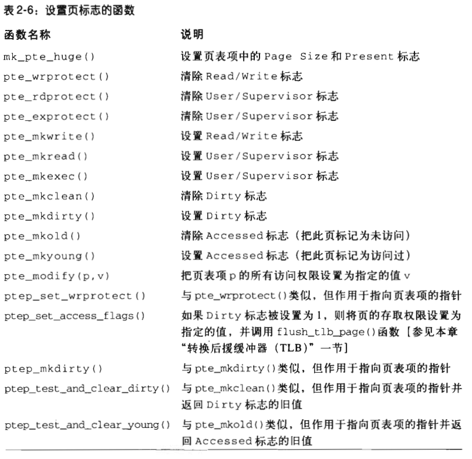
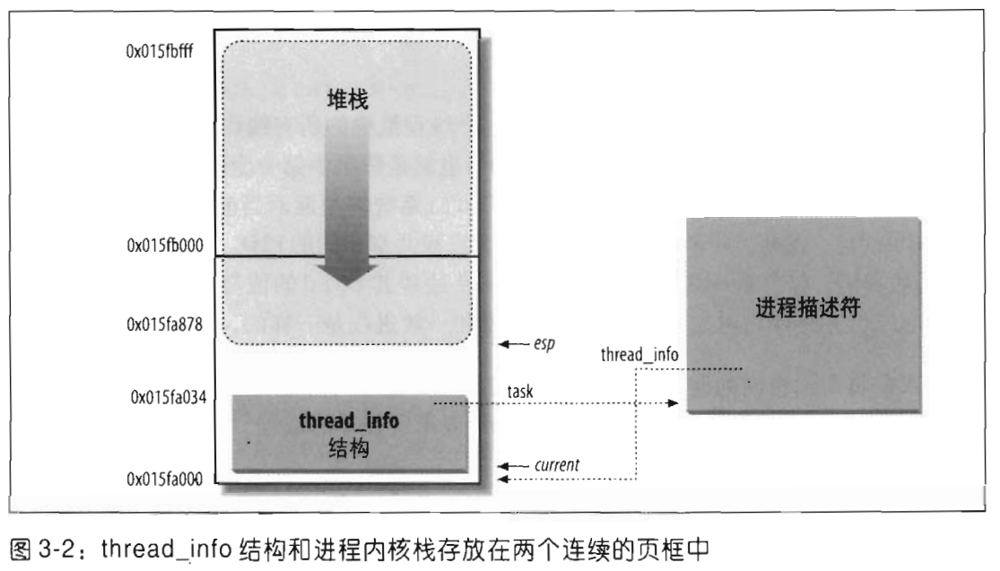

# 深入理解Linux内核

| **ID：12110504** |
| ---------------- |
| **NAME：李子豪** |

---------

## 第一章 绪论

**必须强调的是本书描述的是Linux2.6.11版的内核！**

从技术角度来说，Linux是一个**真正的Unix内核**，但它不是一个完全的Unix操作系统。

### Linux与其他类Unix内核的比较

Linux包括了现代Unix操作系统的全部特点：

- 虚拟存储
- 虚拟文件系统
- 轻量级进程
- Unix信号量
- SVR4进程间通信
- 支持对称多处理器(SymmetricMultiprocessor，SMP)系统等。

#### **单块结构的内核(Monolithic kernel)**

它是一个**庞大、复杂的自我完善(do-it-yourself)程序**，由几个逻辑上独立的成分构成。在这一点上，它是相当传统的，**大多数商用Unix变体也是单块结构**。(一个显著的例外是Apple的Mac Os X和GNU的Hurd操作系统，它们都是从卡耐基-梅隆大学的Mach演变而来的，都遵循**微内核**的方法。)

#### **编译并静态连接的传统Unix内核**

大部分现代操作系统内核可以**动态地装载和卸载部分内核代码**(典型的例子如设备驱动程序)，通常把这部分代码称做**模块(module)**。**Linux对模块的支持是很好的**，因为它能自动按需装载或卸载模块。

#### **内核线程**

一些Unix内核，如Solaris和SVR4.2/MP，被组织成一组**内核线程(kernel thread)**。

**内核线程是一个能被独立调度的执行环境(context)**；也许它与用户程序有关，也许仅仅执行一些内核函数。

内核线程之间的上下文切换比普通进程之间的上下文切换**花费的代价要少得多**，因为前者**通常在同一个地址空间执行**。

#### **多线程应用程序支持**

**用户程序是根据很多相对独立的执行流**来设计的，而这些执行流之间**共享应用程序的大部分数据结构**。

**一个多线程用户程序由很多轻量级进程(lightweight process，LWP)组成**，这些进程可能对**共同的地址空间、共同的物理内存页、共同的打开文件**等等进行操作。

**Linux定义了自己的轻量级进程版本**，这与SVR4、Solaris等其他系统上所使用的类型有所不同。当LWP的所有商用Unix变体都基于内核线程时，**Linux却把轻量级进程当作基本的执行上下文，通过非标准的clone()系统调用来处理它们**

> `clone()` 是 Linux 内核中的一个系统调用，它用于创建一个新进程或线程，并允许更灵活的控制新创建的进程或线程与调用进程之间共享的资源。与传统的 `fork()` 系统调用不同，`clone()` **允许父进程和子进程在多个层面上共享不同的资源**。具体来说，`clone()` 允许选择性地共享虚拟内存、文件描述符、信号处理器等。

#### **抢占式(preemptive)内核**

当采用“**可抢占的内核**”选项来编译内核时，**Linux2.6可以随意交错执行处于特权模式的执行流**。

> 在非抢占式内核中，当任务进入内核态执行系统调用时，系统不会打断它，直到系统调用结束。在可抢占式内核中，即使任务在内核态执行，系统也可以通过中断或定时器等机制抢占当前的任务，给其他更重要的任务以执行机会。

#### **多处理器支持**

几种Unix内核变体都利用了多处理器系统。

**Linux 2.6支持不同存储模式的对称多处理(SMP)，包括NUMA:系统不仅可以使用多处理器，而且每个处理器可以毫无区别地处理任何一个任务。**

尽管通过一个单独的“大内核锁”使得内核中的少数代码依然串行执行，但公平地说，Linux 2.6以几乎最优化的方式使用SMP。

> 对称多处理器结构 ， 英文名称为 " **Symmetrical Multi-Processing** " ， 简称 SMP ；
>
> SMP 又称为 UMA ， 全称 " **Uniform Memory Access** " ， 中文名称 " **统一内存访问架构** " ；
>
> 在 " 对称多处理器结构 " 的 系统中 ， **所有的 CPU 处理器的地位都是平等的** ， 一般指的是 服务器 设备上 ， 运行的 多个 CPU ， 没有 主次/从属 关系 ， 都是平等的 ；
>
> 这些处理器 共享 所有的设备资源 ， 所有的资源 对 处理器 具有相同的 可访问性 ， 如 : 磁盘 ， 内存 ， 总线 等 ； 多个 CPU 处理器 **共享相同的物理内存** ， 每个 CPU 访问相同的物理地址所消耗的时间是相同的 ；
>
> **优点 :** 避免了 结构障碍 ， 其最大的特点是 所有的资源共享 ；
>
> **缺点 :** SMP 架构的系统 ， 扩展能力有限 ， 有瓶颈限制 ；
>
> 通过实践证明 ， SMP 架构的系统 ， 使用 2 ~ 4 个 CPU ， 可以达到利用率最高 ， 如果 CPU 再多 ， 其利用率就会降低 ， 浪费处理器的性能 

#### 文件系统

**Linux标准文件系统呈现出多种风格。**

- **Ext2**：是Linux操作系统最早的文件系统之一

- **Ext3**：是Ext2的改进版本，引入了日志功能

- **ReiserFS**：是Linux操作系统的另一个文件系统，专门设计用于处理大量小文件的情况。

除了Ext3和ReiserFS，还可以在Linux中使用另外几个日志文件系统

- **JFS（Journaling File System）**：是IBM AIX操作系统的文件系统，也被移植到了Linux中。它使用日志来记录文件系统的变化，提高了系统的稳定性和可靠性。
- **XFS**：是SGI公司（Silicon Graphics International）开发的一种高性能日志文件系统，最初用于IRIX操作系统。它也被移植到了Linux中，并且在处理大文件和大容量存储方面表现出色。

有了强大的**面向对象虚拟文件系统技术**(为Solaris和SVR4所采用)把外部文件系统移植到Linux比移植到其他内核相对要容易。

> **面向对象虚拟文件系统技术**：这是一种技术，用于在操作系统中实现文件系统抽象层。它允许不同类型的文件系统通过一个统一的接口与操作系统交互，使得操作系统可以支持多种不同类型的文件系统。

### 硬件的依赖性

Linux试图在硬件无关的源代码与硬件相关的源代码之间保持清晰的界限。

为了做到这点，在arch和include目录下包含了23个子目录

### Linux版本

第一位版本号**2**从1996年开始就没有变过。

第二位版本号表示内核的类型：**如果为偶数，表示稳定的内核；否则，表示开发中的内核**。

第三位发布号

第四位数字表示带有不同补丁的内核版本。例如，在写本段文字时，最新的稳定内核版本是2.6.11.12。

### 操作系统基本概念

任何计算机系统都包含一个名为操作系统的基本程序集合。在这个集合里，最重要的程序称为**内核(kernel)**。

当操作系统启动时，**内核被装入到RAM中**，内核中包含了系统运行所必不可少的很多核心过程(procedure)。

操作系统必须完成两个主要目标：

- **与硬件部分交互**，为包含在硬件平台上的所有低层可编程部件提供服务。

- 为运行在计算机系统上的应用程序(即所谓用户程序)**提供执行环境。**

一些操作系统允许所有的用户程序都直接与硬件部分进行交互(典型的例子是MS-DOS)。

与此相反，类Unix操作系统把与计算机物理组织相关的所有低层细节都对用户运行的程序隐藏起来。当程序想使用硬件资源时，**必须向操作系统发出一个请求**。

为了实施这种机制，现代操作系统依靠**特殊的硬件特性来禁止用户程序直接与低层硬件部分进行交互**，或者**禁止直接访问任意的物理地址**。

特别是，**硬件为CPU引入了至少两种不同的执行模式**：

- 用户程序的非特权模式

- 内核的特权模式。

Unix把它们分别称为用户态(User Mode)和内核态(Kernel Mode)。

#### 多用户系统

多用户系统(multiuser system)就是一台能**并发和独立**地执行分别属于两个或多个用户的若干应用程序的计算机。

- **“并发”(concurrently)**意味着几个应用程序能**同时处于活动状态并竞争各种资源**，如CPU、内存、硬盘等等。
- **“独立”(independently)**意味着每个应用程序能执行自己的任务，而**无需考虑其他用户的应用程序**在干些什么。

多用户操作系统必须包含以下几个特点：

- 核实用户身份的认证机制
- 防止有错误的用户程序防碍其他应用程序在系统中运行的保护机制
- 防止有恶意的用户程序干涉或窥视其他用户的活动的保护机制
- 限制分配给每个用户的资源数的计账机制。

#### 用户和组

在多用户系统中，每个用户在机器上都有私用空间

操作系统必须保证用户空间的私有部分仅**仅对其拥有者是可见的**

所有的用户由一个惟一的数字来标识，这个数字叫**用户标识符(User ID，UID)**

为了和其他用户有选择地共享资料，每个用户是一个或多个用户组的一名成员，组由唯一的**用户组标识符(user group ID)标识。**

每个文件也恰好与一个组相对应。例如，可以设置这样的访问权限，拥有文件的用户具有对文件的读写权限，同组用户仅有只读权限，而系统中的其他用户没有对文件的任何访问权限。

任何类Unix操作系统都有一个特殊的用户，叫做**root，即超级用户(superuser)。**

#### 进程 (process)

一个进程可以定义为：“**程序执行时的一个实例**"，或者**一个运行程序的“执行上下文"**。

在传统的操作系统中，一个进程在**地址空间(address space)**中执行一个单独的指令序列。

>  地址空间是允许进程引用的内存地址集合

现代操作系统允许**具有多个执行流**的进程，也就是说，在**相同的地址空间可执行多个指令序列**。

允许进程并发活动的系统称为**多道程序系统**(multiprogramming)或**多处理系统**(multiprocessing)

区分程序和进程是非常重要的

- 几个进程能并发地执行同一程序
- 同一个进程能**顺序地**执行几个程序

操作系统中叫做**调度程序(scheduler)**的部分决定哪个进程能执行

多用户系统中的进程必须是**抢占式的(preemptable)**；操作系统记录下每个进程占有的CPU时间，并周期性地激活调度程序。

 Unix是具有**抢占式进程**的**多处理操作系统**。

即使没有用户登录，没有程序运行，也还是有几个系统进程在监视外围设备。

尤其是，**有几个进程在监听系统终端等待用户登录**。 当用户输入一个登录名，监听进程就运行一个程序来验证用户的口令。如果用户身份得到证实，那么监听进程就创建另一个进程来执行shell，此时在shell下可以输入命令。

当一个图形化界面被激活时，有一个进程就运行窗口管理器，界面上的每个窗口通常都由 一个单独的进程来执行。

类Unix操作系统采用进程/内核模式。**每个进程都自以为它是系统中唯一的进程**，可以独占操作系统所提供的服务。

#### 内核体系结构

如前所述，大部分Unix内核是单块结构：每一个内核层都被集成到整个内核程序中，并代表当前进程在内核态下运行。

相反，**微内核(microkernel)**操作系统只需要内核有一个很小的函数集，通常包括**几个同步原语、一个简单的调度程序和进程间通信机制**。

**运行在微内核之上的几个系统进程**实现从前操作系统级实现的功能，如内存分配程序、设备驱动程序、系统调用处理程序等等。

微内核的操作系统一般比单块内核的**效率低**，因为操作系统不同层次之间显式的消息传递要花费一定的代价。

**微内核的理论优势：**

- 微内核操作系统迫使系统程序员采用**模块化**的 方法，因为任何操作系统层都是一个相对独立的程序，这种程序必须通过定义明确而清晰的软件接口与其他层交互

- 已有的微内核操作系统可以**很容易地移植到其他的体系结构上**，因为**所有与硬件相关的部分都被封装进微内核代码中**
- 最后，微内核操作系统比单块内核**更加充分地利用了RAM，**因为暂且不需要执行的系统进程可以被调出或撤消

为了达到微内核理论上的很多优点而又不影响性能，**Linux内核提供了模块(module)。**

模块是一个目标文件，其代码可以在运行时**链接到内核或从内核解除链接**。

这种目标代码通常由一组函数组成，用来实现文件系统、驱动程序或其他内核上层功能。

与微内核操作系统的外层不同，模块**不是作为一个特殊的进程执行**的。相反，与任何其他静态链接的内核函数一样，它**代表当前进程在内核态下执行**。

模块化的优势：

- 模块化方法

	因为任何模块都可以在运行时被链接或解除链接，因此，系统程序员**必须提出良定义的软件接口**以访问由模块处理的数据结构。这使得开发新模块变得容易

- 平台无关性

	即使模块依赖于某些特殊的硬件特点，但它**不依赖于某个固定的硬件平台**

- 节省内存使用

	当需要模块功能时，把它链接到正在运行的内核中，否则，将该模块解除链接。这种机制对于小型嵌入式系统是非常有用的。

- 无性能损失

	模块的目标代码一旦被链接到内核，其**作用与静态链接的内核的目标代码完全等价**。因此，当模块的函数被调用时，无需显式地进行消息传递

### Unix文件系统概述

Unix文件是以字节序列组成的信息载体(container)，内核不解释文件的内容。

从用户的观点来看，文件被组织在一个树结构的命名空间中，除了叶节点之外，树的所有节点都表示目录名。


- /：是所有文件的根目录；
- /bin：存放二进制可执行命令目录；
- /home：用户主目录的基点目录，默认情况每个用户主目录都设在该目录下，如默认情况下用户user01的主目录是/home/user01；
- /lib：存放标准程序设计库目录，又叫动态链接共享库目录，目录中文件类似windows里的后缀名为dll的文件；
- /etc：存放系统管理和配置文件目录；
- /dev：存放设备特殊文件目录，如声卡文件，磁盘文件等；
- /usr：最庞大的目录，存放应用程序和文件目录；
- /proc：虚拟目录，是系统内存的映射，可直接访问这个目录来获取系统信息；
- /root：系统管理员的主目录；
- /var：存放系统产生的经常变化文件的目录，例如打印机、邮件等假脱机目录、日志文件、格式化后的手册页以及一些应用程序的数据文件等；
- /tmp：存放公用临时文件目录。

文件或目录名由除 **“/”** 和空字符 **“\0”** 之外的任意ASCII字符序列组成。大多数文件系统对文件名的长度都有限制，通常不能超过255个字符。

Unix的**每个进程都有一个当前工作目录**，它属于进程**执行上下文(execution context)**，标识出进程所用的当前目录。

**“/”**  开头的路径是绝对路径，否则是相对路径，起点为当前目录

当标识文件名时，也用符号 “.” 和 “..” 。它们分别标识**当前工作目录**和**父目录**。如果 当前工作目录是根目录，“.” 和 “..” 就是一致的。

#### 硬链接和软链接

包含在目录中的文件名就是一个文件的**硬链接(hard link)**，或简称**链接(Link)**。

在同一目录或不同的目录中，同一文件可以有几个链接，因此对应几个文件名。

**Unix命令**

```shell
 $ ln P1 P2
```

用来创建一个新的硬链接，即为由路径P1标识的文件创建一个路径名为P2的硬链接。

**硬链接有两方面的限制**

- **不允许用户给目录创建硬链接**。因为这**可能把目录树变为环形图**，从而就不可能通过名字定位一个文件
- 只有在**同一文件系统中的文件之间才能创建链接**。这带来比较大的限制，因为现代 Unix系统可能包含了多种文件系统，这些文件系统位于不同的磁盘和/或分区，用 户也许无法知道它们之间的物理划分。

为了克服这些限制，引入了**软链接(soft link) [也称符号链接(symbolic link)]**

路径名可以指向位于任意一个文件系统的任意文件或目录，甚至可以指向一个不存在的文件。

**Unix命令**

```SHELL
 $ ln -s P1 P2 
```

创建一个路径名为P2的新软链接，P2指向路径名P1。这样，任何对P2的引用都可以被自动转换成指向P1的一个引用。

> **硬链接**：硬链接实际上是为文件建一个别名，**链接文件和原文件实际上是同一个文件**。可以通过ls -i来查看一下，这两个文件的inode号是同一个，说明它们是同一个文件
>
> **软链接**：通过软链接建立的链接文件与原文件并不是同一个文件，**相当于原文件的快捷方式**。具体理解的话，链接文件内存储的是原文件的inode，也就是说是用来指向原文件文件，这两个文件的inode是不一样的。
>
> **复制**：相当于将原文件进行一个拷贝，为另一个全新的文件，**与原文件没有关系**。修改任何一个都不会影响另一个

#### 文件类型

Unix文件可以是下列类型之一：

- 普通文件(regular file) 

- 目录

- 符号链接 

- 面向块的设备文件(block-oriented device file) 

  > 块设备文件用于与块设备交互，如硬盘、光驱和 USB 存储设备等
  >
  > 通常位于 `/dev` 目录下

- 面向字符的设备文件(character-oriented device file) 

  > 字符设备文件用于与字符设备交互，如键盘、鼠标、串口和终端等。
  >
  > 数据以字符流的形式进行读写，不支持随机访问。

- 管道(pipe)和命名管道(named pipe)(也叫FIFO) 

  > 管道是一种用于进程间通信的机制，允许一个进程的输出作为另一个进程的输入。
  >
  > 在 shell 中，通过管道符 `|` 实现。

- 套接字(socket)

  > 套接字文件用于在不同进程间进行通信，支持本地通信和网络通信。
  >
  > 在文件系统中存在的套接字称为 Unix 域套接字。

前三种文件类型是所有Unix文件系统的基本类型

设备文件与I/O设备以及集成到内核中的设备驱动程序相关

管道和套接字是用于进程间通信的特殊文件

#### 文件描述符与索引节点

Unix对文件的内容和描述文件的信息给出了清楚的区分。

除了设备文件和特殊文件系统 文件外，每个文件都由字符序列组成。文件内容不包含任何控制信息，如文件长度或文件结束(end-of-file，EOF)符。

文件系统处理文件需要的所有信息包含在一个名为**索引节点(inode)**的数据结构中。每个文件都有自己的索引节点，**文件系统用索引节点来标识文件**。

虽然文件系统及内核函数对索引节点的处理可能随Unix系统的不同有很大的差异，但它们必须至少提供在POSIX标准中指定的如下属性：

- 文件类型
- 与文件相关的**硬链接个数**
- **以字节为单位的文件长度**
- 设备标识符(即包含文件的设备的标识符)
- 在文件系统中标识文件的索引节点号
- 文件拥有者的UID
- 文件的用户组ID
- 几个时间戳，表示索引节点状态改变的时间、最后访问时间及最后修改时间
- 访问权限和文件模式

#### 访问权限和文件模式

文件的潜在用户分为三种类型：

- 作为文件所有者的用户
- 同组用户，不包括所有者
- 所有剩下的用户(其他)

有三种类型的访问权限——**读、写及执行**，每组用户都有这三种权限。因此，文件访问权限的组合就用九种不同的二进制来标记。

还有三种附加的标记，当这些标记应用到可执行文件时有如下含义：

- suid 

	进程执行一个文件时通常保持进程拥有者的UID。然而，如果设置了可执行文件 suid的标志位，进程就获得了该文件拥有者的UID。

- sgid

	进程执行一个文件时保持进程组的用户组ID。然而，如果设置了可执行文件sgid 的标志位，进程就获得了该文件用户组的ID。

- sticky

	设置了sticky标志位的可执行文件相当于向内核发出一个请求，当程序执行结 束以后，依然将它保留在内存（过时）

当文件由一个进程创建时，**文件拥有者的ID就是该进程的UID**。而其用户组ID可以是进程创建者的ID，也可以是父目录的ID，这取决于父目录sgid标志位的值。

#### 文件操作的系统调用

当用户访问一个普通文件或目录文件的内容时，他**实际上是访问存储在硬件块设备**上的一些数据。从这个意义上说，文件系统是硬盘分区物理组织的用户级视图。

因为处于**用户态的进程不能直接与低层硬件交互**，所以每个实际的文件操作必须在内核态下进行。 因此，Unix操作系统定义了几个与文件操作有关的系统调用。

##### 打开文件

进程只能访问 “打开的” 文件。为了打开一个文件，进程调用系统调用： 

```c
fd = open(path， flag， mode)
```

 其中的三个参数具有以下含义：

- **path**：表示被打开文件的(相对或绝对)**路径**
- **flag**：指定文件**打开的方式**(例如，读、写、读/写、追加)。它也指定是否应当创建一个 不存在的文件
- **mode**：指定新创建文件的**访问权限**

这个系统调用创建一个 “**打开文件**” 对象，并返回所谓**文件描述符(file descriptor)**的标识符。

一个打开文件对象包括： 

- 文件操作的一些数据结构，如指定文件打开方式的一组标志；表示文件当前位置的 offset字段，从这个位置开始将进行下一个操作(即所谓的文件指针)，等等。
- **进程可以调用的一些内核函数指针**。这组允许调用的函数集合由参数flag的值决定。

> **文件描述符**表示进程与打开文件之间的交互，而**打开文件对象包含了与这种交互相关的数据**。同一打开文件对象也许由同一个进程中的几个文件描述符标识。
>
> 几个进程也许同时打开同一文件。在这种情况下，文件系统**给每个文件分配一个单独的打开文件对象以及单独的文件描述符**。当这种情况发生时，Unix文件系统对进程在同一文件上发出的I/O操作之间不提供任何形式的同步机制。然而，有几个系统调用，如flock()，可用来让进程在整个文件或部分文件上对I/O操作实施 同步(参见第十二章)。

为了创建一个新的文件，进程也可以调用**create()**系统调用，它与**open()**非常相似，都是由内核来处理。

##### 访问打开的文件

对普通Unix文件，可以顺序地访问，也可以随机地访问，而对设备文件和命名管道文件，通常只能顺序地访问。

在这两种访问方式中，**内核把文件指针存放在打开文件对象中**，也就是说，当前位置就是下一次进行读或写操作的位置。

**顺序访问是文件的默认访问方式**，即read()和write()系统调用总是从文件指针的当前位置开始读或写。

为了修改文件指针的值，必须在程序中显式地调用**lseek()**系统调用。当打开文件时，内核让文件指针指向文件的第一个字节(偏移量为0)。

lseek()系统调用需要下列参数： 

```shell
newoffset = 1seek(fd， offset， whence)； 
```

其参数含义如下：

- fd 

	表示打开文件的文件描述符。

- offset 

	指定一个有符号整数值，用来计算文件指针的新位置。

-  whence 

	指定文件指针新位置的计算方式：可以是offset加0，表示文件指针从文件头移动， 也可以是offset加文件指针的当前位置，表示文件指针从当前位置移动；还可以是 offset加文件最后一个字节的位置，表示文件指针从文件末尾开始移动。

read()系统调用需要以下参数： 

```shell
nread = read(fd， buf，count)； 
```

其参数含义如下： 

- fd：表示打开文件的文件描述符
- buf：指定在进程地址空间中缓冲区的地址，所读的数据就放在这个缓冲区
- count： 表示所读的字节数

当处理这样的系统调用时，内核会尝试从拥有文件描述符fd的文件中读count个字节， 其起始位置为打开文件的offset字段的当前值。

在某些情况下可能遇到文件结束、空管 道等等，因此内核无法成功地读出全部count个字节。返回的nread值就是实际所读的字节数。给原来的值加上nread就会更新文件指针。write()的参数与read()相似。

##### 关闭文件

当进程无需再访问文件的内容时，就调用系统调用：

```shell
res = close(fd)； 
```

释放与文件描述符fd相对应的打开文件对象。当一个进程终止时，内核会关闭其所有 仍然打开着的文件。

##### 更名及删除文件

 要重新命名或删除一个文件时，进程不需要打开它。实际上，这样的操作并没有对这个文件的内容起作用，而是对一个或多个目录的内容起作用。例如，系统调用： 

```shell
res = rename(oldpath， newpath)； 
```

改变了文件链接的名字，而系统调用：

```shell
res = unlink(pathname)；
```

 减少了文件链接数，删除了相应的目录项。**只有当链接数为0时，文件才被真正删除**。

###  Unix内核概述

**Unix内核提供了应用程序可以运行的执行环境**。因此，内核必须实现一组服务及相应的接口。应用程序使用这些接口，而且通常不会与硬件资源直接交互。

#### 进程/内核模式

如前所述，CPU既可以运行在用户态下，也可以运行在内核态下。实际上，一些CPU可 以有两种以上的执行状态。例如，Intel 80x86微处理器有四种不同的执行状态。但是， 所有标准的Unix内核都仅仅利用了内核态和用户态。

每种CPU模型都为**从用户态到内核态的转换提供了特殊的指令**，反之亦然。一个程序执行时，大部分时间都处在用户态下， 只有需要内核所提供的服务时才切换到内核态。当内核满足了用户程序的请求后，它让 程序又回到用户态下。

**内核本身并不是一个进程，而是进程的管理者**。

进程/内核模式假定：请求内核服务的进程使用所谓系统调用(system call)的特殊编程机制。每个系统调用都设置了一组识别进程请求的参数，然后执行与硬件相关的CPU指令完成从用户态到内核态的转换。

除用户进程之外，Unix系统还包括几个所谓**内核线程(kernel thread)的特权进程**

- 它们以**内核态运行在内核地址空间**
- 它们**不与用户直接交互**，因此不需要终端设备
- 它们通常**在系统启动时创建，然后一直处于活跃状态直到系统关闭**

在单处理器系统中，任何时候只有一个进程在运行，它要么处于用户态，要么处于内核态。如果进程运行在内核态，处理器就执行一些内核例程。

Unix内核做的工作远不止处理系统调用。实际上，可以有几种方式激活内核例程：

- 进程调用**系统调用**
- 正在执行进程的CPU发出一个**异常(exception)信号**
- **外围设备向CPU发出一个中断(interrupt)信号**以通知一个事件的发生，如一个要求注意的请求、一个状态的变化或一个I/O操作已经完成等。每个中断信号都是由内核中的**中断处理程序(interrupt handler)**来处理的
- 内核线程被执行

#### 进程实现

为了让内核管理进程，**每个进程由一个进程描述符(process descriptor)**表示，这个描述符包含有关进程当前状态的信息。

当内核**暂停一个进程**的执行时，就把几个**相关处理器寄存器的内容保存在进程描述符**中。 这些寄存器包括：

- 程序计数器(PC)和栈指针(SP)寄存器
- 通用寄存器
- 浮点寄存器
- 包含CPU状态信息的处理器控制寄存器(处理器状态字，Processor Status Word) 
- 用来跟踪进程对RAM访问的内存管理寄存器

当内核决定**恢复执行一个进程**时，它用进程描述符中合适的字段来装载CPU寄存器。

当一个进程不在CPU上执行时，它正在等待某一事件。**Unix内核可以区分很多等待状态，这些等待状态通常由进程描述符队列实现**。每个（可能为空）队列对应一组等待特定事件的进程。

#### 可重入内核

**所有的Unix内核都是可重入的(reentrant)，**这意味着**若干个进程可以同时在内核态下执行**。

当然，在单处理器系统上只有一个进程在真正运行，但是有许多进程可能在等待CPU或某一I/O操作完成时在内核态下被阻塞。

提供可重入的一种方式是编写函数，以便这些函数**只能修改局部变量，而不能改变全局数据结构**，这样的函数叫**可重入函数**。

但是可重入内核不仅仅局限于这样的可重入函数 (尽管一些实时内核正是如此实现的)。相反，可重入内核可以包含非重入函数，并且**利用锁机制保证一次只有一个进程执行一个非重入函数**。

**如果一个硬件中断发生，可重入内核能挂起当前正在执行的进程，即使这个进程处于内核态**。这种能力是非常重要的，因为这能提高发出中断的设备控制器的吞吐量。

一旦设备已发出一个中断，它就一直等待直到CPU应答它为止。如果内核能够快速应答，设备控制器在CPU处理中断时就能执行其他任务。

**内核控制路径(kernel control path)**表示内核处理**系统调用、异常或中断**所执行的指令序列。

在最简单的情况下，CPU从第一条指令到最后一条指令顺序地执行内核控制路径。然而，当下述事件之一发生时，**CPU交错执行内核控制路径**： 

- 运行在用户态下的进程调用一个系统调用，而相应的内核控制路径**证实这个请求无法立即得到满足**；然后，内核控制路径调用调度程序选择一个新的进程投入运行。结果，进程切换发生。第一个内核控制路径还没完成，而CPU又重新开始执行其他的内核控制路径。在这种情况下，两条控制路径代表两个不同的进程在执行。 
- 当运行一个内核控制路径时，CPU检测到一个异常(例如，访问一个不在RAM中的页)。第一个控制路径被挂起，而CPU开始执行合适的过程。在我们的例子中， 这种过程能给进程分配一个新页，并从磁盘读它的内容。当这个过程结束时，第一个控制路径可以恢复执行。在这种情况下，两个控制路径代表同一个进程在执行。 
- 当CPU正在运行一个启用了中断的内核控制路径时，一个硬件中断发生。第一个内核控制路径还没执行完，CPU开始执行另一个内核控制路径来处理这个中断。当这个中断处理程序终止时，第一个内核控制路径恢复。在这种情况下，两个内核控制路径运行在同一进程的可执行上下文中，所花费的系统CPU时间都算给这个进程。然而，中断处理程序无需代表这个进程运行。 
- 在支持抢占式调度的内核中，CPU正在运行，而一个更高优先级的进程加入就绪队列，则中断发生。在这种情况下，第一个内核控制路径还没有执行完，CPU代表高优先级进程又开始执行另一个内核控制路径。只有把内核编译成支持抢占式调度之后，才可能出现这种情况。


#### 进程地址空间

**每个进程运行在它的私有地址空间**。在用户态下运行的进程涉及到**私有栈、数据区和代码区**。当在内核态运行时，进程访问**内核的数据区和代码区**，但使用**另外的私有栈**。

 因为内核是可重入的，因此几个内核控制路径(每个都与不同的进程相关)可以轮流执行。在这种情况下，**每个内核控制路径都引用它自己的私有内核栈**。

 尽管看起来每个进程访问一个私有地址空间，但有时进程之间也**共享部分地址空间**。在一些情况下，这种共享由进程显式地提出；在另外一些情况下，由内核自动完成共享以节约内存。

 如果同一个程序(比如说编辑程序)由几个用户同时使用，则这个程序**只被装入内存一次**，其指令由所有需要它的用户共享。当然，其**数据不被共享**，因为每个用户将有独立的数据。这种**共享的地址空间由内核自动完成以节省内存**。

**进程间也能共享部分地址空间**，以实现一种进程间通信，这就是由System V引入并且已经被Linux支持的“共享内存”技术。

最后，Linux支持**mmap()**系统调用，该系统调用允许存放在**块设备上的文件或信息的 一部分映射到进程的部分地址空间**。内存映射为正常的读写传送数据方式提供了另一种选择。如果同一文件由几个进程共享，那么共享它的每个进程地址空间都包含有它的内存映射。

#### 同步和临界区

**实现可重入内核需要利用同步机制**：如果内核控制路径对某个内核数据结构进行**操作时被挂起**，那么，**其他的内核控制路径就不应当再对该数据结构进行操作**，除非它已被重新设置成一致性(consistent)状态。否则，两个控制路径的交互作用将破坏所存储的信息。

例如，假设全局变量V包含某个系统资源的可用项数。第一个内核控制路径A读这个变 量，并且确定仅有一个可用资源项。这时，另一个内核控制路径B被激活，并读同一个 变量V，V的值仍为1。因此，B对V减1，并开始用这个资源项。然后，A恢复执行。因为A已经读到V的值，于是它假定自己可以对V减1并获取B已经在使用的这个资源项。 结果，V的值变为-1，两个内核控制路径使用相同的资源项有可能导致灾难性的后果。

当某个计算结果取决于如何调度两个或多个进程时，相关代码就是不正确的。我们说存在一种竞争条件(race condition)。

一般来说，对**全局变量的安全访问**通过**原子操作(atomic operation)**来保证。在前面的例子中，如果两个控制路径读V并减1是一个单独的、不可中断的操作，那么，就不可能出现数据讹误。然而，**内核包含的很多数据结构是无法用单一操作访问的**。例如， 用单一的操作从链表中删除一个元素是不可能的，因为内核一次至少访问两个指针。

**临界区(critical region)**是这样的一段代码，进入这段代码的进程必须完成，之后另一个 进程才能进入(注9)

##### 非抢占式内核

在寻找彻底、简单地解决同步问题的方案中，大多数传统的Unix内核都是非抢占式的： **当进程在内核态执行时，它不能被任意挂起，也不能被另一个进程代替**。因此，在单处理器系统上，中断或异常处理程序不能修改的所有内核数据结构，内核对它们的访问都是安全的。

当然，内核态的进程能自愿放弃CPU，但是在这种情况下，它必须确保所有的数据结构都处于一致性状态。此外，当这种进程恢复执行时，它**必须重新检查以前访问过的数据结构的值**，因为这些数据结构有可能被改变。

如果内核支持抢占，那么在应用同步机制时，**确保进入临界区前禁止抢占，退出临界区时启用抢占。**

**非抢占能力在多处理器系统上是低效的**，因为运行在不同CPU上的两个内核控制路径本可以并发地访问相同的数据结构。

##### 禁止中断

单处理器系统上的另一种同步机制是：**在进入一个临界区之前禁止所有硬件中断，离开时再重新启用中断。**

这种机制尽管简单，但远不是最佳的。如果临界区比较大，那么在 一个相对较长的时间内持续禁止中断就可能使所有的硬件活动处于冻结状态。 此外，由于在多处理器系统中禁止本地CPU上的中断是不够的，所以必须使用其他的同步技术。

##### 信号量

广泛使用的一种机制是**信号量(semaphore)**，它在单处理器系统和多处理器系统上都有效。

信号量仅仅是与一个数据结构相关的计数器。所有内核线程在试图访问这个数据结构之前，都要检查这个信号量。可以把每个信号量看成一个对象，其组成如下：

- 一个整数变量
- 一个等待进程的链表
- 两个原子方法：down() 和 up()

down()方法对信号量的值减1，如果这个新值小于0，该方法就把正在运行的进程加入到这个信号量链表，然后阻塞该进程(即调用调度程序)。

up()方法对信号量的值加1， 如果这个新值大于或等于0，则激活这个信号量链表中的一个或多个进程。

每个要保护的数据结构都有它自己的信号量，其**初始值为1**。当内核控制路径希望访问这个数据结构时，它在相应的信号量上执行down()方法。如果信号量的当前值不是负数，则允许访问这个数据结构。否则，把执行内核控制路径的进程加入到这个信号量的链表并阻塞该进程。当另一个进程在那个信号量上执行up()方法时，允许信号量链表上的一个进程继续执行。

##### 自旋锁

在多处理器系统中，信号量并不总是解决同步问题的最佳方案。

系统不允许在不同CPU 上运行的内核控制路径同时访问某些内核数据结构，在这种情况下，如果修改数据结构所需的时间比较短，那么，信号量可能是很低效的。

为了检查信号量，内核必须把进程插入到信号量链表中，然后挂起它。因为这两种操作比较费时，完成这些操作时，其他的内核控制路径可能已经释放了信号量。 在这些情况下，多处理器操作系统使用了**自旋锁(spin lock)**。自旋锁与信号量非常相似，但没有进程链表；

当一个进程发现锁被另一个进程锁着时，它就不停地“旋转”，执行一个紧凑的循环指令直到锁打开。 

当然，自旋锁在单处理器环境下是无效的。当内核控制路径试图访问一个上锁的数据结构时，它开始无休止循环。因此，内核控制路径可能因为正在修改受保护的数据结构而没有机会继续执行，也没有机会释放这个自旋锁。最后的结果可能是系统挂起。

##### 避免死锁

与其他控制路径同步的进程或内核控制路径很容易进入**死锁(deadlock)**状态。

举一个最简单的死锁的例子，进程p1获得访问数据结构a的权限，进程p2获得访问b的权限， 但是pl在等待b，而p2在等待a。进程之间其他更复杂的循环等待的情况也可能发生。 显然，死锁情形会导致受影响的进程或内核控制路径完全处于冻结状态。 只要涉及到内核设计，当所用内核信号量的数量较多时，死锁就成为一个突出问题。在这种情况下，很难保证内核控制路径在各种可能方式下的交错执行不出现死锁状态。

有几种操作系统(包括Linux)通过按**规定的顺序请求信号量**来避免死锁。

#### 信号和进程间通信

**Unix信号(signal)提供了把系统事件报告给进程的一种机制**。每种事件都有自己的信号编号，通常用一个符号常量来表示，例如SIGTERM。有两种系统事件：

- 异步通告 

	例如，当用户在终端按下中断键(通常为CTRL-C)时，即向前台进程发出中断信号SIGINT。 

- 同步错误或异常 

	例如，当进程访问内存非法地址时，内核向这个进程发送一个SIGSEGV信号。

POSIX标准定义了大约20种不同的信号，其中，有两种是用户自定义的，可以当作用户态下进程通信和同步的原语机制。一般来说，进程可以以两种方式对接收到的信号做出反应： 

- 忽略该信号。 
- **异步地执行一个指定的过程(信号处理程序)**。 

如果进程不指定选择何种方式，内核就根据信号的编号执行一个默认操作。五种可能的默认操作是： 

- 终止进程。 
- 将执行上下文和进程地址空间的内容写入一个文件**(核心转储，core dump)**，并终止进程。 
- 忽略信号。 
- 挂起进程。 
- 如果进程曾被暂停，则恢复它的执行。

因为POSIX语义允许进程暂时阻塞信号，因此内核信号的处理相当精细。此外，SIGKILL 和SIGSTOP信号不能直接由进程处理，也不能由进程忽略。

AT&T的Unix System V引入了在用户态下其他种类的进程间通信机制，很多Unix内核也采用了这些机制：**信号量、消息队列及共享内存**。它们被统称为**System V IPC**。

> - 消息队列亦称报文队列，也叫做信箱。是Linux的一种通信机制，这种通信机制传递的数据具有某种结构，而不是简单的字节流。
>
> - 消息队列的本质其实是一个内核提供的链表，内核基于这个链表，实现了一个数据结构
>
> - 向消息队列中写数据，实际上是向这个数据结构中插入一个新结点；从消息队列汇总读数据，实际上是从这个数据结构中删除一个结点
>
> - 消息队列提供了一个从一个进程向另外一个进程发送一块数据的方法
>
> - 无论发送进程还是接收进程，都需要在进程空间中用消息缓冲区来暂存消息。该消息缓冲区的结构定义如下
>
> 	```text
> 	struct msgbuf {
> 		long mtype；         /* 消息的类型 */
> 		char mtext[1]；      /* 消息正文 */
> 	}；
> 	```
>
> 	- 可通过mtype区分数据类型，同过判断mtype，是否为需要接收的数据
> 	- mtext[]为存放消息正文的数组，可以根据消息的大小定义该数组的长度


有关消息队列可以参考[Linux进程间通信——消息队列 - 知乎 (zhihu.com)](https://zhuanlan.zhihu.com/p/268389190)

内核把它们作为IPC（Inter-Process Communication）资源来实现：进程要获得一个资源，可以调用**shmget()**，**semget()** 或**msgget()**系统调用。与文件一样，IPC资源是持久不变的，进程创建者、进程拥有者或超级用户进程必须显式地释放这些资源。

> 1. **`shmget()`**：用于获取**共享内存（Shared Memory）**的系统调用。共享内存允许多个进程访问同一块物理内存区域，从而实现进程之间的数据共享。
> 2. **`semget()`**：用于获取**信号量（Semaphore）**的系统调用。信号量是一种用于进程间同步和互斥的机制，可以控制多个进程对共享资源的访问。
> 3. **`msgget()`**：用于获取**消息队列（Message Queue）**的系统调用。消息队列是一种进程间通信的方式，允许一个进程向另一个进程发送消息。

消息队列允许进程利用**msgsnd()**及**msgget()**系统调用**交换消息**，

- msgsnd() 表示把消息插入到指定的队列中
- msgget() 表示从队列中提取消息

POSIX标准(IEEE Std 1003.1-2001)定义了一种基于消息队列的IPC机制，这就是所谓的POSIX消息队列。它们和System VIPC消息队列是相似的，但是，它们对应用程序提供一个更简单的基于文件的接口。

**共享内存为进程之间交换和共享数据提供了最快的方式**。通过调用shmget()系统调用来创建一个新的共享内存，其大小按需设置。在获得IPC资源标识符后，进程调用 shmat()系统调用，其返回值是进程的地址空间中新区域的起始地址。当进程希望把共享内存从其地址空间分离出去时，就调用shmdt()系统调用。**共享内存的实现依赖于内核对进程地址空间的实现。**

#### 进程管理

Unix在进程和它正在执行的程序之间做出一个清晰的划分。

- fork()系统调用用来创建一个新进程
- exit()系统调用用来终止一个进程
- exec()类系统调用是装入一个新程序，当这样一个系统调用执行以后，进程就在所装入程序的全新地址空间恢复运行。

调用fork()的进程是父进程，而新进程是它的子进程。父子进程能互相找到对方，因为**描述每个进程的数据结构都包含有两个指针，一个直接指向它的父进程，另一个直接指向它的子进程**。

实现fork() 一种天真的方式就是将父进程的数据与代码都复制，并把这个拷贝赋予子进程。这会相当费时。当前依赖硬件分页单元的内核采用写时复制(Copy-On-Write)技术，即把页的复制延迟到最后一刻(也就是说，直到父或子进程需要时才写进页)。我们将在第九章“写时复制”一节中描述Linux是如何实现这一技术的。

_exit()系统调用终止一个进程。内核对这个系统调用的处理是通过释放进程所拥有的资源并向父进程发送**SIGCHILD**信号(默认操作为忽略)来实现的。

##### 僵死进程(zombie process) 

父进程如何查询其子进程是否终止了呢?

**wait4()**系统调用允许进程等待，直到其中的一个子进程结束；它返回已终止子进程的进程标识符(Process ID，PID)。

内核在执行这个系统调用时，检查子进程是否已经终止。

引入僵死进程的特殊状态是为了表示终止的进程：父进程执行完wait4()系统调用之前，进程就一直停留在那种状态。

系统调用处理程序从进程描述符字段中获取有关资源使用的一些数据；一旦得到数据，就可以释放进程描述符。

当进程执行wait4()系统调用时如果没有子进程结束，内核就通常把该进程设置成等待状态，一直到子进程结束。

很多内核也实现了waitpid()系统调用，它允许进程等待一个特殊的子进程。其他wait4() 系统调用的变体也是相当通用的。

在父进程发出wait4()调用之前，让内核保存子进程的有关信息是一个良好的习惯，但是，假设父进程终止而没有发出wait4()调用呢?

这些信息占用了一些内存中非常有用的位置，而这些位置本来可以用来为活动着的进程提供服务。

例如，很多shell允许用户在后台启动一个命令然后退出。正在运行这个shell命令的进程终止，但它的子进程继续运行。 

解决的办法是使用一个名为**init的特殊系统进程**，它在系统初始化的时候被创建。

当一个进程终止时，内核改变其所有现有子进程的进程描述符指针，**使这些子进程成为init的孩子**。init监控所有子进程的执行，并且按常规发布wait4()系统调用，其副作用就是除掉所有僵死的进程。

##### 进程组和登录会话

现代Unix操作系统引入了进程组(process group)的概念，以表示一种“作业(job)” 的抽象。

例如，为了执行命令行： 

```shell
$ ls | sort | more
```

**Shell支持进程组**，例如bash，为三个相应的进程ls、sort及more创建了一个新的组。

shell以这种方式作用于这三个进程，就好像它们是一个单独的实体(更准确地说是作业)。每个进程描述符包括一个包含进程组ID的字段。每一进程组可以有一个**领头进程(即其PID与这个进程组的ID相同的进程)**。新创建的进程最初被插入到其父进程的进程组中。

现代Unix内核也引入了登录会话(login session)。

非正式地说，**一个登录会话包含在指定终端已经开始工作会话的那个进程的所有后代进程**——通常情况下，登录会话就是shell进程为用户创建的第一条命令。

**进程组中的所有进程必须在同一登录会话中**。一个登录会话可以让几个进程组同时处于活动状态，其中，**只有一个进程组一直处于前台**，这意味着该进程组可以访问终端，而其他活动着的进程组在后台。当一个后台进程试图访问终端时，它将收到SIGTTIN或SIGTTOUT信号。在很多shell命令中，用内部命令bg和fg把一个进程组放在后台或者前台。

> 进程都有父进程，父进程也有父进程，这就形成了一个以init进程为根的家族树。
>
> 除此以外，进程还有其他层次关系：进程、进程组和会话。
>
> 进程组和会话在进程之间形成了两级的层次：
>
> - 进程组是一组相关进程的集合
>
> - 会话是一组相关进程组的集合
>
> 这样说来，一个进程会有如下ID：
>
> - PID：进程的唯一标识。对于多线程的进程而言，所有线程调用getpid函数会返回相同的值
> - PGID：进程组ID。每个进程都会有进程组ID，表示该进程所属的进程组。默认情况下新创建的进程会继承父进程的进程组ID
> - SID：会话ID。每个进程也都有会话ID。默认情况下，新创建的进程会继承父进程的会话ID

#### 内存管理

##### 虚拟内存

所有新近的Unix系统都提供了一种有用的抽象，叫虚拟内存(virtual memory)。

虚拟内存作为一种逻辑层，处于应用程序的内存请求与**硬件内存管理单元(Memory Management Unit，MMU)**之间。

> MMU的主要功能是将**逻辑地址（由CPU生成的地址）转换为物理地址（实际存储在内存中的地址）**，同时提供内存保护和虚拟内存功能
>
> - MMU可以根据操作系统设定的权限进行内存保护。通过设置页表中的权限位或段表中的段属性，MMU可以**限制对内存的访问权限**，如只读、读写、执行等
>
> - MMU实现了虚拟内存的概念，允许系统使用比物理内存更大的地址空间。当物理内存不足时，MMU可以将**部分内存数据暂时存储在硬盘**上，从而扩展可用的内存空间。
> - 当程序访问的内存不在物理内存中时，MMU会触发页面错误（Page Fault），操作系统会将相应的页面从硬盘加载到物理内存中，然后重新执行引发页面错误的指令
> - MMU也可以管理CPU的缓存，确保缓存中的数据与内存中的数据一致。当内存中的数据被修改时，MMU可以通知CPU清除相关的缓存行，以保证数据的一致性

虚拟内存有很多用途和优点：

- 若干个进程可以并发地执行
- 应用程序所需内存大于可用物理内存时也可以运行
- 程序只有部分代码装入内存时进程可以执行它
- 允许每个进程访问可用物理内存的子集
- 进程可以共享库函数或程序的一个单独内存映像
- 程序是可重定位的，也就是说，**可以把程序放在物理内存的任何地方** 
- 程序员可以编写与机器无关的代码，因为他们不必关心有关物理内存的组织结构

虚拟内存子系统的主要成分是虚拟地址空间(virtual address space)的概念。进程所用的一组内存地址不同于物理内存地址。当进程使用一个虚拟地址时，**内核和MMU协同定位**其在内存中的实际物理位置。

现在的CPU包含了能**自动把虚拟地址转换成物理地址的硬件电路**。为了达到这个目标，把可用RAM划分成**长度为4KB或8KB的页框**(page frame)，并且引入一组页表来指定虚拟地址与物理地址之间的对应关系。这些电路使内存分配变得简单，因为**一块连续的虚拟地址请求可以通过分配一组非连续的物理地址页框**而得到满足。

##### 随机访问存储器(RAM)的使用

所有的Unix操作系统都将**RAM毫无疑义地划分为两部分**，其中若干兆字节专门用于**存放内核映像(也就是内核代码和内核静态数据结构)**。

RAM的其余部分通常由虚拟内存系统来处理，并且用在以下三种可能的方面：

- 满足内核对缓冲区、描述符及其他动态内核数据结构的请求
- 满足进程对一般内存区的请求及对文件内存映射的请求
- 借助于高速缓存从磁盘及其他缓冲设备获得较好的性能

每种请求类型都是重要的。但从另一方面来说，因为可用RAM是有限的，所以必须在请求类型之间做出平衡，尤其是当可用内存没有剩下多少时。此外，当可用内存达到临界阈值时，可以调用**页框回收(page-frame-reclaiming)算法**释放其他内存

虚拟内存系统必须解决的一个主要问题是**内存碎片**。理想情况下，只有当空闲页框数太少时，内存请求才失败。然而，通常要求内核使用物理上连续的内存区域，因此，即使有足够的可用内存，但它不能作为一个连续的大块使用时，内存的请求也会失败。

##### 内核内存分配器 

内核内存分配器(Kernel Memory Allocator，KMA)是一个子系统，它试图满足系统中所有部分对内存的请求。

其中一些请求来自内核其他子系统，它们需要一些内核使用的内存，还有一些请求来自于用户程序的系统调用，用来增加用户进程的地址空间。一个好的KMA应该具有下列特点：

- 必须快。实际上，这是最重要的属性，因为它由所有的内核子系统(包括中断处理程序)调用
- 必须把内存的浪费减到最少
- 必须努力**减轻内存的碎片(fragmentation)**问题
-  必须能与其他内存管理子系统合作，以便借用和释放页框

基于各种不同的算法技术，已经提出了几种KMA，包括：

- 资源图分配算法(allocator)
- 2的幂次方空闲链表
- McKusick-Karels分配算法
- 伙伴(Buddy)系统
- Mach的区域(Zone)分配算法
- Dynix分配算法
- Solaris的Slab分配算法

Linux的KMA在伙伴系统之上采用了Slab分配算法

##### 进程虚拟地址空间处理

进程的虚拟地址空间包括了进程可以引用的所有虚拟内存地址。

内核通常用**一组内存区描述符描述进程虚拟地址空间**。例如，当进程通过exec()类系统调用开始某个程序的执行时，内核分配给进程的虚拟地址空间由以下内存区组成：

- 程序的可执行代码
- 程序的初始化数据
- 程序的未初始化数据
- 初始程序栈(即用户态栈)
- 所需共享库的可执行代码和数据
- 堆(由程序**动态请求的内存**)

所有现代Unix操作系统都采用了所谓**请求调页(demand paging)**的内存分配策略。有了请求调页，进程可以在它的**页还没有在内存时就开始执行。**

当进程访问一个不存在的页时，MMU产生一个异常；异常处理程序找到受影响的内存区，分配一个空闲的页，并用适当的数据把它初始化。同理，当进程通过调用**malloc()或brk()**(由malloc() 在内部调用)系统调用动态地请求内存时，内核**仅仅修改进程的堆内存区的大小**。只有试图引用进程的虚拟内存地址而产生异常时，才给进程分配页框。

虚拟地址空间也采用其他更有效的策略，如前面提到的**写时复制策略**。

例如，当一个新进程被创建时，内核**仅仅把父进程的页框赋给子进程的地址空间**，但是把这些页框**标记为只读**。一旦父或子进程试图修改页中的内容时，一个异常就会产生。异常处理程序把新页框赋给受影响的进程，并用原来页中的内容初始化新页框。

##### 高速缓存

物理内存的一大优势就是**用作磁盘和其他块设备的高速缓存**。

这是因为硬盘非常慢：磁盘的访问需要数毫秒，与RAM的访问时间相比，这太长了。因此，**磁盘通常是影响系统性能的瓶颈**。

通常，在最早的Unix系统中就已经实现的一个策略是：尽可能地推迟写磁盘的时间，因此，从磁盘读入内存的数据即使任何进程都不再使用它们，它们也继续留在RAM中。 这一策略的前题是有好机会摆在面前：新进程请求从磁盘读或写的数据，就是被撤消进程曾拥有的数据。当一个进程请求访问磁盘时，内核首先检查进程请求的数据是否在缓存中，如果在(把这种情况叫做**缓存命中**)，内核就可以为进程请求提供服务而不用访问磁盘。

**sync()系统调用把所有“脏”的缓冲区(即缓冲区的内容与对应磁盘块的内容不一样) 写入磁盘来强制磁盘同步**。为了避免数据丢失，所有的操作系统都会注意周期性地把脏缓冲区写回磁盘。

#### 设备驱动程序

**内核通过设备驱动程序(device driver)与I/O设备交互。**

设备驱动程序包含在内核中， 由控制一个或多个设备的数据结构和函数组成，这些设备包括硬盘、键盘、鼠标、监视器、网络接口及连接到SCSI总线上的设备。

通过特定的接口，每个驱动程序与内核中的其余部分(甚至与其他驱动程序)相互作用这种方式具有以下优点：

- 可以把特定设备的代码封装在特定的模块中
- 厂商可以在不了解内核源代码而只知道接口规范的情况下，就能增加新的设备
- 内核以统一的方式对待所有的设备，并且通过相同的接口访问这些设备
- 可以把设备驱动程序写成模块，并动态地把它们装进内核而不需要重新启动系统。 不再需要时，也可以动态地卸下模块，以减少存储在RAM中的内核映像的大小


一些用户程序(P)希望操作硬件设备。这些程序就利用常用的、与文件相关的系统调用及在**/dev**目录下能找到的设备文件向内核发出请求。实际上，设备文件是设备驱动程序接口中用户可见的部分。**每个设备文件都有专门的设备驱动程序**，它们由内核调用以执行对硬件设备的请求操作。

这里值得一提的是，在Unix刚出现的时候，图形终端是罕见而且昂贵的，因此Unix内核只直接处理字符终端。当图形终端变得非常普遍时，一些如XWindow系统那样的特别的应用就出现了，它们以标准进程的身份运行，并且能直接访问图形界面的I/O端口和RAM的视频区域。一些新近的Unix内核，例如Linux 2.6，对图形卡的帧缓冲提供了一种抽象，从而允许应用软件无需了解图形界面的I/O端口的任何知识就能对其进行访问

## 第二章 内存寻址

### 内存地址

程序员偶尔会引用**内存地址(memory address)**作为访问内存单元内容的一种方式，但是，当使用80x86微处理器时，我们必须区分以下三种不同的地址：

- **逻辑地址(logical address)** 包含在机器语言指令中用来指定一个操作数或一条指令的地址。这种寻址方式在 80x86著名的分段结构中表现得尤为具体，它促使MS-DOS或Windows程序员把程序分成若干段**。每一个逻辑地址都由一个段(segment)和偏移量(offser或displacement) 组成**，偏移量指明了从段开始的地方到实际地址之间的距离

- **线性地址(linear address)**(也称**虚拟地址virtual address)** 是一个**32位无符号整数，可以用来表示高达4GB的地址**，也就是，高达4294967 296个内存单元。线性地址通常用十六进制数字表示，值的范围从**0x00000000到 Oxffffffff**

- **物理地址(physical address)** 用于内存芯片级内存单元寻址。它们与从微处理器的地址引脚发送到内存总线上的电信号相对应。物理地址由32位或36位无符号整数表示

**内存控制单元(MMU)**通过一种称为**分段单元(segmentation unit)的硬件电路**把一个逻辑地址转换成线性地址；接着，第二个称为**分页单元(paging unit)的硬件电路**把线性地址转换成一个物理地址


> - 逻辑地址：由程序使用的抽象地址，相对于程序而言，是程序逻辑上的地址。
> - 线性地址：由MMU转换后得到的地址，代表程序在虚拟内存中的实际位置。
> - 物理地址：内存芯片上存储数据的实际硬件地址，用于访问系统中的实际物理内存。

**在多处理器系统中，所有CPU都共享同一内存**；这意味着RAM芯片可以由独立的CPU并发地访问。因为**在RAM芯片上的读或写操作必须串行地执行**，因此一种所谓**内存仲裁器(memory arbiter)的硬件电路**插在总线和每个RAM芯片之间。其作用是如果某个RAM芯片空闲，就准予一个CPU访问，如果该芯片忙于为另一个处理器提出的请求服务，就延迟这个CPU的访问。

即使在**单处理器上也使用内存仲裁器**，因为单处理器系统中包含一个叫做**DMA控制器的特殊处理器**，而DMA控制器与CPU并发操作。在多处理器系统的情况下，因为仲裁器有多个输入端口，所以其结构更加复杂。例如，双Pentium在每个芯片的入口维持一个两端口仲裁器，并在试图使用公用总线前请求两个CPU交换同步信息。从编程观点看，因为仲裁器由硬件电路管理，因此它是隐藏的。

### 硬件中的分段

从80286模型开始，Intel微处理器以两种不同的方式执行地址转换

- 实模式(real mode)
- 保护模式(protected mode)

实模式存在的主要原因是要维持处理器与早期模型兼容，并让操作系统自举

> 操作系统自举（bootstrapping）是计算机启动时的过程，其中计算机的硬件和软件系统开始运行。自举过程通常包括以下步骤：
>
> 1. **固件初始化**：
> 	- 计算机启动时，硬件上的固件（例如BIOS或UEFI）将被加载和执行。
> 	- 固件负责初始化和配置基本的硬件组件，例如CPU、内存、存储设备、外围设备等。
> 2. **引导加载程序**：
> 	- 固件在初始化后，会查找启动设备上的引导加载程序（boot loader）。
> 	- 引导加载程序通常存储在引导扇区（boot sector）或其他预定义位置上，它的作用是加载操作系统内核到内存中。
> 3. **加载操作系统内核**：
> 	- 引导加载程序负责加载操作系统内核（kernel）到计算机的内存中。
> 	- 内核是操作系统的核心部分，负责管理系统的资源和提供各种服务。
> 4. **内核初始化**：
> 	- 加载内核到内存后，引导加载程序将控制权交给内核，内核开始执行。
> 	- 内核初始化过程涉及设置系统环境、初始化设备驱动程序、建立内存管理等操作。
> 5. **启动用户空间**：
> 	- 内核初始化完成后，它会启动用户空间（user space），即操作系统的用户界面和用户程序。
> 	- 操作系统的用户空间提供了用户与计算机交互的界面，例如图形用户界面（GUI）或命令行界面（CLI）。

#### 段选择符和段寄存器

一个逻辑地址由两部分组成:

- 一个段标识符
	- 段标识符是一个16位长的字段，称为段选择符(Segment Selector)
- 一个指定段内相对地址的偏移量
	- 一个32位长的字段

为了快速方便地找到段选择符，处理器提供段寄存器，**段寄存器的唯一目的是存放段选择符**。

这些段寄存器称为cs，ss，ds，es，fs和gs。

尽管只有6个段寄存器，但程序可以把同一个段寄存器用于不同的目的，方法是先将其值保存在内存中，用完后再恢复。

6个寄存器中3个有专门的用途：

- cs  代码段寄存器，指向包含程序指令的段
- ss  栈段寄存器，指向包含当前程序栈的段
- ds  数据段寄存器，指向包含静态数据或者全局数据段
- 其他3个段寄存器作一般用途，可以指向任意的数据段。

cs寄存器还有一个很重要的功能：它含有一个**两位**的字段，用以指明**CPU的当前特权级(Current Privilege Level，CPL)**

值为0代表最高优先级，而值为3代表最低优先级。

Linux只用0级和3级，分别称之为内核态和用户态。

> 1. 段选择符（Segment Selector）：段选择符是一个由硬件提供的特殊值，用于标识要访问的段。它通常存储在用于地址转换的特殊寄存器中，例如x86体系结构中的段选择子寄存器。段选择符由两个部分组成：索引和特权级。索引用于在段描述符表中查找对应的段描述符，而特权级用于确定访问该段的权限级别。
> 2. 段标识符（Segment Identifier）：段标识符是与段选择符相关联的一个概念，它是在段描述符表中用于唯一标识一个段的值。段标识符可以看作是段描述符在段描述符表中的索引或标签。当使用段选择符来访问一个段时，硬件将使用段选择符来查找对应的段标识符，并进一步获取与该段相关的段描述符。
> 3. 段描述符（Segment Descriptor）：段描述符是一个数据结构，用于描述一个段的属性和位置信息。它存储在段描述符表中，每个段都有一个对应的段描述符。段描述符包含了关于段的信息，如段的起始地址、段的长度、访问权限、特权级等。当硬件使用段选择符来访问一个段时，它将使用段选择符来查找对应的段描述符，并从段描述符中提取所需的段信息。
>
> 总结起来，段选择符是一个**特殊的值**，用于标识要访问的段，而**段标识符唯一标识一个段**。段描述符是存储在段描述符表中的数据结构，用于**描述一个段的属性和位置信息**。段选择符用于查找段标识符，而段标识符用于查找段描述符，最终从段描述符中获取段的具体信息。

#### 段描述符

每个段由一个8字节的**段描述符(Segment Descriptor)**表示，它描述了段的特征。

段描述符放在**全局描述符表(Global Descriptor Table，GDT)**或**局部描述符表(Local Descriptor Table，LDT)**中。


Linux中被广泛采用的段类型：

- 代码段描述符

	表示这个段描述符代表一个**代码段**，它可以放在GDT或LDT中。该描述符置S标志为1(非系统段)。

- 数据段描述符

	表示这个段描述符代表一个数据段，它可以放在GDT或LDT中。该描述符置S标志为1。栈段是通过一般的数据段实现的。

- 任务状态段描述符(TSSD) 

	表示这个段描述符代表一个任务状态段(Task State Segment，TSS)，也就是说这个段用于**保存处理器寄存器的内容**。它**只能出现在GDT**中。根据相应的进程是否正在CPU上运行，其Type字段的值分别为11或9。这个描述符的S标志置为0。

- 局部描述符表描述符(LDTD)

	表示这个段描述符代表一个包含LDT的段，它只出现在GDT中。相应的Type字段的值为2，S标志置为0

#### 快速访问段描述符

逻辑地址由16位段选择符和32位偏移量组成，段寄存器仅仅存放段选择符。

为了加速逻辑地址到线性地址的转换，80x86处理器提供一种附加的**非编程的寄存器** (**一个不能被程序员所设置的寄存器**)，6个可编程的段寄存器使用。

每当一个段选择符被装入段寄存器时，相应的段描述符就由内存装入到对应的非编程CPU寄存器。

针对那个段的逻辑地址转换就可以不访问主存中的GDT 或LDT，处理器只需直接引用存放段描述符的CPU寄存器即可。仅当段寄存器的内容 改变时，才有必要访问GDT或LDT(参见图2-4)。


GDT的第一项总是设为0。这就确保空段选择符的逻辑地址会被认为是无效的，因此引 起一个处理器异常。能够保存在GDT中的段描述符的最大数目是8191，即 $2^{13}-1$

#### 分段单元 

图2-5详细显示了一个逻辑地址是怎样转换成相应的线性地址的。

分段单元(segmentation unit)执行以下操作： 

先检查段选择符的TI字段，以决定段描述符保存在哪一个描述符表中。

TI字段指明描述符

- GDT中(在这种情况下，分段单元从gdtr寄存器中得到GDT的线性基地址)

- 激活的LDT中(在这种情况下，分段单元从ldtr寄存器中得到 LDT的线性基地址)。

从段选择符的index字段计算段描述符的地址，index字段的值乘以8(一个段描述符的大小)，这个结果与adtr或ldtr寄存器中的内容相加。 把逻辑地址的偏移量与段描述符Base字段的值相加就得到了线性地址。


请注意，有了与段寄存器相关的不可编程寄存器，只有当段寄存器的内容被改变时才需要执行前两个操作。

### Linux中的分段

实际上，分段和 分页在某种程度上有点多余，因为它们都可以划分进程的物理地址空间

- 分段可以给每一个进程分配不同的线性地址空间
- 分页可以把同一线性地址空间映射到不同的物理空间。

与分段相比，Linux更喜欢使用分页方式

- 当所有进程使用相同的段寄存器值时，内存管理变得更简单，也就是说它们能共享同样的一组线性地址。

- Linux设计目标之一是可以把它移植到绝大多数流行的处理器平台上。然而，RISC 体系结构对分段的支持很有限。

2.6版的Linux只有在80x86结构下才需要使用分段。

 运行在用户态的所有Linux进程都使用**一对相同的段来对指令和数据寻址**。这两个段就是所谓的用户代码段和用户数据段。类似地，运行在内核态的所有Linux进程都使用**一对相同的段对指令和数据寻址**：它们分别叫做内核代码段和内核数据段。表2-3显示了 这四个重要段的段描述符字段的值。


相应的段选择符由宏 **\_\_USER_CS，\_\_USER_DS，\_\_KERNEL_CS，和\_\_KERNEL_DS** 分别定义。

例如，为了对内核代码段寻址，内核只需要把**__KERNEL_CS**宏产生的值装进cs 段寄存器即可。 

与段相关的线性地址从0开始，达到$2^{32}-1$的寻址限长。这就意味着在用户态或内核态下的所有进程可以使用相同的逻辑地址。 

所有段都从0x00000000开始，这可以得出另一个重要结论，那就是在**Linux下逻辑地址与线性地址是一致**的，即逻辑地址的偏移量字段的值与相应的线性地址的值总是一致的。 

**CPU的当前特权级(CPL)反映了进程是在用户态还是内核态**，并由存放在cs寄存器中的段选择符的RPL字段指定。只要当前特权级被改变，一些段寄存器必须相应地更新。

例如，当CPL=3时(用户态)，ds寄存器必须含有用户数据段的段选择符， 而当CPL=0时，ds寄存器必须含有内核数据段的段选择符。类似的情况也出现在ss寄存器中。当CPL为3时，它必须指向一个用户数据段中的用户栈，而当CPL为0时，它必须指向内核数据段中的一个内核栈。

当从用户态切换到内核态时，Linux总是确保**ss寄存器装有内核数据段的段选择符**。 当对指向指令或者数据结构的指针进行保存时，**内核根本不需要为其设置逻辑地址的段选择符**，因为cs寄存器就含有当前的段选择符。

例如，当内核调用一个函数时，它执 行一条call汇编语言指令，该指令仅指定其逻辑地址的偏移量部分，而段选择符不用设置，它已经隐含在cs寄存器中了。

因为“在内核态执行”的段只有一种，叫做代码段，由宏**\_\_KERNEL_CS**定义，所以只要当CPU切换到内核态时将**__KERNEL_CS**装载进cs就足够了。同样的道理也适用于指向内核数据结构的指针(隐含地使用ds寄存器)以及指向用户数据结构的指针(内核显式地使用es寄存器)。 

> - **CS** 寄存器：用于指向当前执行的代码段。
> - **SS** 寄存器：用于指向当前的堆栈段。
> - **DS** 寄存器：用于指向当前的数据段。
>
> #### 扩展说明：
>
> - 在 **实模式** 下，寄存器 `SS`、`CS`、`DS` 等指向实际的内存段，每个段的大小是固定的（64 KB）。段寄存器中的值乘以 16（也就是左移 4 位），然后再加上偏移量，得到实际的物理内存地址。
>
> - 在 **保护模式** 下（现代操作系统如 Linux 使用保护模式），这些段寄存器存储段选择符，段选择符指向段描述符表中的条目，段描述符包含段的基地址、大小和权限信息。
>
> - 在现代 64 位操作系统中，使用分页机制来管理内存，段机制的作用已经减弱，内存模型大多是平坦的，段寄存器的基址通常设为 0，限制也设置为最大值。这使得整个地址空间可以通过分页来管理。然而，`CS` 寄存器在 64 位模式下仍然重要，因为它被用来区分 32 位和 64 位代码。
>
>
> | 特性         | 实模式                             | 保护模式                                 |
> | ------------ | ---------------------------------- | ---------------------------------------- |
> | 内存寻址     | 最大1MB内存，使用段:偏移的方式     | 最大可访问4GB甚至更多，支持32位/64位寻址 |
> | 内存保护     | 无内存保护，程序可访问任意内存     | 有内存保护，程序只能访问自己的内存       |
> | 多任务处理   | 不支持                             | 支持                                     |
> | 段的大小     | 每个段最多64KB                     | 段可以非常大，可以扩展到4GB              |
> | 特权级别     | 无特权级别                         | 有特权级别（Ring 0到Ring 3）             |
> | 使用场景     | 早期操作系统（如MS-DOS），启动阶段 | 现代操作系统（如Windows、Linux）         |
> | 内存管理机制 | 使用段式内存管理，无分页           | 支持分段和分页，提供虚拟内存机制         |
>
> #### **现代系统的实模式和保护模式**
>
> - 在现代系统中，**实模式**主要用于启动过程中。在计算机启动时，BIOS 运行在实模式中，加载启动引导程序。之后，操作系统启动并将处理器切换到保护模式。
> - 一旦操作系统进入保护模式，实模式的内存限制和缺乏保护的特性就不再适用。

#### Linux GDT 

在单处理器系统申只有一个GDT，而在多处理器系统中每个CPU对应一个GDT。

所有的GDT都存放在*cpu_gdt_table*数组中，而所有GDT的地址和它们的大小(当初始化gdtr寄存器时使用)被存放在*cpu_gdt_descr*数组中。

 图2-6是GDT的布局示意图。每个GDT包含18个段描述符和14个空的，未使用的或保留的项。

插入未使用的项的目的是为了使经常一起访问的描述符能够处于同一个32字节的硬件高速缓存行中

 每一个GDT中包含的18个段描述符指向下列的段： 

- 用户态和内核态下的代码段和数据段共4个。 
- 任务状态段(TSS)，每个处理器有1个。每个TSS相应的线性地址空间都是内核数据段相应线性地址空间的一个小子集。

所有的任务状态段都顺序地存放在 *init_tss*数组中；值得特别说明的是，第n个CPU的TSS描述符的Base字段指 向*init_tss*数组的第n个元素。G(粒度)标志被清0，而*Limit*字段置为0xeb，因为TSS段是236字节长。Type字段置为9或11(可用的32位TSS)，且DPL置 为0，因为不允许用户态下的进程访问TSS段。


- 1个包括缺省局部描述符表的段，这个段通常是被所有进程共享的段(参见下一 节)。 

- 3个局部线程存储(Thread-Local Storage，TLS)段：这种机制允许多线程应用程序使用最多3个局部于线程的数据段。系统调用*set_thread_area()*和*get_thread_area()* 分别为正在执行的进程创建和撤消一个TLS段。 

- 与高级电源管理(AMP)相关的3个段：由于BIOS代码使用段，所以当Linux APM 驱动程序调用BIOS函数来获取或者设置APM设备的状态时，就可以使用自定义的代码段和数据段。 

- 与支持即插即用(PnP)功能的BIOS服务程序相关的5个段：在前一种情况下，就 像前述与AMP相关的3个段的情况一样，由于BIOS例程使用段，所以当Linux的 PnP设备驱动程序调用BIOS函数来检测PnP设备使用的资源时，就可以使用自定义的代码段和数据段。 

- 被内核用来处理“双重错误”异常的特殊TSS段(参见第四章的“异常” 一节)。

  > 处理一个异常时可能会引发另一个异常，在这种情况下产生双重错误

系统中每个处理器都有一个GDT副本。除少数几种情况以外，所有GDT的副本都存放相同的表项。

首先，每个处理器都有它自己的TSS段，因此其对应的GDT 项不同。

其次，GDT中只有少数项可能依赖于CPU正在执行的进程(LDT和TLS段描 述符)。

最后，在某些情况下，处理器可能临时修改GDT副本里的某个项；例如，当调 用APM的BIOS例程时就会发生这种情况。

#### Linux LDT 

大多数用户态下的Linux程序不使用局部描述符表，这样内核就定义了一个缺省的LDT供大多数进程共享。

缺省的局部描述符表存放在*default_ldt*数组中。它包含5个项，但内核仅仅有效地使用了其中的两个项：

- 用于iBCS执行文件的调用门
- Solaris/x86可执行文件的调用门(参见第二十章的“执行域”一节)。

调用门是80x86微处理器提供的一种机制，用于在调用预定义函数时改变CPU的特权级

在某些情况下，进程仍然需要创建自己的局部描述符表。这对有些应用程序很有用，像 Wine那样的程序，它们执行面向段的微软Windows应用程序。modify_ldt()系统调用 允许进程创建自己的局部描述符表。 任何被modify_ldt()创建的自定义局部描述符表仍然需要它自己的段。当处理器开始执行拥有自定义局部描述符表的进程时，该CPU的GDT副本中的LDT表项相应地就被修改了。 用户态下的程序同样也利用modify_ldt()来分配新的段，但内核却从不使用这些段， 它也不需要了解相应的段描述符，因为这些段描述符被包含在进程自定义的局部描述符表中了

### 硬件中的分页 

分页单元(paging unit)把线性地址转换成物理地址。

其中的一个关键任务是把所请求的访问类型与线性地址的访问权限相比较，如果这次内存访问是无效的，就产生一个缺页异常(参见第四章和第八章)。 

为了效率起见，线性地址被分成以固定长度为单位的组，称为面(page)。页内部连续的线性地址被映射到连续的物理地址中。这样，内核可以指定一个页的物理地址和其存取权限，而不用指定页所包含的全部线性地址的存取权限。

分页单元把所有的RAM分成固定长度的**页框(page frame)**(有时叫做物理页)。每一 个页框包含一个页(page)，也就是说一个页框的长度与一个而的长度一致。页框是主存的一部分，因此也是一个存储区域。区分一页和一个页框是很重要的，前者只是一个数据块，可以存放在任何页框或磁盘中。 

把线性地址映射到物理地址的数据结构称为页表(page table)。页表存放在主存中，并在启用分页单元之前必须由内核对页表进行适当的初始化。

 从80386开始，所有的80x86处理器都支持分页，它通过设置cr0寄存器的PG标志启用。当PG=0时，线性地址就被解释成物理地址。 常规分页 从80386起，Intel处理器的分页单元处理4KB的页。 

**32位的线性地址被分成3个域**： 

- Directory(目录)  最高10位 
- Table(页表)  中间10位 
- Offset(偏移量)  最低12位

线性地址的转换分两步完成，每一步都基于一种转换表，第一种转换表称为页目录表 (page directory)，第二种转换表称为页表(page table)

 使用这种二级模式的目的在于减少每个进程页表所需RAM的数量。如果使用简单的一级页表，那将需要高达220个表项(也就是，在每项4个字节时，需要4MB RAM)来 表示每个进程的页表(如果进程使用全部4GB线性地址空间)，即使一个进程并不使用那个范围内的所有地址。二级模式通过只为进程实际使用的那些虚拟内存区请求页表来减少内存容量。 每个活动进程必须有一个分配给它的页目录。不过，没有必要马上为进程的所有页表都分配RAM。只有在进程实际需要一个页表时才给该页表分配RAM会更为有效率。

正在使用的页目录的物理地址存放在**控制寄存器cr3**中。线性地址内的*Directory*字段决定页目录中的目录项，而目录项指向适当的页表。地址的Table字段依次又决定页表中的表项，而表项含有页所在页框的物理地址。Offset字段决定页框内的相对位置(见 图2-7)。由于它是12位长，故每一页含有4096字节的数据。


#### 扩展分页 

从Pentium模型开始，80x86微处理器引入了**扩展分页(extended paging)**，它允许页框大小为4MB而不是4KB(见图2-8)。扩展分页用于把**大段连续**的线性地址转换成相应的物理地址，在这些情况下，内核可以不用中间页表进行地址转换，从而节省内存并保留TLB项[参阅“转换后援缓冲器(LTB)”一节]。


通过设置页目录项的Page Size标志启用扩展分页功能。

通过设置cr4处理器寄存器的PSE标志能使扩展分页与常规分页共存。

#### 硬件保护方案 

分页单元和分段单元的保护方鉴不同。尽管80x86处理器允许一个段使用4种可能的特权级别，但与页和页表相关的特权级只有两个，因为特权由前面“常规分页”一节中 所提到的*User/Supervisor*标志所控制。若这个标志为0，只有当CPL小于3(这意味着对于Linux而言，处理器处于内核态)时才能对页寻址；若该标志为1，则总能对页寻址。 此外，与段的3种存取权限(读、写，执行)不同的是，**页的存取权限只有两种(读，写)**。 如果页目录项或页表项的Read/Write标志等于0，说明相应的页表或页是只读的，否则是可读写的(注2)。

#### 常规分页举例 

我们假定内核已给一个正在运行的进程分配的线性地址空间范围是0x20000000到0x2003ffff，这个空间正好由64页组成

我们不必关心包含这些页的页框的物理地址，事实上，其中的一些页甚至可能不在主存中。

我们只关注页表项中剩余的字段。 让我们从分配给进程的线性地址的最高10位(分页单元解释为Directory字段)开始。 这两个地址都以2开头后面跟着0，因此高10位有相同的值，即0x080或十进制的128。 因此，这两个地址的Directory字段都指向进程页目录的第129项。

相应的目录项中必须包含分配给该进程的页表的物理地址(见图2-9)。如果没有给这个进程分配其它的线性地址，则页目录的其余1023项都填为0。 中间10位的值(即Table字段的值)范围从0到0x03f，或十进制的从0到63，因而 只有页表的前64个表项是有意义的，其余960个表项都填0。 假设进程需要读线性地址0x20021406中的字节。这个地址由分页单元按下面的方法处理： 1. Directory字段的0x80用于选择页目录的第0x80目录项，此目录项指向和该进程 的页相关的页表。 2. Table字段0x21用于选择页表的第0x21表项，此表项指向包含所需页的页框。 3. 最后，Offet字段0x406用于在目标页框中读偏移量为0x406中的字节。


如果页表第0x21表项的Present标志为0，则此页就不在主存中；在这种情况下，分页单元在线性地址转换的同时产生一个缺页异常。无论何时，当进程试图访问限定在 0x20000000到0x2003ffff范围之外的线性地址时，都将产生一个缺页异常，因为这些页表项都填充了0，尤其是它们的Present标志都被清0。

#### 物理地址扩展(PAE)分页机制 

处理器所支持的RAM容量受连接到地址总线上的地址管脚数限制。

早期Intel处理器从 80386到Pentium使用32位物理地址。从理论上讲，这样的系统上可以安装高达4GB的 RAM；而实际上，由于用户进程线性地址空间的需要，内核不能直接对1GB以上的RAM 进行寻址，我们将会在后面“Linux中的分页”一节中看到这一点。

 然而，大型服务器需要大于4GB的RAM来同时运行数以千计的进程，近几年这对Intel 造成了压力，所以必须扩展32位80x86结构所支持的RAM容量。 Intel通过在它的处理器上把管脚数从32增加到36已经满足了这些需求。从Pentium Pro 开始，Intel所有处理器现在寻址能力达$2^{36}=64GB$。不过，只有引入一种新的分页机制把32位线性地址转换为36位物理地址才能使用所增加的物理地址。

 从Pentium Pro处理器开始、Intel引入一种叫做物理地址扩展(Physical Address Extension，PAE)的机制。另外一种叫做页大小扩展[Page Size Extension (PSE-36)] 的机制在Pentium Ⅲ 处理器中引入，但是Linux并没有采用这种机制。 通过设置cr4控制寄存器中的物理地址扩展(PAE)标志激活PAE。页目录项中的页大小标志VB启用大尺寸页(在PAE启用时为2MB)。

Intel为了支持PAE已经改变了分页机制

- 64GB的RAM被分为$2^{24}$个页框，页表项的物理地址字段从20位扩展到了24位。 因为PAE页表项必须包含12个标志位(在前面“常规分页”一节已描述)和24个物理地址位，总数之和为36，页表项大小从32位变为64位增加了一倍。结果，一个4KB的页表包含512个表项而不是1024个表项。 

- 引入一个叫做页目录指针表(Page Directory Pointer Table，PDPT)的页表新级别，它由4个64位表项组成。
-  cr3控制寄存器包含一个27位的页目录指针表(PDPT)基地址字段。因为PDPT存放在RAM的前4GB中，并在32字节的倍数上对齐，因此27位足以表示 这种表的基地址。
-  当把线性地址映射到4KB的页时(页目录项中的PS标志清0)，32位线性地址按下列方式解释：
  - cr3 指向一个PDPT 
  - 位31-30 指向PDPT中4个项中的一个
  - 位29-21 指向页目录中512个项中的一个 
  - 位20-12 指向页表中512项中的一个 
  - 位11-0 4KB页中的偏移量

- 当把线性地址映射到2MB的页时(页目录项中的PS标志置为1),32位线性地址 按下列方式解释：
  - cr3 指向一个PDPT 
  - 位31-30 指向PDPT中4个项中的一个 
  - 位29-21 指向页目录中512个项中的一个
  - 位20-0 2MB页中的偏移量

总之，一旦cr3被设置，就可能寻址高达4GB RAM。如果我们希望对更多的RAM寻址，就必须在cr3中放置一个新值，或改变PDPT的内容。然而，使用PAE的**主要问题是线性地址仍然是32位长**。这就迫使内核编程人员用同一线性地址映射不同的RAM区。 在后面的“当RAM大于4096MB时的最终内核页表”一节中，我们将描述启用PAE时 Linux如何初始化页表。很明显，PAE并没有扩大进程的线性地址空间，因为它只处理物理地址。此外，只有内核能够修改进程的页表，所以在用户态下运行的进程不能使用大于4GB的物理地址空间。另一方面，PAE允许内核使用容量高达64GB的RAM,从 而显著增加了系统中的进程数量。

#### 64位系统中的分页 

我们在前面几节已经看到，32位微处理器普遍采用两级分页。然而两级分页并不 适用于采用64位系统的计算机。

让我们用一种思维实验来解释为什么： 首先假设一个大小为4KB的标准页。因为1KB覆盖2^10^个地址的范围，4KB覆盖2^12^个 地址，所以offset字段是12位。这样线性地址就剩下52位分配给Table和Directory字段。如果我们现在决定仅仅使用64位中的48位来寻址(这个限制仍然使我们自在地拥 有256TB的寻址空间!),剩下的48-12=36位将被分配给Table和Directory字段。如 果我们现在决定为两个字段各预留18位，那么每个进程的页目录和页表都含有2^18^个项， 即超过256000个项。 由于这个原因，所有64位处理器的硬件分页系统都使用了额外的分页级别。使用的级别数量取决于处理器的类型。表2-4总结了一些Linux所支持64位平台使用的硬件分页系统的主要特征。对于与平台名称相关的硬件的简要描述请参见第一章的“硬件的依赖性” 一节。


#### 硬件高速缓存 

当今的微处理器时钟频率接近几个GHz,而动态RAM(DRAM)芯片的存取时间是时钟周期的数百倍。这意味着，当从RAM中取操作数或向RAM中存放结果这样的指令执行时，CPU可能等待很长时间。 

为了缩小CPU和RAM之间的速度不匹配，引入了硬件高速缓存内存(hardware cache memory)。硬件高速缓存基于著名的局部性原理(locality principle),该原理既适用程序结构和也适用数据结构。这表明由于程序的循环结构及相关数组可以组织成线性数组， 最近最常用的相邻地址在最近的将来又被用到的可能性极大。

因此，引入小而快的内存来存放最近最常使用的代码和数据变得很有意义。为此，80x86体系结构中引入了一个叫行(line)的新单位。行由几十个连续的字节组成，它们以脉冲突发模式(burst mode) 在慢速DRAM和快速的用来实现高速缓存的片上静态RAM(SRAM)之间传送，用来实现高速缓存。 

高速缓存再被细分为行的子集。在一种极端的情况下，高速缓存可以是直接映射的 (direct mapped),这时主存中的一个行总是存放在高速缓存中完全相同的位置。在另一 种极端情况下，高速缓存是充分关联的(fully associative),这意味着主存中的任意一个行可以存放在高速缓存中的任意位置。但是大多数高速缓存在某种程度上是N-路组关联的(N-way set associative),意味着主存中的任意一个行可以存放在高速缓存N行中的任意一行中。例如，内存中的一个行可以存放到一个2路组关联高速缓存两个不同的行中。 如图2-10所示，高速缓存单元插在分页单元和主内存之间。它包含一个硬件高速缓存内存(hardware cache memory)和一个高速缓存控制器(cache controller)。


高速缓存内存存放内存中真正的行。高速缓存控制器存放一个表项数组，每个表项对应高速缓存内存中的一个行。每个表项有一个标签(tag)和描述高速缓存行状态的几个标志(flag)。 这个标签由一些位组成，这些位让高速缓存控制器能够辨别由这个行当前所映射的内存单元。这种内存物理地址通常分为3组：最高几位对应标签，中间几位对应高速缓存控制器的子集索引，最低几位对应行内的偏移量。

当访问一个RAM存储单元时，CPU从物理地址中提取出子集的索引号并把子集中所有行的标签与物理地址的高几位相比较。

如果发现某一个行的标签与这个物理地址的高位相同，则CPU命中一个高速缓存(cache hit);否则，高速缓存没有命中(cache miss)。 

当命中一个高速缓存时，高速缓存控制器进行不同的操作，具体取决于存取类型。

- 对于读操作，控制器从高速缓存行中选择数据并送到CPU寄存器；不需要访问RAM因而节约了CPU时间，因此，高速缓存系统起到了其应有的作用。

- 对于写操作，控制器可能采 用以下两个基本策略之一，分别称之为通写(write-through)和回写(write-back)。
  - 在通写中，控制器总是既写RAM也写高速缓存行，为了提高写操作的效率关闭高速缓存。
  -  回写方式只更新高速缓存行，不改变RAM的内容，提供了更快的功效。当然，回写结束以后，RAM最终必须被更新。只有当CPU执行一条要求刷新高速缓存表项的指令时， 或者当一个FLUSH硬件信号产生时(通常在高速缓存不命中之后),高速缓存控制器才把高速缓存行写回到RAM中。 当高速缓存没有命中时，高速缓存行被写回到内存中，如果有必要的话，把正确的行从 RAM中取出放到高速缓存的表项中。 

多处理器系统的每一个处理器都有一个单独的硬件高速缓存，因此它们需要额外的硬件电路用于保持高速缓存内容的同步。如图2-11所示，每个CPU都有自己的本地硬件高速缓存。但是，现在更新变得更耗时：只要一个CPU修改了它的硬件高速缓存，它就必 须检查同样的数据是否包含在其他的硬件高速缓存中；如果是，它必须通知其他CPU用适当的值对其更新。常把这种活动叫做高速缓存侦听(cache snooping)。值得庆幸的是， 所有这一切都在硬件级处理，内核无需关心。


高速缓存技术正在快速向前发展。例如，第一代Pentium芯片包含一颗称为LI-cache的 片上高速缓存。近期的芯片又包含另外的容量更大、速度较慢，称之为L2-cache,L3- cache等的片上高速缓存。多级高速缓存之间的一致性是由硬件实现的。Linux忽略这些 硬件细节并假定只有一个单独的高速缓存。 处理器的**cr0寄存器的CD标志位用来启用或禁用高速缓存电路**。这个寄存器中的NN标志指明高速缓在是使用通写还是回写策略。 Pentium处理器高速缓存的另一个有趣的特点是，让操作系统把不同的高速缓存管理策略与每一个页框相关联。为此，每一个页目录项和每一个页表项都包含两个标志；PCD (Page Cache Disabit)标志指明当访问包含在这个页框中的数据时，高速缓存功能必须被启用还是禁用。PWT(page Write-Through)标志指明当把数据写到页框时，必须使 用的策略是回写策略还是通写策略。**Linux清除了所有页目录项和页表项中的PCD和 PWT标志；结果是：对于所有的页框都启用高速缓存，对于写操作总是采用回写策略。**

#### 转换后援缓冲器(TLB)

除了通用硬件高速缓存之外，80x86处理器还包含了另一个称为转换后援缓冲器或TLB (Translation Lookaside Buffer)的高速缓存用于加快线性地址的转换。

当一个线性地址被第一次使用时，通过慢速访问RAM中的页表计算出相应的物理地址。同时，物理地址被存放在一个TLB表项(TLB entry)中，以便以后对同一个线性地址的引用可以快速地得到转换。 在多处理系统中，每个CPU都有自己的TLB,这叫做该CPU的本地TLB。与硬件高速缓存相反，TLB中的对应项不必同步，这是因为运行在现有CPU上的进程可以使同一线性地址与不同的物理地址发生联系。 当CPU的cr3控制寄存器被修改时，硬件自动使本地TLB中的所有项都无效，这是因为新的一组页表被启用而TLB指向的是旧数据。

### Linux中的分页

Linux采用了一种同时适用于32位和64位系统的普通分页模型。

两级页表对32位系统来说已经足够了，但64位系统需 要更多数量的分页级别。直到2.6.10版本，Linux采用三级分页的模型。

从2.6.11版本 开始，采用了四级分页模型。图2-12中展示的4种页表分别被为： 

- 页全局目录(Page Global Directory)
- 页上级目录(Page Upper Directory) 
- 页中间目录(Page Middle Directory) 
- 页表(Page Table) 

页全局目录包含若干页上级目录的地址，页上级目录又依次包含若干页中间目录的地址， 而页中间目录又包含若干页表的地址。每一个页表项指向一个页框。线性地址因此被分成五个部分。图2-12没有显示位数，因为每一部分的大小与具体的计算机体系结构有关。

 对于没有启用物理地址扩展的32位系统，两级页表已经足够了。Linux通过使“页上级 目录”位和“页中间目录”位全为0,从根本上取消了页上级目录和页中间目录字段。不 过，页上级目录和页中间目录在指针序列中的位置被保留，以便同样的代码在32位系统 和64位系统下都能使用。内核为页上级目录和页中间目录保留了一个位置，这是通过把它们的页目录项数设置为1,并把这两个目录项映射到页全局目录的一个适当的目录项而实现的。


启用了物理地址扩展的32位系统使用了三级页表。Linux的页全局目录对应80x86的页目录指针表(PDPT),取消了页上级目录，页中间目录对应80x86的页目录，Linux的 页表对应80x86的页表。 

最后，64位系统使用三级还是四级分页取决于硬件对线性地址的位的划分。 

Linux的进程处理很大程度上依赖于分页。事实上，线性地址到物理地址的自动转换使下面的设计目标变得可行： 给每一个进程分配一块不同的物理地址空间，这确保了可以有效地防止寻址错误。 区别页(即一组数据)和页框(即主存中的物理地址)之不同。这就允许存放在某个页框中的一个页，然后保存到磁盘上，以后重新装入这同一页时又可以被装在不同的页框中。这就是虚拟内存机制的基本要素(参见第十七章)。

我们将在第九章看到，每一个进程有它自己的页全局目录和自己的页表集。

当发生进程切换时(参见第三章“进程切换”一节),Linux把cr3控制寄存器的内容保存在前一个热行进程的描述符中，然后把下一个要执行进程的描述符的值装入cr3寄存器中。因此， 当新进程重新开始在CPU上执行时，分页单元指向一组正确的页表。 把线性地址映射到物理地址虽然有点复杂，但现在已经成了一种机械式的任务。

本章内容介绍了若干函数和宏，这些函数和宏用于检索内核中查找地址和管理表格的信息，虽然它们大多只有一两行，但非常重要。以下宏简化了页表的处理：

- **PAGE_SHIFT**：指定 `Offset` 字段的位数。当用于 80x86 处理器时，它的值为 `12`。由于页内所有地址都必须能放入 `Offset` 字段，因此 80x86 系统的页大小为 `2^12 = 4096` 字节。
  - `PAGE_SHIFT = 12` 可以看作页大小的对数。此宏由 `PAGE_SIZE` 使用，以返回页的大小。
  - `PAGE_MASK` 产生的值为 `0xfffff000`，用于屏蔽 `Offset` 字段的所有位。
- **PMD_SHIFT**：指定线性地址的 `Offset` 字段和 `Table` 字段的总位数，换句话说，是页中间目录项可以映射的区域大小的对数。
  - **PMD_SIZE**：用于计算由页中间目录的一个单独表项所映射的区域大小，也就是一个页表的大小。
  - **PMD_MASK**：用于屏蔽 `Offset` 字段与 `Table` 字段的所有位。
  - 当 `PAE` 被禁用时，`PMD_SHIFT` 的值为 `22`（12 位 `Offset` 加上 10 位 `Table`），`PMD_SIZE` 的值为 `2^22 = 4MB`，`PMD_MASK` 的值为 `0xffc00000`。
  - 当 `PAE` 被激活时，`PMD_SHIFT` 的值为 `21`（12 位 `Offset` 加上 9 位 `Table`），`PMD_SIZE` 的值为 `2^21 = 2MB`，`PMD_MASK` 的值为 `0xffe00000`。
- **LARGE_PAGE_SIZE**：大型页不使用最后一级页表，因此此宏等于 `PMD_SIZE (2^PMD_SHIFT)`。
  - **LARGE_PAGE_MASK**：用于屏蔽大型页地址中 `Offset` 字段和 `Table` 字段的所有位，等于 `PMD_MASK`。
- **PUD_SHIFT**：确定页上级目录项能映射的区域大小的对数。
  - **PUD_SIZE**：用于计算页全局目录中一个单独表项所能映射的区域大小。
  - **PUD_MASK**：用于屏蔽 `Offset` 字段、`Table` 字段、`Middle Air` 字段和 `Upper Air` 字段的所有位。
  - 在 80x86 处理器上，`PUD_SHIFT` 总是等价于 `PMD_SHIFT`，而 `PUD_SIZE` 则等于 `4MB` 或 `2MB`。
- **PGDIR_SHIFT**：确定页全局目录项能映射的区域大小的对数。
  - **PGDIR_SIZE**：用于计算页全局目录中一个单独表项所能映射区域的大小。
  - **PGDIR_MASK**：用于屏蔽 `Offset`、`Table`、`Middle Air` 及 `Upper Air` 字段的所有位。
  - 当 `PAE` 被禁用时，`PGDIR_SHIFT` 的值为 `22`（与 `PMD_SHIFT` 和 `PUD_SHIFT` 相同），`PGDIR_SIZE` 的值为 `2^22 = 4MB`，`PGDIR_MASK` 的值为 `0xffc00000`。
  - 当 `PAE` 被激活时，`PGDIR_SHIFT` 的值为 `30`（12 位 `Offset` 加上 9 位 `Table` 再加 9 位 `Middle Air`），`PGDIR_SIZE` 的值为 `2^30 = 1GB`，`PGDIR_MASK` 的值为 `0xc0000000`。
- **PTRS_PER_PTE, PTRS_PER_PMD, PTRS_PER_PUD 和 PTRS_PER_PGD**：用于计算页表、页中间目录、页上级目录和页全局目录表中表项的个数。
  - 当 `PAE` 被禁用时，产生的值分别为 `1024, 1, 1 和 1024`。
  - 当 `PAE` 被激活时，产生的值分别为 `512, 512, 1 和 4`。

#### 页表处理

在页表处理中，`pte_t`、`pmd_t`、`pud_t` 和 `pgd_t` 分别描述页表项、页中间目录项、页上级目录项和页全局目录项的格式。当 `PAE` 被激活时，它们是 64 位的数据类型；当 `PAE` 被禁用时，它们是 32 位的数据类型。`pgprot_t` 是另一个 64 位（`PAE` 激活时）或 32 位（`PAE` 禁用时）的数据类型，用于表示与一个单独表项相关的保护标志。

以下五个类型转换宏用于将一个无符号整数转换成指定的类型：

- `__pte`
- `__pmd`
- `__pud`
- `__pgd`
- `__pgprot`

另外五个类型转换宏则用于相反的转换，即将特殊类型转换为无符号整数：

- `pte_val`
- `pmd_val`
- `pud_val`
- `pgd_val`
- `pgprot_val`

#### 宏与函数操作

内核提供了许多宏和函数用于读取或修改页表表项：

1. **判定与清除操作：**
   - `pte_none`、`pmd_none`、`pud_none` 和 `pgd_none` 宏：如果相应的表项值为 0，则返回 `1`，否则返回 `0`。
   - `pte_clear`、`pmd_clear`、`pud_clear` 和 `pgd_clear` 宏：清除相应页表中的一个表项，禁止进程使用该页表项映射的线性地址。
   - `ptep_get_and_clear()` 函数：清除一个页表项并返回其先前的值。
2. **写入操作：**
   - `set_pte`、`set_pmd`、`set_pud` 和 `set_pgd`：将指定的值写入相应的页表项。
   - `set_pte_atomic`：与 `set_pte` 作用相同，但能保证在 `PAE` 激活时 64 位的值被原子性写入。
3. **比较与判定：**
   - `pte_same(a, b)`：如果 `a` 和 `b` 两个页表项指向同一页且具有相同的访问优先级，返回 `1`，否则返回 `0`。
   - `pmd_large(e)`：如果页中间目录项 `e` 指向一个大型页（2MB 或 4MB），返回 `1`，否则返回 `0`。
4. **错误检测：**
   - `pmd_bad` 宏：用于检查页中间目录项是否无效。如果目录项不能使用（如页不在主存中，读/写权限被清除，或 `Accessed` 和 `Dirty` 位被清除），返回 `1`。
   - `pud_bad` 和 `pgd_bad` 宏：总是返回 `0`。
   - `pte_bad` 宏未定义，因为页表项指向一个不在主存中的页、不可写的页或不可访问的页是合法的。
5. **存在性判断：**
   - `pte_present` 宏：如果页表项的 `Present` 标志或 `Page Size` 标志为 `1`，返回 `1`，否则返回 `0`。虽然 `Page Size` 对分页单元无意义，但内核将当前在主存中却无读、写或执行权限的页标记为 `Present=0` 和 `Page Size=1`，以确保对此类页的访问触发缺页异常。
   - `pmd_present` 宏：如果页中间目录项的 `Present` 标志为 `1`，返回 `1`。
   - `pud_present` 和 `pgd_present` 宏：总是返回 `1`。

#### 页表标志查询

表 2-5 列出的函数可以用于查询页表项中任意标志的当前值。除 `pte_file()` 外，其他函数只有在 `pte_present()` 返回 `1` 时才能正常返回页表项中的任意标志。




#### 表 2-7: 对页表项操作的宏

这些宏用于将一个页地址和一组保护标志组合成页表项，或者从一个页表项中提取页地址。请注意，某些宏引用页时是通过“页描述符”的线性地址，而不是通过该页本身的线性地址。

| 宏名称                        | 说明                                                         |
| ----------------------------- | ------------------------------------------------------------ |
| `pgd_index(addr)`             | 找到线性地址 `addr` 对应的目录项在页全局目录中的索引 (相对位置) |
| `pgd_offset(mm, addr)`        | 接收内存描述符地址 `mm` 和线性地址 `addr`，产生 `addr` 在页全局目录中相应表项的地址 |
| `pgd_offset_k(addr)`          | 产生主内核页全局目录中的某个项的地址，该项对应于地址 `addr`  |
| `pgd_page(pgd)`               | 通过页全局目录项 `pgd` 产生页上级目录所在页框的页描述符地址，在两级或三级分页系统中等价于 `pud_page()` |
| `pud_offset(pgd, addr)`       | 接收指向页全局目录项的指针 `pgd` 和线性地址 `addr`，产生页上级目录中目录项的地址 |
| `pud_page(pud)`               | 通过页上级目录项 `pud` 产生相应的页中间目录的线性地址，在两级系统中等价于 `pmd_page()` |
| `pmd_index(addr)`             | 产生线性地址 `addr` 在页中间目录中所对应目录项的索引 (相对位置) |
| `pmd_offset(pud, addr)`       | 接收指向页上级目录项的指针 `pud` 和线性地址 `addr`，产生页中间目录项的地址 |
| `pmd_page(pmd)`               | 通过页中间目录项 `pmd` 产生相应页表的页描述符地址            |
| `mk_pte(p,prot)`              | 接收页描述符地址 `p` 和存取权限 `prot`，创建相应的页表项     |
| `pte_index(addr)`             | 产生线性地址 `addr` 对应的表项在页表中的索引 (相对位置)      |
| `pte_offset_kernel(dir,addr)` | 产生线性地址 `addr` 在页中间目录 `dir` 中对应的页表项地址，只在主内核页表使用 |
| `pte_offset_map(dir,addr)`    | 接收指向页中间目录项的指针 `dir` 和线性地址 `addr`，产生相应的页表项地址 |
| `pte_page(x)`                 | 返回页表项 `x` 所引用页的描述符地址                          |
| `pte_to_pgoff(pte)`           | 从页表项的 `pte` 字段提取文件偏移量，用于非线性文件内存映射  |
| `pgoff_to_pte(offset)`        | 为非线性文件内存映射的页创建相应的页表项内容                 |

#### 页分配函数

表 2-8 列出了页分配和释放相关的函数，用于管理页全局目录和页表的创建与释放，尤其是在 PAE 激活时，三级分页的处理更加复杂。

| 函数名称                          | 说明                                                         |
| --------------------------------- | ------------------------------------------------------------ |
| `pgd_alloc(mm)`                   | 分配一个新的页全局目录。当 PAE 激活时，还分配三个对应用户态线性地址的子页中间目录。 |
| `pgd_free(pgd)`                   | 释放页全局目录中的地址 `pgd`，并释放对应的三个页中间目录 (当 PAE 激活时) |
| `pud_alloc(mm,pgd,addr)`          | 在两级或三级分页系统中，返回页全局目录项 `pgd` 的线性地址    |
| `pud_free(x)`                     | 在两级或三级分页系统下，什么也不做                           |
| `pmd_alloc(mm,pud,addr)`          | 在三级分页系统下，为线性地址 `addr` 分配一个新的页中间目录；如果 PAE 未激活，返回 `pud` 的值 |
| `pmd_free(x)`                     | 不执行任何操作，页中间目录的分配和释放随其父全局目录进行     |
| `pte_alloc_map(mm,pmd,addr)`      | 返回与 `addr` 对应的页表项地址。如果页中间目录项为空，则分配一个新的页表 |
| `pte_alloc_kernel(mm,pmd,addr)`   | 如果 `addr` 相关的页中间目录项 `pmd` 为空，分配一个新页表，只在主内核页表使用 |
| `pte_free(pte)`                   | 释放与页描述符指针 `pte` 相关的页表                          |
| `pte_free_kernel(pte)`            | 等同于 `pte_free()`，但专为主内核页表使用                    |
| `clear_page_range(mmu,start,end)` | 从线性地址 `start` 到 `end`，通过释放页表和清除页中间目录项来清除进程页表内容 |

#### 物理内存布局

在初始化阶段，内核必须建立一个物理地址映射，用以指定哪些物理地址范围对内核可用，哪些不可用（例如映射硬件设备 I/O 的共享内存，或含有 BIOS 数据的页框）。

#### 内核保留的页框

内核将以下页框标记为保留：

- **不可用的物理地址范围内的页框**。
- **包含内核代码和已初始化的数据结构的页框**。

**保留页框**中的页不能被动态分配或交换到磁盘。

#### 内核安装在 RAM 中的地址

一般情况下，Linux 内核安装在 RAM 中，从物理地址 `0x00100000`（即第二个 MB 开始）开始。所需页框总数取决于内核的配置方案。典型的配置方案下，内核可以被安装在小于 3MB 的 RAM 中。

#### 为什么内核没有安装在 RAM 的第一个 MB？

PC 体系结构有几个独特的地方需要考虑：

- **页框 0** 由 BIOS 使用，存放加电自检（POST）期间检测到的系统硬件配置数据。很多笔记本电脑的 BIOS 即便在系统初始化后，仍然会写入该页框。
- 物理地址 `0x000A0000` 到 `0x000FFFFF` 的范围通常留给 BIOS 例程，并映射 ISA 图形卡上的内部内存。这个区域就是著名的“640KB 到 1MB 间的洞”，其对应的页框不能由操作系统使用。
- **特定计算机模型的保留页框**：例如，IBM ThinkPad 会将页框 `0xA0` 映射到 `0x9F`，这些页框也被保留。

#### 内核获取物理内存大小的方式

在启动的早期阶段（参见附录一），内核通过 BIOS 查询物理内存的大小。对于较新的计算机，内核还会调用 BIOS 过程，获取物理地址范围和对应的内存类型。

随后，内核执行 `machine_specific_memory_setup()` 函数，建立物理地址映射（见表 2-9 中的例子）。如果这张表可以通过 BIOS 获取，内核会基于 BIOS 提供的列表构建表；否则，内核会按保守的默认设置构建表：从 `0x9F`（即 `LOWMEMSIZE()`）到 `0x100`（即 `HIGH_MEMORY`）的所有页框都标记为保留。

**表2-9: BIOS提供的物理地址映射举例**

| 开始地址   | 结束地址   | 类型      |
| ---------- | ---------- | --------- |
| 0x00000000 | 0x0009ffff | Usable    |
| 0x000f0000 | 0x000fffff | Reserved  |
| 0x00100000 | 0x07feffff | Usable    |
| 0x07ff0000 | 0x07ff2fff | ACPI data |
| 0x07ff3000 | 0x07ffffff | ACPI NVS  |
| 0xffff0000 | 0xffffffff | Reserved  |

表2-9显示了具有128MB RAM计算机的典型配置。从0x07ff0000到0x07ff2fff的物理地址范围中存有加电自检（POST）阶段由BIOS写入的系统硬件设备信息；在初始化阶段，内核将这些信息拷贝到合适的内核数据结构中，然后认为这些页框是可用的。相反，从0x07ff3000到0x07ffffff的物理地址范围被映射到硬件设备的ROM芯片。从0xffff0000开始的物理地址范围标记为保留，因为它由硬件映射到BIOS的ROM芯片（参见附录一）。注意BIOS可能并不提供某些物理地址范围的信息（在上述表中，范围是0x000a0000到0x000effff）。为确保安全可靠，Linux假定这样的范围是不可用的。

内核可能不会识别BIOS报告的所有物理内存：例如，如果没有使用PAE支持来编译，即使有更多物理内存可用，内核也只能寻址4GB的RAM。`setup_memory()`函数在`machine_specific_memory_setup()`执行后被调用：它分析物理内存区域表并初始化一些变量来描述内核的物理内存布局，这些变量如表2-10所示。


为了避免把内核装入一组不连续的页框里，Linux更愿跳过RAM的第一个MB。明确地说，Linux用PC体系结构未保留的页框来动态存放所分配的页。

图2-13显示Linux怎样填充前3MB的RAM。我们假设内核需要小于3MB的RAM。


符号\_text对应于物理地址0x00100000,表示内核代码第一个字节的地址。内核代 码的结束位置由另外一个类似的符号\_etext表示。内核数据分为两组：初始化过的数 据的和没有初始化的数据。初始化过的数据在\_etext后开始，在\_edata处结束。紧接着是未初始化的数据并以\_end结束。 图中出现的符号并没有在Linux源代码中定义，它们是编译内核时产生的

#### **进程页表**

进程的线性地址空间分为两部分：

1. **用户态与内核态可寻址的区域**：
   - 线性地址从 **0x00000000** 到 **0xbfffffff**，无论进程运行在用户态还是内核态，都可以进行寻址。
2. **仅内核态可寻址的区域**：
   - 线性地址从 **0xc0000000** 到 **0xffffffff**，只有在内核态的进程才能寻址该区域。

当进程运行在用户态时，它产生的线性地址小于 **0xc0000000**。当进程运行在内核态时，它执行内核代码，所产生的地址大于等于 **0xc0000000**。然而，在某些情况下，内核需要访问用户态的线性地址空间，以便检索或存放数据。

---

**宏 `PAGE_OFFSET` 产生的值**

- `PAGE_OFFSET` 产生的值是 **0xc0000000**，这是进程在线性地址空间中的偏移量，也是内核生存空间的开始地址。在本书中，我们常常直接引用 **0xc0000000** 这个值。
  
- 页全局目录的第一部分表项映射的线性地址小于 **0xc0000000**（在未启用PAE时是前768项，启用PAE时是前3项），具体大小依赖于特定进程。相反，**剩余的表项对所有进程来说都应该是相同的**，它们等于主内核页全局目录的相应表项（参见下一节）。

---

**内核页表**

- 内核维持着一组自己使用的页表，驻留在所谓的 **主内核页全局目录**（Master Kernel Page Global Directory）中。
- 系统初始化后，这组页表还从未被任何进程或内核线程直接使用；更确切地说，主内核页全局目录的最高目录项部分作为参考模型，为系统中每个普通进程的页全局目录项提供参考模型。

我们在第八章“非连续内存区的线性地址”一节将会解释，内核如何确保对主内核页全局目录的修改能传递到由进程实际使用的页全局目录中。

---

**内核页表初始化**

- 内核的页表初始化过程分为两个阶段：
  1. **第一阶段**：创建一个有限的地址空间，包括内核的代码段和数据段、初始页表以及128KB的空间，用于存放动态数据结构。这段地址空间足够将内核装入RAM并初始化核心数据结构。
  2. **第二阶段**：内核充分利用剩余的RAM，并建立更完整的分页表。

---

**临时内核页表**

- **临时页全局目录** 在内核编译过程中静态地初始化，临时页表由 `startup_32()` 汇编函数初始化。PAE在此阶段尚未激活。
- 临时页全局目录存放在 `swapper_pg_dir` 变量中，临时页表从 `pg0` 变量开始，紧随内核未初始化的数据段之后。
  

为了映射RAM的前8MB空间，内核创建了以下映射：
- 从 **0x00000000** 到 **0x007fffff** 的线性地址映射到物理地址 **0x00000000** 到 **0x007fffff**。
- 从 **0xc0000000** 到 **0xc07fffff** 的线性地址映射到同样的物理地址范围（前8MB的RAM）。

> ##### 为什么需要这两种地址映射？
>
> **物理地址映射（0x00000000 到 0x007FFFFF）**：
>
> - 内核启动的最初阶段在实模式下进行，CPU通过物理地址访问RAM。因此，需要映射内存的前8MB区域，以便可以直接通过物理地址访问内存。
>
> **虚拟地址映射（0xC0000000 到 0xC07FFFFF）**：
>
> - 当内核切换到保护模式并启用分页机制后，内核将开始使用虚拟地址进行内存访问。为了保持内核的统一性，内核的代码和数据结构通过 **0xC0000000** 起始的虚拟地址进行访问。因此，需要为虚拟地址 **0xC0000000** 到 **0xC07FFFFF** 创建映射，确保内核能够访问物理内存的前8MB区域。

---

**当RAM小于896MB时的最终内核页表**

- 内核页表的最终映射必须将从 **0xc0000000** 开始的线性地址转换为从 **0x00000000** 开始的物理地址。
- 宏 `__pa` 用于将从 `PAGE_OFFSET` 开始的线性地址转换成相应的物理地址，而宏 `__va` 做相反的转换。
  

主内核页全局目录保存在 `swapper_pg_dir` 变量中，由 `paging_init()` 函数初始化。

1. `paging_init()` 调用 `pagetable_init()` 来建立页表项。
2. 将 `swapper_pg_dir` 的物理地址写入 `cr3` 控制寄存器。
3. 如果CPU和内核支持PAE，则设置 `cr4` 控制寄存器中的PAE标志位。
4. 调用 `__flush_tlb_all()` 来使TLB的所有项无效。

如果系统有小于896MB的RAM，内核无需激活PAE机制。通过对 `swapper_pg_dir` 页全局目录的初始化，内核可以有效地将线性地址映射到物理地址。

> **896MB** 是在32位系统中，Linux内核为低端内存直接映射的最大物理内存容量。超过896MB的部分称为**高端内存**，不能通过直接映射访问，而需要通过临时映射或页表访问。
>
> 这种限制是由内核虚拟地址空间的布局决定的，内核的虚拟地址空间为1GB，其中896MB用于直接映射物理内存，剩余部分用于内核的其他功能。

我们从最简单的情况开始。假设我们的计算机有小于896MB的RAM，在这种情况下，32位物理地址足以对所有可用的RAM进行寻址，因此没有必要激活PAE机制（详见前面“物理地址扩展（PAE）分页机制”一节）。

**swapper_pg_dir页全局目录** 通过以下等价的循环重新初始化：

```c
pgd = swapper_pg_dir + pgd_index(PAGE_OFFSET); /* 768 */
phys_addr = 0x00000000;
while (phys_addr < (max_low_pfn * PAGE_SIZE)) {
    pmd = one_md_table_init(pgd); /* 返回pgd */
    set_pmd(pmd, _pmd(phys_addr | pgprot_val(_pgprot(0x1e3))));
    /* 0x1e3 == Present, Accessed, Dirty, Read/Write, Page Size, Global */
    phys_addr += PTRS_PER_PTE * PAGE_SIZE; /* 0x400000 */
    ++pgd;
}
```

我们假定CPU是支持4MB页和“全局（global）”TLB表项的最新80x86微处理器。注意，如果页全局目录项对应的是 **0xc0000000** 以上的线性地址，则需要将这些项的 **User/Supervisor** 标志清零，从而拒绝用户态进程访问内核地址空间。

另外，**Page Size** 标志会被置位，使得内核可以通过使用大型页（4MB页）来对RAM进行高效寻址（详见本章先前的“扩展分页”一节）。

由 `startup_32()` 函数创建的物理内存前8MB的恒等映射用于完成内核的初始化阶段。当这些映射不再必要时，内核会调用 `zap_low_mappings()` 函数来清除对应的页表项。

实际上，这个描述并未覆盖所有细节。我们将在后面的“固定映射的线性地址”一节详细解释，内核如何调整与固定映射的线性地址相对应的页表项。

---

**页表项初始化**

- 页表项的初始化过程包括以下步骤：
  - 对于0xc0000000之上的线性地址，User/Supervisor标志被清除，拒绝用户态进程访问内核地址空间。
  - 页全局目录项还设置为使用4MB的大页（Page Size），以便**内核对RAM进行高效寻址**。

---

#### 当RAM大小在896MB和4096MB之间时的最终内核页表

在这种情况下，并不会将所有RAM映射到内核地址空间。Linux在初始化阶段能够做到的最好的方案是将一个大小为 **896MB** 的RAM窗口映射到内核的线性地址空间。如果程序需要访问剩余的RAM，那么必须通过动态重映射将某些其他线性地址间隔映射到所需的RAM，这需要修改某些页表项的值。我们将在第八章详细讨论这种动态重映射的具体实现。

内核使用与前一种情况相同的代码来初始化页全局目录。

> 注7：线性地址的最高128MB留作几种固定映射使用（详见本章后面的“固定映射的线性地址”一节及第八章“非连续内存区的线性地址”一节）。因此，RAM的映射空间为 **1GB - 128MB = 896MB**。

---

#### 当RAM大于4096MB时的最终内核页表

对于拥有超过 **4GB RAM** 的计算机，内核的页表初始化稍有不同，特别是以下情况：

- CPU支持**物理地址扩展(PAE)**。
- RAM的容量大于 **4GB**。
- 内核在编译时启用了PAE支持。

尽管PAE可以处理36位物理地址，但线性地址仍然保持32位。与前述情况类似，Linux将一个 **896MB** 的RAM窗口映射到内核的线性地址空间，其余的RAM通过动态重映射进行管理（第八章将对此详细描述）。主要的区别在于此时使用了三级分页模型，页全局目录的初始化代码如下：

```c
pgd_idx = pgd_index(PAGE_OFFSET); /* 3 */
for (i = 0; i < pgd_idx; i++) {
    set_pgd(swapper_pg_dir + i, __pgd(__pa(empty_zero_page) + 0x001)); /* 0x001 == Present */
}
pgd = swapper_pg_dir + pgd_idx;
phys_addr = 0x00000000;
for (; i < PTRS_PER_PGD; ++i, ++pgd) {
    pmd = (pmd_t *)alloc_bootmem_low_pages(PAGE_SIZE);
    set_pgd(pgd, __pgd(__pa(pmd) | 0x001)); /* 0x001 == Present */
    if (phys_addr < max_low_pfn * PAGE_SIZE) {
        for (j = 0; j < PTRS_PER_PMD && phys_addr < max_low_pfn * PAGE_SIZE; ++j) {
            set_pmd(pmd, _pmd(phys_addr | pgprot_val(_pgprot(0x1e3))));
            /* 0x1e3 == Present, Accessed, Dirty, Read/Write, Page Size, Global */
            phys_addr += PTRS_PER_PTE * PAGE_SIZE; /* 0x200000 */
        }
    }
}
swapper_pg_dir[0] = swapper_pg_dir[pgd_idx];
```

在这段代码中，页全局目录的前三项对应用户线性地址空间，内核使用 **empty_zero_page** 的地址对这三项进行初始化。第四项使用由 `alloc_bootmem_low_pages()` 函数分配的 **页中间目录(pmd)** 的地址进行初始化。页中间目录的前448项（共有512项，但后64项留给非连续内存分配，详见第八章“非连续内存区管理”一节）用RAM前896MB的物理地址进行填充。

值得注意的是，支持PAE的所有CPU模型也支持2MB的大页和全局页。与前述情况类似，Linux尽量使用大页来减少页表的数量。

随后，页全局目录的第四项被拷贝到第一项中，以便为线性地址空间的前896MB中的低物理内存创建镜像。这对于SMP系统的初始化是必需的。当这种映射不再需要时，内核会通过调用 `zap_low_mappings()` 函数清除对应的页表项。

---

#### 固定映射的线性地址

内核线性地址的第四个GB的初始部分映射了系统的物理内存。但至少128MB的线性地址总是预留给其他用途，因为内核使用这些线性地址来实现非连续内存分配和固定映射的线性地址。

- **非连续内存分配** 是一种动态分配和释放内存页的特殊方式，将在第八章“非连续内存区的线性地址”一节详细描述。
- 本节主要讨论 **固定映射的线性地址**。

固定映射的线性地址（fix-mapped linear address）通常是类似于 **0xffffc000** 这样的常量线性地址。这些地址不必按常规线性映射规则（线性地址减去 **0xc000000**）对应物理地址，而是可以任意映射。每个固定映射的线性地址都对应一个物理内存的页框。

内核使用固定映射的线性地址代替指针变量，因为这些地址的值是常量，不会发生改变。

固定映射的线性地址概念上与前896MB的RAM映射类似，但它可以映射到任何物理地址，而前述的线性地址映射是线性的（线性地址X映射物理地址 **X - PAGE_OFFSET**）。相比指针变量，固定映射的线性地址更有效，因为间接引用一个立即常量地址比引用一个指针变量更少一次内存访问。另外，对常量线性地址的引用不需要额外的值检查，而对指针变量的引用通常需要进行有效性检查。

#### 枚举固定映射的线性地址

每个固定映射的线性地址通过定义在 `enum fixed_addresses` 数据结构中的整型索引来表示，例如：

```c
enum fixed_addresses {
    FIX_HOLE,
    FIX_VSYSCALL,
    FIX_APIC_BASE,
    FIX_IO_APIC_BASE_0,
    [...]
    _end_of_fixed_addresses
};
```

每个固定映射的线性地址存放在线性地址的第四个GB末端。`fix_to_virt()` 函数用于计算从给定索引开始的常量线性地址：

```c
inline unsigned long fix_to_virt(const unsigned int idx) {
    if (idx >= _end_of_fixed_addresses)
        __this_fixmap_does_not_exist();
    return (0xfffff000UL - (idx << PAGE_SHIFT));
}
```

假设某个内核函数调用 `fix_to_virt(FIX_IO_APIC_BASE_0)`。由于该函数被声明为 `inline`，C编译器不会实际调用 `fix_to_virt()`，而是直接将其代码插入调用函数中。运行时不会对索引值执行检查，因为 `FIX_IO_APIC_BASE_0` 是一个编译时已知的常量。编译器在编译时计算 `0xfffff000 - (3 << PAGE_SHIFT)`，并用常量线性地址 **0xffffc000** 替代函数调用。

#### 关联物理地址与固定映射的线性地址

要将一个物理地址与固定映射的线性地址关联起来，内核使用 `set_fixmap(idx, phys)` 和 `set_fixmap_nocache(idx, phys)` 宏。这两个宏将 `fix_to_virt(idx)` 线性地址对应的页表项初始化为物理地址 `phys`。不同的是，`set_fixmap_nocache()` 还会将页表项的 **PCD** 标志置位，以禁用该页框的硬件高速缓存（详见前面的“硬件高速缓存”一节）。

此外，`clear_fixmap(idx)` 用来撤销固定映射线性地址和物理地址之间的连接。

---

#### 处理硬件高速缓存和TLB

内存寻址的最后一个主题是关于内核如何使用硬件高速缓存以达到最佳效果。硬件高速缓存和**转换后援缓冲器（TLB）** 在提升现代计算机体系结构的性能中扮演了重要角色。内核开发者采用了一些技术来减少高速缓存和TLB未命中的次数。

#### 处理硬件高速缓存

如前所述，硬件高速缓存是通过**高速缓存行（cache line）** 来寻址的。`L1_CACHE_BYTES` 宏用于产生以字节为单位的高速缓存行大小。在早期的Intel处理器中（Pentium 4之前），该宏的值为 **32**；而在Pentium 4上，这个值为 **128**。

为了优化高速缓存的命中率，内核在设计中考虑了以下体系结构决策：

- **数据结构的优化**：内核会将一个数据结构中最常使用的字段放置在该数据结构的低偏移部分，以便这些字段可以处于同一高速缓存行中，从而提高访问速度。
  
- **大数据组的内存分配**：当为一大组数据结构分配空间时，内核会尝试将这些结构存放在连续的内存中，以确保所有高速缓存行能够按相同方式被利用。

80x86 微处理器会自动处理高速缓存的同步，因此，应用于这种处理器的Linux内核无需手动刷新硬件高速缓存。不过，内核为不能自动同步高速缓存的处理器提供了高速缓存刷新接口。

---

#### 处理TLB

处理器不能自动同步它们的TLB高速缓存，因为决定线性地址和物理地址之间映射是否仍然有效的是内核，而非硬件。

Linux 2.6提供了几种合适时机的**TLB刷新方法**，具体取决于页表更换的类型（参见表2-11）。


---

尽管普通Linux内核提供了丰富的TLB管理方法，但通常每个微处理器都只提供了一组较为有限的使TLB无效的汇编语言指令。在这一方面，像Sun的**UltraSPARC** 这样的硬件平台更为灵活。相比之下，**Intel微处理器** 仅提供了两种使TLB无效的技术：

1. **自动刷新**：在所有Pentium处理器中，当向 **cr3** 寄存器写入值时，处理器会自动刷新与非全局页相关的所有TLB表项。
2. **invlpg指令**：从Pentium Pro处理器开始，汇编指令 **invlpg** 可用于使映射特定线性地址的单个TLB表项无效。

表2-12列出了Linux内核中使用这些硬件技术的宏。这些宏是实现与系统无关的TLB刷新方法（表2-11）的基本要素。


---

尽管普通Linux内核提供了丰富的TLB方法，但通常每个微处理器都提供了有限的使TLB无效的汇编指令。在这一方面，**Sun的UltraSPARC** 硬件平台更加灵活。相比之下，**Intel微处理器** 仅提供了两种使TLB无效的技术：

1. 当向 **cr3** 寄存器写入值时，所有Pentium处理器会自动刷新与非全局页相关的TLB表项。
2. 从Pentium Pro开始，**invlpg** 汇编指令可使映射特定线性地址的单个TLB表项无效。

### 多处理器系统上的TLB刷新

Linux内核通过发送**处理器间中断（IPI）** 来强制多个CPU刷新其TLB。在多处理器系统中，运行在一个CPU上的函数可以发送处理器间中断，通知其他CPU执行相应的TLB刷新操作。

### 进程切换与TLB刷新

一般情况下，**进程切换** 通常意味着更换活动页表集。当发生进程切换时，本地CPU的TLB表项必须刷新，这会在内核将新页全局目录地址写入 **cr3** 控制寄存器时自动完成。然而，在以下两种情况下，TLB刷新可以避免：

- 当两个进程使用相同的页表集时（详见第七章“schedule()函数”）。
- 当在普通进程和内核线程之间切换时。事实上，内核线程不拥有自己的页表集，而是使用之前在CPU上执行的普通进程的页表集（详见第九章“内核线程的内存描述符”）。

### 其他TLB刷新情况

除了进程切换之外，内核还需要在某些情况下刷新TLB表项。例如，当内核为用户态进程分配页框并将其物理地址存入页表项时，必须刷新相应线性地址的本地TLB表项。如果多个CPU使用相同的页表集，内核还需要刷新这些CPU上的TLB表项。

### 懒惰TLB模式

为了避免在多处理器系统上不必要的TLB刷新，Linux内核引入了**懒惰TLB（lazy TLB）模式**。懒惰TLB的基本思想是，如果多个CPU使用相同的页表集，并且某个TLB表项需要刷新，那么运行内核线程的CPU可以延迟执行刷新操作。

每个**内核线程** 不拥有自己的页表集，而是使用普通进程的页表集。因此，没有必要使用户态线性地址对应的TLB表项无效，因为内核线程不访问用户态地址空间。

当某个CPU开始运行一个内核线程时，内核将其设置为**懒惰TLB模式**。当发出清除TLB表项的请求时，处于懒惰TLB模式的CPU不会立即刷新表项，而是记录当前使用的页表集。当CPU切换回普通进程时，硬件会自动刷新TLB表项，内核将该CPU设置为非懒惰TLB模式。如果CPU切换的进程使用与之前的内核线程相同的页表集，那么延迟的TLB刷新操作将在此时完成。

### 懒惰TLB模式的数据结构

为实现懒惰TLB模式，内核使用了一些额外的数据结构：

- **cpu_tlbstate**：一个静态数组，大小为 **NR_CPUS**（默认值32），表示系统中的CPU数量。每个数组元素包含两个字段：
  - **active_mm**：指向当前进程的内存描述符。
  - **state**：表示TLB的状态，可能的值为 **TLBSTATE_OK**（非懒惰TLB模式）或 **TLBSTATE_LAZY**（懒惰TLB模式）。
  
- **cpu_vm_mask**：每个内存描述符中包含一个 **cpu_vm_mask** 字段，存放需要接收TLB刷新相关处理器间中断的CPU索引。当一个CPU开始执行内核线程时，内核将该CPU的 `cpu_tlbstate.state` 字段置为 **TLBSTATE_LAZY**。当另一个CPU发出TLB刷新请求时，该请求会发送给 **cpu_vm_mask** 中记录的CPU。

### TLB刷新和处理器间中断

当CPU收到与TLB刷新相关的处理器间中断，并验证它影响了其当前进程的页表集时，会检查 **cpu_tlbstate.state** 是否等于 **TLBSTATE_LAZY**。如果是，内核将拒绝刷新该CPU的TLB表项，并从 **cpu_vm_mask** 中移除该CPU的索引。这有以下两个结果：

1. 只要CPU处于懒惰TLB模式，它将不再接收其他与TLB刷新相关的中断。
2. 如果该CPU切换到另一个进程，且该进程与先前的内核线程使用相同的页表集，内核将调用 `__flush_tlb()` 来刷新该CPU的所有非全局TLB表项。


## 第三章 进程

进程是任何多道程序设计的操作系统中的基本概念。通常把进程定义为程序执行的一个实例，在Linux源代码中，常把进程称为任务(task)或线程(thread)。

### 进程、轻量级进程和线程

**进程**

从操作系统内核的角度来看，进程是系统资源（如CPU时间、内存等）的分配实体。当一个进程创建时，它**继承了父进程的地址空间**（逻辑拷贝），并从系统调用的下一条指令开始执行与父进程相同的代码。尽管父子进程可以共享程序代码的页面，但它们的**栈和堆是独立的**。因此，子进程对内存单元的修改对父进程不可见，反之亦然。

-------

**轻量级进程（Lightweight Process）**
轻量级进程是现代操作系统中用于支持多线程应用的一种机制。它**允许多个执行流共享相同的地址空间和资源**（如打开的文件）。轻量级进程通过共享资源实现线程间的通信，同时也需要**同步机制来防止资源冲突**。

每个轻量级进程可以独立地由内核调度，这意味着一个轻量级进程处于睡眠状态时，另一个轻量级进程仍然可以运行。轻量级进程的这种独立调度能力极大地提高了多线程应用的效率和响应速度。

------

**线程**
线程是进程的一个执行流。一个多线程的进程可能包含多个线程，它们共享进程的大部分数据结构，但每个线程都有独立的执行路径。线程的创建和调度可以由用户态的库（如POSIX线程库）进行管理。

在Linux中，线程与轻量级进程密切相关。POSIX兼容的多线程应用程序使用轻量级进程来实现线程之间的资源共享和独立调度。这意味着每个线程都可以独立运行，甚至在某些线程阻塞时，其他线程仍然可以继续执行。

Linux中的轻量级进程为多线程应用程序提供了更加灵活和高效的实现方式，如LinuxThreads、NPTL（Native POSIX Thread Library）和NGPT（Next Generation POSIX Threading Package）等都使用轻量级进程来实现。

------------

### **进程描述符**

为了管理进程，内核需要对每个进程的状态进行详细描述。例如，内核必须知道进程的优先级，进程当前是在CPU上运行还是由于某些事件被阻塞，进程的地址空间配置，以及允许其访问的文件等信息。这些信息都由**进程描述符**（process descriptor）来保存和管理。

进程描述符是一个**task_struct**类型的结构，其字段包含了与一个进程相关的所有信息。由于需要存储大量信息，进程描述符的结构相对复杂。它不仅包含了多个描述进程属性的字段，还包括了指向其他数据结构的指针，用于进一步记录相关的进程信息。

图3-1为Linux进程描述符的示意图，展示了其复杂的结构和字段配置。


---

#### **进程状态**

顾名思义，进程描述符中的 `state` 字段描述了进程当前所处的状态。该字段由一组标志组成，每个标志对应一种进程状态。在当前的Linux版本中，**这些状态是互斥的**，因此进程只能处于其中一种状态，其余状态标志会被清除。以下是进程可能的状态：

- **可运行状态 (TASK_RUNNING)**  
  进程要么正在CPU上执行，要么准备执行。

- **可中断的等待状态 (TASK_INTERRUPTIBLE)**  
  进程处于挂起状态（睡眠），直到某个条件为真时被唤醒。可能唤醒进程的条件包括硬件中断的产生、系统资源的释放或信号的传递，这会使进程状态变回 `TASK_RUNNING`。

- **不可中断的等待状态 (TASK_UNINTERRUPTIBLE)**  
  类似于可中断的等待状态，但不同的是信号不能改变其状态。这种状态较少使用，但在某些必须等待不可中断事件的情况下有用。例如，当进程打开设备文件，设备驱动程序开始探测硬件时，进程会进入此状态。在探测完成前，驱动程序不能被中断，否则可能导致硬件设备不可预知的状态。

- **暂停状态 (TASK_STOPPED)**  
  进程的执行被暂停。当进程收到 `SIGSTOP`、`SIGTSTP`、`SIGTTIN` 或 `SIGTTOU` 信号后，进入暂停状态。

- **跟踪状态 (TASK_TRACED)**  
  进程的执行被调试器暂停。当一个进程被另一个进程（例如调试器）监控时，任何信号都会将该进程置于 `TASK_TRACED` 状态。

还有两个进程状态可以存放在 `state` 字段或 `exit_state` 字段中，且仅在进程终止时会处于这两种状态之一：

- **僵死状态 (EXIT_ZOMBIE)**  
  进程的执行已终止，但其父进程还未调用 `wait4()` 或 `waitpid()` 系统调用来获取有关死亡进程的信息。在父进程调用这些系统调用之前，内核不会丢弃死进程描述符中的数据，因为父进程可能需要这些数据。

- **僵死撤消状态 (EXIT_DEAD)**  
  最终状态：父进程刚发出 `wait4()` 或 `waitpid()` 系统调用，进程因此被系统删除。为了防止其他线程同时对同一进程执行 `wait()` 系列系统调用（避免竞争条件），进程状态由 `EXIT_ZOMBIE` 改为 `EXIT_DEAD`。

---

内核可以通过简单的赋值语句设置 `state` 字段的值，例如：

```c
p->state = TASK_RUNNING;
```

此外，内核还提供了 `set_task_state` 和 `set_current_state` 宏，分别用于设置指定进程和当前执行进程的状态。这些宏确保赋值操作与其他指令不会混合执行，以防止可能导致系统错误的指令顺序问题。

---

#### **标识一个进程**

通常，所有能被独立调度的执行上下文都需要拥有各自的进程描述符。因此，即使是共享大部分内核数据结构的轻量级进程，也有它们自己的 `task_struct` 结构。进程与进程描述符之间存在严格的一一对应关系，这使得通过32位进程描述符地址来标识进程变得方便。这些地址指向进程描述符指针，内核大部分情况下通过这些指针引用进程。

另一方面，类Unix操作系统允许用户使用一个称为进程标识符（**PID**，Process ID）的数字来标识进程。PID存储在进程描述符的 `pid` 字段中。新创建的进程PID通常是前一个进程的PID加1，且PID值有一个上限。默认情况下，最大PID号是32767（`PID_MAX_DEFAULT-1`），系统管理员可以通过 `/proc/sys/kernel/pid_max` 文件设置一个更小的上限值。在64位体系结构中，最大PID可以扩展到4194303。

由于PID编号是循环使用的，内核使用 `pidmap-array` 位图来管理当前已分配的和闲置的PID号。32位体系结构中，`pidmap-array` 位图存放在单独的一页内，而在64位体系结构中，当PID号超出当前位图大小时，系统会为位图增加更多的页。

Linux为每个进程或轻量级进程分配不同的PID，这种机制提供了最大的灵活性，因为每个执行上下文都有唯一的标识。尽管如此，Unix程序员希望线程组中的所有线程共享相同的PID。例如，当发送信号给某个PID时，组内的所有线程都能接收到。POSIX 1003.1c标准也规定，**多线程应用程序中的所有线程必须共享相同的PID**。

为了实现这一要求，Linux引入了**线程组**的概念。一个线程组中的所有线程使用与该线程组的领头线程（线程组中第一个轻量级进程）的相同PID，这个PID存储在进程描述符的 `tgid` 字段中。`getpid()` 系统调用返回的是当前进程的 `tgid` 值，而不是 `pid`，因此，一个多线程应用的所有线程共享相同的PID。大多数进程只包含单个成员，因此对于这些进程，`tgid` 值与 `pid` 值相同，`getpid()` 对它们的作用与一般进程相同。

---

#### **进程描述符处理**

进程是动态实体，其生命周期可能从几毫秒到几个月不等。为了管理众多进程，内核必须将进程描述符存放在动态内存中，而不是占用永久分配给内核的内存区域。

在Linux中，每个进程都将两个不同的数据结构紧凑地存放在一个专门为该进程分配的内存区域内：一个是内核态的**进程堆栈**，另一个是紧挨进程描述符的小数据结构**thread_info**（线程描述符）。这个存储区域的大小通常为8192字节（即两个页框）。为了提高效率，内核通常让这8KB空间占据两个连续的页框，并确保第一个页框的起始地址是2¹³的倍数。

然而，当系统内存空间紧张时，找到两个连续的页框可能会变得困难，因为内存中可能存在大量的碎片（详见第八章“伙伴系统算法”）。因此，在80x86体系结构中，系统编译时可以设置内核栈和线程描述符共用一个单独的页框（即4096字节）。

根据第二章“Linux中的分段”内容，内核态的进程访问的栈位于内核数据段，与用户态进程使用的栈不同。由于内核控制路径使用的栈空间较少，几千个字节的内核态栈已经足够。因此，8KB的空间通常足够存放内核态堆栈和 `thread_info` 结构。

不过，当内核使用一个页框来存放内核态堆栈和 `thread_info` 结构时，内核会采取一些额外的措施，以防止在处理深度嵌套的中断和异常时发生栈溢出（详见第四章）。

下图（图3-2）展示了在2页（8KB）内存区域内存放两种数据结构的方式。线程描述符位于该内存区域的起始位置，而栈从末端向下增长。该图还展示了通过 `task` 和 `thread_info` 字段，使 `thread_info` 结构和 `task_struct` 结构相互关联的方式。



---

**esp寄存器与栈指针管理**

- **esp寄存器**是CPU的栈指针，存放栈顶单元的地址。在80x86系统中，栈从内存区的高地址（末端）开始，向低地址方向增长。
- 当从用户态切换到内核态时，进程的内核栈是空的，因此**esp寄存器**会指向栈的顶端（高地址）。
- 一旦数据被写入栈，**esp** 的值会递减。由于 `thread_info` 结构占用52个字节，因此内核栈最多可以扩展到8192字节中的8140字节。

**C语言表示线程描述符与内核栈的结构**

C语言中，使用联合结构方便地表示一个进程的线程描述符和内核栈。结构定义如下：

```c
union thread_union {
    struct thread_info thread_info;
    unsigned long stack[2046];  /* 对于32位系统，栈的数组下标为1024 */
};
```

- **thread_info** 结构从地址 `0x015fa000` 处开始存放，而栈从地址 `0x015fc000` 开始存放，且向下增长。
- **esp寄存器**的值始终指向当前的栈顶。在图3-2中，栈顶的地址为 `0x015fa878`。

**内核宏分配与释放内核栈和 `thread_info` 的内存**

- **alloc_thread_info** 和 **free_thread_info** 是内核宏，分别用于分配和释放用于存储 `thread_info` 结构和内核栈的内存区域。

---

**标识当前进程**

从效率的角度来看，**thread_info** 结构与内核态堆栈的紧密结合带来了显著的好处：内核可以通过读取**esp寄存器**的值轻松获取当前正在运行的进程的 `thread_info` 结构的地址。

- 如果 `thread_union` 结构的长度为8K（即2¹³字节），则内核只需屏蔽掉 **esp** 寄存器的低13位有效位，就能获得 `thread_info` 结构的基地址。
- 如果 `thread_union` 结构的长度为4K，则内核需要屏蔽掉 **esp** 的低12位有效位。

这项工作由 `current_thread_info()` 函数完成。它生成了如下汇编指令：

```asm
movl $0xffffe000, %ecx   /* 或者用于4K堆栈的0xfffff000 */
andl %esp, %ecx
movl %ecx, p
```

- 在这三条指令执行后，`p` 变量将包含当前CPU上运行的进程的 `thread_info` 结构的指针。

然而，内核更常用的是**进程描述符的地址**而不是 `thread_info` 结构的地址。为了获得当前正在运行的进程的描述符指针，内核使用了 `current` 宏。该宏本质上等价于 `current_thread_info()->task`，并生成如下汇编指令：

```asm
movl $0xffffe000, %ecx   /* 或者用于4K堆栈的0xfffff000 */
andl %esp, %ecx
movl (%ecx), p
```

- 由于 `task` 字段在 `thread_info` 结构中的偏移量为0，执行完这三条指令后，`p` 将包含当前CPU上运行的进程的描述符指针。

### **使用 `current` 宏获取进程信息**

`current` 宏经常在内核代码中用作进程描述符字段的前缀。例如，`current->pid` 用于返回当前在CPU上执行的进程的**PID**（进程标识符）。

### **多处理器系统中的优势**

将**进程描述符**和**内核栈**存放在一起的另一个好处体现在多处理器系统上：每个处理器都可以通过检查其对应的栈获取当前正在执行的进程。在早期版本的Linux中，内核栈与进程描述符并没有存放在一起，系统需要使用全局静态变量 `current` 来标识当前正在运行的进程描述符。

在多处理器系统中，为了支持多个CPU并行工作，`current` 必须被定义为一个数组，其中每个元素对应一个可用的CPU。这种方法较为复杂，但通过将进程描述符存放在栈中，Linux能够简化进程的获取，并提高多处理器系统的效率。

---

#### **双向链表**

在继续讲述内核如何跟踪系统中各种进程的细节之前，我们先介绍一下用于实现双向链表的特殊数据结构及其作用。

对于每个链表，必须实现一组基本的操作，例如：链表的初始化、插入和删除元素、扫描链表等。这种重复的工作不仅浪费开发人员的时间和精力，而且由于每个不同的链表都要实现相同的基本操作，也会造成存储空间的浪费。

为了避免这些问题，Linux内核定义了一个通用的双向链表结构：`list_head`。该结构包含两个字段：
- **next**：指向链表中的下一个元素；
- **prev**：指向链表中的上一个元素。

特别需要注意的是，在 `list_head` 结构的指针中，存储的是另一个 `list_head` 字段的地址，而不是包含 `list_head` 结构的整个数据结构的地址。如图3-3(a)所示。


