# TDX学习

### Intel TDX Demystified: A Top-Down Approach

**摘要**：Intel Trust Domain Extensions (TDX) 是一种在第四代 Intel Xeon Scalable 处理器中引入的架构扩展，支持保密计算。TDX 允许在安全仲裁模式 (SEAM) 中部署虚拟机 (VM)，提供加密的 CPU 状态和内存、完整性保护以及远程认证。

> **安全仲裁模式（Secure Arbitration Mode, SEAM）** 是英特尔在其处理器架构中引入的一种硬件安全机制，它允许在处理器中隔离一个由 SEAM 模块（SEAM Module）控制的安全环境，这个模块用于处理一些高度敏感的任务和数据。

**简介**：将计算迁移到云基础设施中可以降低成本，但受监管的行业对于将敏感数据移交给第三方云服务提供商仍存在担忧。

保密计算旨在通过最小化处理器及其供应商的信任根来提供端到端的保护。所有数据必须在整个生命周期中受到保护，从离开其所有者的设备到进入**经过认证的 CPU 封装**。

TDX 的威胁模型假设特权软件（如**虚拟机管理程序或主机操作系统**）可能是不可信的或具有对抗性的。

---------------------

**1.1 TDX 的概述**

TDX 的目标是保护指定信任域 (TD) 的 CPU 状态和内存的机密性和完整性，并使 TD 所有者能够验证远程平台的真实性。

TDX 基于一系列技术构建，包括虚拟化技术 (VT)、**多密钥全内存加密 (MKTME)** 和 TDX 模块 (TDX Module)。TDX 还依赖于软件保护扩展 (SGX) 和**数据中心认证原语 (DCAP)** 来进行远程认证。

> - MKTME 提供了一种机制，使得处理器能够利用多个加密密钥，对内存数据进行加密和解密。
> - DCAP 提供了一种机制，使得远程用户或服务可以验证 TDX 环境的可信状态。

**2. 安全原则**

消除了对不可信/特权主机软件的层级依赖，并**将虚拟机管理程序和云操作员排除在可信计算基 (TCB) 之外**，从而允许租户以信任的方式安全部署和运行其计算任务。

TDX 保障 TD 的内存和虚拟 CPU 状态的机密性和完整性，确保这些数据不会被同一台机器上运行的其他安全域访问或篡改。它通过以下机制来实现这一点：

1. **内存访问控制**
2. **运行时内存加密**
3. **由 Intel 签署的 TDX 模块，负责处理涉及安全敏感的 TD 管理操作**

此外，远程认证为租户提供了 TD 在真实的 TDX 支持的 Intel 处理器上运行的证明。

**2.1 内存机密性**
TD 的数据在处理器封装内以明文形式存储，但当数据从处理器卸载到主存储器时，处理器使用**仅处理器已知的 TD 专用密钥**对其进行加密。

加密操作在**缓存行粒度**上执行，这使得外围设备无法读取或篡改 TD 的私有内存而不被检测到。当处理器从主存储器加载数据时，处理器**可以检测到任何篡改行为**。

> 一个缓存行是 CPU 从主存储器**读取或写入数据的基本单位**，通常为 64 字节。这样做是为了提高加密和解密操作的效率，因为 CPU 的数据处理与缓存行的操作直接相关。

**2.2 CPU 状态机密性**
TDX 通过在安全域之间进行上下文切换时**管理 TD 的虚拟 CPU 状态**来保护并发进程的机密性。

这些状态存储在 **TD 的元数据**中，并在主存储器中通过 TD 的密钥进行保护。上下文切换期间，TDX 会清除或隔离处理器内部的与 TD 相关的特定状态，如翻译后援缓冲 (TLB) 条目或分支预测缓冲，以保持 TD 信息的保护。

> **元数据（Metadata）** 是指描述数据的数据。它提供了有关某一数据的结构、属性、特征等信息，帮助我们理解、组织和管理这些数据。

**2.3 执行完整性**
TDX 保护 TD 执行的完整性，防止主机干扰，确保在预期的状态下恢复 TD 的计算。它能够检测到虚拟 CPU 状态中的恶意变化，以及位于私有内存中的指令的插入、修改或删除。

然而，TDX 不提供额外的控制流完整性保证。

TD 所有者有责任使用现有的基于编译或硬件辅助的控制流完整性执行技术，例如控制流强制技术 (CET)。

> 意味着，如果 TD 的**代码本身有漏洞**，攻击者仍然可以通过某种方式来影响其控制流。
>
> CET 是一种由英特尔提供的硬件安全特性，用于检测和阻止控制流劫持攻击。

**2.4 I/O 保护**
外围设备或加速器位于 TD 信任边界之外，不应被允许访问 TD 的私有内存。为了支持虚拟化 I/O，TD 可以选择**显式共享内存**以进行数据传输。

但是，TDX **不对位于共享内存区域中的数据提供机密性和完整性保护**。TD 所有者有责任实现适当的机制，例如使用传输层安全协议 (TLS) 等安全通信通道，**以保护离开 TD 信任边界的数据**。

在未来，TDX 2.0 计划包括 TDX Connect 以解决受信 I/O 问题。

> **TLS（Transport Layer Security）** 是一种用于在计算机网络上提供安全通信的加密协议。它通过加密、数据完整性验证和身份认证来保护数据的传输，防止信息泄露和篡改。

---

**3. 威胁模型**

TDX 假设对手可能具有**物理或远程访问计算机**的能力，并能够**控制启动固件、系统管理模式 (SMM)、主机操作系统 (OS)、虚拟机管理程序 (Hypervisor) 和外围设备**。

这些对手的主要目标是获取机密数据或干扰 TD 的执行。需要注意的是，TDX 不能保证可用性，因为对手**可以控制分配给 TD 的所有计算资源**，并发起拒绝服务 (DoS) 攻击。

> 这里的“可用性”是指虚拟机（TD）能够可靠、持续地执行和运行的能力
>
> **拒绝服务攻击（Denial of Service，简称 DoS）** 是一种网络攻击，它的目的是使目标系统或服务无法正常提供服务。攻击者通过向目标发送大量请求或恶意数据，耗尽目标的资源（如带宽、CPU、内存等），导致合法用户无法访问或使用目标系统或服务。

因此，TDX 的设计必须防止对手采取任何可能破坏 TDX 安全保证的行为。下面，我们总结了对手的能力，并确定了潜在的攻击向量和场景。

对手可以通过其主机侧接口函数与 TDX 模块进行交互，这些接口函数允许它们构建、初始化、测量和销毁 TD。对手可以按照任意顺序调用这些接口函数，并提供语义上和语法上合法或非法的输入。

对手可以控制分配给 TD 的计算资源，包括物理内存页、处理器时间和物理/虚拟设备。它们可以在任意时刻中断 TD，并尝试读取和写入任意内存位置，还可以重新配置输入/输出内存管理单元 (IOMMU)。

对手可以操纵 TD 的输入数据，包括高级配置和电源接口 (ACPI) 表、外围组件互连 (PCI) 配置、特定型号寄存器 (MSR)、内存映射输入/输出 (MMIO)、直接内存访问 (DMA)、模拟设备、主机处理的超调用、随机源和时间概念。

对手可以进行物理和硬件攻击，例如通过探测总线或通过恶意 DMA 访问主存储器。对于回滚任意内存区域的物理攻击，没有防御措施。然而，**对手不可能提取嵌入处理器芯片中的密钥材料**。威胁模型不包括故障注入或侧信道攻击，如电源扰动、时序和电力分析。

攻击 TDX 认证在模型范围之内，因为它破坏了信任模型，并可能使对手伪造虚假的 TEE，以从租户处收集机密信息。

**3.1 可信计算基 (TCB)**

TDX 的 TCB 由**支持 TDX 的 Intel 处理器**及其内置技术（如 VT、MKTME 和 SGX）组成。TCB 还包括由 Intel 签署的软件模块，如 TDX 模块、NP/P-SEAM 加载器，以及用于远程认证的 SGX 架构飞地 (enclaves)。

在 TD 内运行的软件栈由租户拥有，并被视为 TCB 的一部分。TDX 中使用的加密原语被认为是可靠的，其实现也是安全的，包括随机数的生成和侧信道攻击（如时间攻击）的防护。

租户必须信任处理器制造商 Intel，以开发、制造、构建和签署用于 TDX 的硬件/软件组件。TDX 模块、NP/P-SEAM 加载器以及 DCAP 的源代码是公开可审计的，允许租户评估其可信度。然而，租户还必须信任 Intel 签署的版本与他们审查的版本一致，这涉及在编译过程中对供应链攻击的保护。

此外，租户还需要信任 Intel 的供应证书服务 (PCS) 进行远程认证。PCS 最初支持 SGX 认证，现已扩展至包括检索供应证书密钥 (PCK) 证书、撤销列表和 TCB 信息。

**4. 保密计算技术的比较**

保密计算技术的共同目标是保护在不可信第三方基础设施上托管的敏感数据和计算，防止未授权访问、篡改和披露。

主要处理器供应商正在竞争将保密计算功能集成到其芯片中。尽管在实现和术语上存在差异，但这些技术共享基本的安全原则，并具有类似的系统设计，如引入新的执行模式或特权级别，将虚拟机管理功能迁移到经过认证的固件/软件中，确保受信或测量的可信组件的启动，实施内存访问控制，并提供内存加密保护。

除了 Intel TDX 外，我们还简要介绍了来自其他供应商的保密计算技术，包括 AMD 安全加密虚拟化 (SEV)、IBM 安全执行和受保护执行设施 (PEF)、Arm 保密计算架构 (CCA) 和 RISC-V 保密虚拟机扩展 (CoVE)。

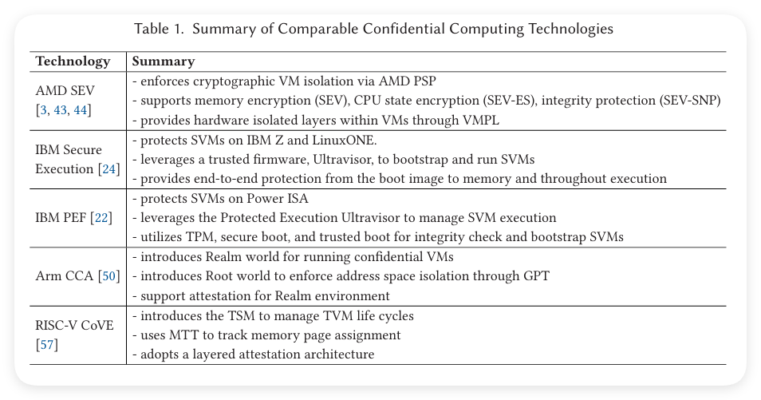

---

**4.1 AMD SEV**

SEV（安全加密虚拟化）是 AMD EPYC 处理器中的一项保密计算功能。它通过在多租户云环境中对虚拟机（VM）内存进行加密来保护敏感数据，防止特权软件或管理员的访问。

SEV 依赖于 AMD 安全内存加密 (SME) 和 AMD 虚拟化 (AMD-V) 技术，通过强制执行 VM 与虚拟机管理程序之间的加密隔离来确保安全。每个 VM 都分配有一个唯一的临时高级加密标准（AES）密钥，用于运行时的内存加密。

内存控制器上的 AES 引擎负责加密或解密写入或读取主存储器的数据。每个 VM 的密钥由 **AMD 平台安全处理器 (PSP) 管理**，该处理器是集成在 AMD 系统芯片 (SoC) 内的 32 位 Arm Cortex-A5 微控制器。物理地址的 C 位（第 47 位）决定了内存页面的加密。

SEV 还提供了远程认证机制，允许 VM 所有者验证 VM 启动测量的可信度及 SEV 平台的可靠性。PSP 生成由 AMD 认证密钥签名的认证报告。VM 所有者可以验证认证报告的真实性及其嵌入的平台/来宾测量信息。

AMD 已经发布了 SEV 的三代版本。第一代 SEV 仅保护 VM 内存的机密性。第二代 SEV-ES（加密状态）增加了在虚拟机管理程序切换期间对 CPU 寄存器状态的保护，而第三代 SEV-SNP（安全嵌套分页）增加了完整性保护，以防止内存篡改、重放和重映射攻击。

特别是，SEV-SNP 使用反向映射表 (RMP) 进行内存完整性保护。RMP 追踪每个页面的所有权和权限，以防止未经授权的访问。SEV-SNP 还通过将来宾地址空间划分为四个级别并在 VM 内部提供额外的安全隔离，来引入**虚拟机权限级别 (VMPL)** 功能。

**4.2 IBM 保密计算**

IBM 对保密计算的早期探索可以追溯到对 SecureBlue++ 的研究，该研究在 Mambo CPU 模拟器上运行了一个模拟的 POWER 处理器。今天，IBM 系统支持两种架构的保密计算：IBM Z 和 LinuxONE 上提供的安全执行 (Secure Execution) 以及 OpenPOWER 系统上发布的受保护执行设施 (PEF)。

**IBM 安全执行 (Secure Execution)**  
IBM 安全执行自 IBM Z15 和 LinuxONE III 以来提供了对在隔离 TEE 中运行的安全虚拟机 (SVM) 的支持。

安全执行保护 SVM 中代码和数据的机密性、完整性和真实性，防止任何未经授权的访问和篡改。安全执行利用被称为 Ultravisor 的可信固件执行安全敏感任务来引导和运行 SVM。Ultravisor 在上下文切换期间保护 SVM 的内存和状态，并防止潜在的恶意虚拟机管理程序的入侵。

**IBM PEF (受保护执行设施)**  
PEF 通过对 IBM Power 指令集架构 (ISA) 的扩展来提供基于 VM 的 TEE。PEF 固件、用于准备 SVM 的工具和操作系统扩展都是作为开源软件发布的。

为了保护敏感数据和代码，PEF 引入了一个受信固件——受保护执行 Ultravisor（Ultravisor），该固件通过 CPU 架构变化来屏蔽 SVM 执行并强制执行安全保障。PEF 依赖于系统的安全和受信启动，并在一个新的、最高特权的 CPU 状态（称为 Secure State）中执行 Ultravisor。

虚拟机管理程序启动 VM，然后调用 Ultravisor 来切换到 SVM。Ultravisor 通过将其移动到受保护的内存来将 VM 转换为 SVM，从而确保这些内存对于不受信任的代码是不可访问的。

**4.3 Arm CCA**

CCA（保密计算架构）是 Armv9 架构中引入的一项技术。传统上，Arm TrustZone 通过将“普通世界”（Normal World）和“安全世界”（Secure World）分隔开来，实现了安全执行。TrustZone 防止普通世界的软件访问安全世界中的数据。

CCA 引入了“领域管理扩展”（Realm Management Extension，RME），通过添加两个新的世界：领域世界（Realm World）和根世界（Root World），进一步扩展了这种分隔。

领域世界（Realm World）为保密虚拟机（Confidential VMs）提供了相互不信任的执行环境，隔离工作负载，使其不受其他安全域（包括主机操作系统、虚拟机管理程序、其他领域和 TrustZone）的干扰。

为了实施地址空间的隔离，CCA 使用了一种扩展的页面表结构——“粒度保护表”（Granule Protection Table，GPT），该结构用于跟踪每个页面的所有权，并将其归属于不同的世界。

根世界（Root World）中的“监控器”（Monitor）负责创建和管理 GPT，防止虚拟机管理程序或操作系统直接更改它。监控器可以通过更新 GPT 动态地在不同世界之间移动物理内存。CCA 还支持对 CCA 平台及其领域的初始状态进行认证，以确保其安全性。

**4.4 RISC-V CoVE**

CoVE（保密虚拟机扩展）是 RISC-V 的一个参考保密计算架构，其受保护的实例被称为 TEE 虚拟机（TVM）。该架构引入了 TEE 安全管理器（TSM）驱动，这是一个 M 模式（RISC-V 中的最高特权级别）固件组件，用于在保密环境和非保密环境之间切换。TSM 驱动通过内存跟踪表（Memory Tracking Table，MTT）跟踪 TVM 的内存页面分配。

TSM 驱动测量并加载 TSM，它是虚拟机管理程序与 TVM 之间的受信中介。CoVE 定义了一个应用程序二进制接口（ABI），供虚拟机管理程序从 TSM 请求虚拟机管理服务。

CoVE 采用分层认证架构，从硬件开始，逐层向上加载、测量并认证 TSM 驱动、TSM 和 TVM。每一层都由上一层加载、测量并签署认证。这种方法提供了一个安全的信任链，可以用于验证系统的完整性。TVM 可以从 TSM 获取一个包含从硬件根源认证的证书，为 TVM 和其所运行的软件的真实性验证提供了机制。

-------------------------------

**5. TDX 的构建模块**

TDX 依赖于一系列现有的 Intel 技术，包括虚拟化技术 (VT)、全内存加密 (TME)/多密钥全内存加密 (MKTME) 和软件保护扩展 (SGX)。

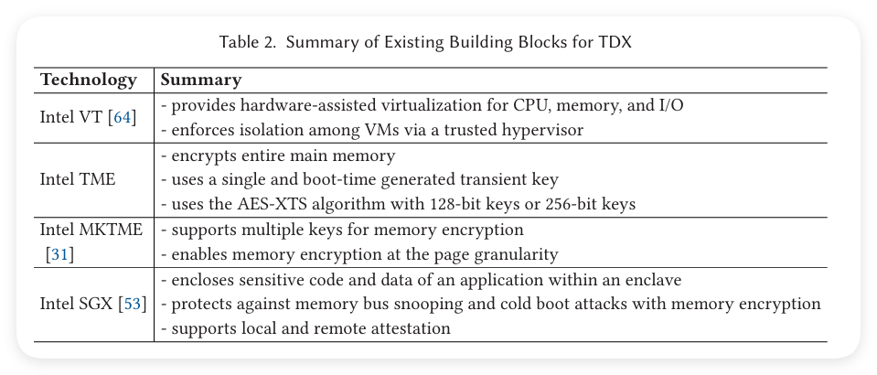

**5.1 Intel VT**

Intel VT（虚拟化技术）是一组由 Intel 处理器提供的**硬件辅助虚拟化**功能。使用 VT，虚拟机监控程序（VMM）或虚拟机管理程序可以获得比基于软件的虚拟化更好的性能、隔离和安全性。Intel 的 VT 产品组合包括 CPU、内存和 I/O 的虚拟化。

支持 VT-x 技术的处理器具有一组称为虚拟机扩展（VMX）的特殊指令集，它可以控制虚拟化功能的实现。支持 VT-x 的处理器可以在两种模式下运行：VMX 根模式和 VMX 非根模式。

虚拟机管理程序运行在 VMX 根模式，而来宾 VM 运行在 VMX 非根模式。VT-x 定义了两种新转换方式：虚拟机进入（VM Entry）和虚拟机退出（VM Exit），用于在来宾和虚拟机管理程序之间切换。

VMX 的切换信息存储在虚拟机控制结构（VMCS）中，用于记录来宾和主机的状态信息，并控制哪些来宾操作可能引发 VM 退出。

Intel VT-x 使用扩展页表（EPT）来实现二级地址转换（SLAT）。每个来宾内核维护其页表以将来宾虚拟地址（GVA）转换为来宾物理地址（GPA）。虚拟机管理程序则管理 EPT，将 GPA 映射到主机物理地址（HPA）。

虚拟机可以使用不同的 I/O 模型，包括基于软件和基于硬件的模型来访问 I/O 设备。基于软件的 I/O 模型包括仿真设备或半虚拟化设备，而基于硬件的 I/O 模型包括直接设备分配、单根 I/O 虚拟化（SR-IOV）设备和可扩展 I/O 虚拟化（S-IOV）设备。

Intel VT 的定向 I/O（VT-d）功能使得能够隔离和限制设备访问的实体，可以包括 I/O 设备分配、DMA 重映射、中断重映射和中断发布。借助 VT-d 的支持，虚拟机可以通过 IOMMU 的虚拟到物理地址翻译，直接访问物理 I/O 内存。VT-d 还提供了灵活的 I/O 设备分配方式，并消除了虚拟机管理程序处理中断和 DMA 传输的需求。总体而言，**VT-d 提升了虚拟化环境中需要直接访问 I/O 设备时的性能和安全性**。

**VT 与 TDX 的关系**  

TDX 是一个基于 VM 的 TEE。它依赖 VT 提供信任域（TD）之间的隔离。在新的威胁模型中，虚拟机管理程序不再被信任，因此管理 TD 的功能被封装在 TDX 模块中。TDX 模块和 TD 运行在新的 SEAM VMX 根/非根模式下，并增加了额外的保护。TDX 仍然依赖 EPT 来管理 GPA 到 HPA 的映射，但**目前为每个 TD 维护两个 EPT**，一个用于私有（加密）内存，另一个用于共享（未加密）内存。

需要注意的是，**目前 TDX 1.0 中不支持嵌套虚拟化**，这意味着在 TD 中运行虚拟机是不可行的。在 TD 中使用 VMX 指令会导致未定义指令（UD）异常。但根据 TD 分区架构规范草案，TDX 1.5 版本将来可能支持嵌套虚拟化。

**5.2 Intel TME/MKTME**

TME 首次在第 11 代 Intel Core vPro 移动处理器中引入。该功能旨在防止攻击者通过物理访问计算机内存窃取数据。

**TME 使用单一的瞬时密钥加密整个计算机的内存**。该密钥通过硬件随机数生成器和系统芯片组中的安全措施在启动时生成。内存加密由每个内存控制器上的加密引擎执行。加密过程使用 NIST 标准的 AES-XTS 算法，密钥长度可以是 128 位或 256 位。

MKTME 是 TME 的扩展，**支持多密钥加密和按页面粒度的内存加密**。对于每个内存事务，MKTME 从物理内存地址中提取**主机密钥标识符（HKID）**，并选择相应的密钥进行内存加密/解密。

HKID 占据物理地址的高位比特，范围由 BIOS 在系统启动时设置。MKTME 允许软件提供的密钥，并引入了一个新的指令 PCONFIG，用于编程与特定 HKID 关联的密钥和加密模式。这些 HKID-密钥对存储在每个 MKTME 加密引擎的密钥加密表（KET）中。**KET 中的密钥永不离开处理器，也不会暴露给软件。**

MKTME 可以在本地和虚拟化环境中使用。在虚拟化环境中，虚拟机管理程序通过将 HKID 附加到 EPT 中的 VM 物理地址来控制不同虚拟机的内存加密。

**MKTME 与 TDX 的关系** 

在虚拟化环境中使用 MKTME 时，虚拟机管理程序必须被信任来控制内存加密，这与保密计算的新威胁模型相冲突。因此，在 TDX 中，**由 TDX 模块负责控制 TD 的内存加密**。HKID 空间被划分为私有 HKID 和共享 HKID。**TDX 模块确保每个 TD 分配一个唯一的私有 HKID**。因此，该 HKID 可以用于表示特定 TD 的身份。私有 HKID 只能用于加密 TD 的私有内存。TDX 模块仍然依赖 MKTME 来保护 TD 的内存。

**5.3 Intel SGX**

Intel 在 2015 年推出了 SGX（软件保护扩展），与第六代 Core 处理器一起发布，旨在防止内存总线监听和冷启动攻击。它允许开发人员将应用程序划分为不同的部分，并保护选定的代码和数据在飞地（enclaves）内。飞地的内存只能被授权代码访问。SGX 使用基于硬件的内存加密来保护飞地的内容。任何未经授权的访问或篡改飞地内存的行为都会触发异常。

SGX 向 Intel 的指令集架构（ISA）中添加了 18 条新指令，并使开发人员能够将计算安全地外包到不可信的主机环境中（包括主机应用程序、主机内核、SMM 和外围设备）。SGX 的安全性最终取决于实现其功能的固件和微代码的安全性。

**飞地页面缓存 (EPC)** 是一个特殊的内存区域，用于存放飞地的代码和数据。每一页都使用内存加密引擎（MEE）加密。飞地页面缓存映射（EPCM）存储页面的元数据，例如配置、权限和页面类型。在启动时，会生成密钥，并用于解密 CPU 内部的加密页面内容。密钥由 MEE 控制，不向外部泄露。因此，**只有特定的 CPU 能够解密内存，CPU 会在内部存储这些密钥，防止任何软件访问它们**。此外，特权软件（非飞地）不允许读取或写入 EPC 或 EPCM 页面。

SGX 提供本地认证和远程认证，用于验证飞地的完整性和真实性。  
- **本地认证**：用于在同一平台上的两个飞地之间建立信任关系。第一个飞地生成一份报告，并使用第二个飞地的身份信息对其进行签名。第二个飞地检索其报告密钥，并使用此密钥验证报告。  
- **远程认证**：用于向平台外的第三方实体验证飞地的可信性。SGX 使用一个特殊的架构飞地，称为引用飞地（Quoting Enclave，QE），由 Intel 开发并签署。QE 接收来自另一个飞地的报告，在本地验证报告，并通过使用认证密钥对其进行签名，将其转换为远程可验证的“引用”（qote）。远程方可以将该 qote 发送到 Intel 认证服务（IAS），IAS 对 qote 进行验证，以确认并评估飞地的可信度。

引用飞地（Quoting Enclave，QE）的角色是**为报告转换为引用**提供一个安全且可信的环境，并**确保引用不能被篡改或伪造**。Intel 还提供了数据中心认证原语（DCAP），这是由多个软件包组成的，数据中心可以利用它们部署自己的 ECDSA 认证基础设施以进行 SGX 飞地认证。

研究人员已经利用 SGX 来提供安全容器（例如，Scone）和为未经修改的应用程序提供屏蔽执行（例如，Haven）。Graphene 是一个基于 SGX 的框架，它提供了在 SGX 飞地内运行未经修改的应用程序及动态库的技术。此外，SGX 还有广泛的应用，包括功能加密系统（如 Iron）、代码划分保护敏感数据和功能（如 Glamdring）、机器学习、安全网络、安全的分布式系统协调（如 SecureKeeper）以及安全的分布式计算等。

同时，识别 SGX 的漏洞也是一个重要的研究方向。研究人员发现了针对 SGX 的各种攻击向量，例如受控通道攻击、缓存攻击、分支预测攻击和推测执行攻击。

**SGX 与 TDX 的关系** 

SGX 和 TDX 在同一平台上保护内存的粒度不同。但在同一平台上，TDX 和 SGX 属于同一可信计算基（TCB），因此它们可以相互进行本地认证。TDX 利用了由 SGX 提供的远程认证机制。TDX 平台的认证报告可以在引用飞地（QE）中验证并签署。

需要注意的是，**目前在 TD 中运行 SGX 飞地是不被允许的**，因为在 TD 中调用 ENCLS / ENCLV 指令会导致未定义指令（UD）异常。

--------------------------

**6. TDX 概述**

在本节中，我们将概述 TDX，讨论其系统架构、内存保护机制、I/O 模型、认证以及未来计划的功能。

**6.1 TDX 系统架构**

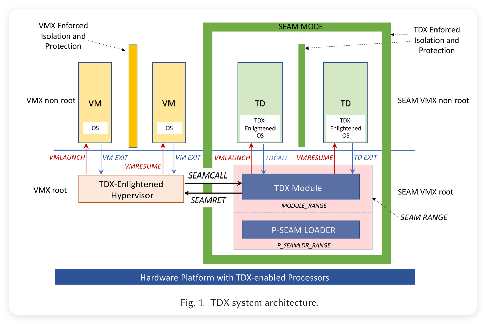

图 1 显示了 TDX 的运行时架构。它由两个关键组件组成：  
1. **TDX 支持的处理器**：提供架构功能，如硬件辅助虚拟化、内存加密/完整性保护，以及认证 TEE 平台的能力。  
2. **TDX 模块**：这是一个由 Intel 签署并由 CPU 认证的软件模块，利用 TDX 支持的处理器的特性来促进信任域（TD）的构建、执行和终止，同时强制执行安全保证。TDX 模块提供两组接口函数，一组用于 TDX 友好的虚拟机管理程序，另一组用于 TD。它加载并执行在 SEAM 范围内，这是由 UEFI/BIOS 保留的系统内存部分。P-SEAM 加载器也驻留在 SEAM 范围内，可以安装和更新 TDX 模块。

安全仲裁模式 (SEAM) 是对 VMX 架构的扩展，提供了两种新的执行模式：SEAM VMX 根模式和 SEAM VMX 非根模式。

一个 TDX 友好的虚拟机管理程序在传统的 VMX 根模式下运行，并使用 SEAMCALL 指令调用 TDX 模块的主机侧接口函数。当 SEAMCALL 指令执行时，逻辑处理器 (LP) 从 VMX 根模式过渡到 SEAM VMX 根模式，并开始执行 TDX 模块中的代码。一旦 TDX 模块完成任务，它通过执行 SEAMRET 指令返回到 VMX 根模式下的虚拟机管理程序。

另一方面，TD（信任域）在 SEAM VMX 非根模式下运行。TDX 支持在 TD 中执行未经修改的用户级应用程序，类似于在标准虚拟机中执行的方式。然而，TD 的来宾操作系统内核（在图 1 中显示为 TDX 友好操作系统）需要进行一些修改，以适应底层 TDX 平台，并符合其架构范式和安全要求。这些修改包括处理新的 TDX 异常（通过来宾虚拟化异常（VE）处理程序）、实现类似于超调用的机制以便 TD 与 TDX 模块通信、为 I/O 操作转换内存页面（从私有到共享），以及集成认证支持。具体实现细节可能因操作系统类型而异。例如，经过增强的来宾 Linux 内核的详细实现已在内核文档中进行了描述。

TD 通过 TD 退出或调用 TDCALL 指令陷入 TDX 模块的上下文中。两种情况下，逻辑处理器 (LP) 都会从 SEAM VMX 非根模式转换到 SEAM VMX 根模式，并开始在 TDX 模块上下文中执行。处理 TDCALL 的来宾侧接口函数以 “TDG” 开头。有关 TDX 上下文切换的详细信息，可以参见第 7.5 节。

保密计算带来的机密性保障使其成为研究侧信道信息泄漏的主要目标。近年来，CPU 推测执行的系列微架构攻击暴露了一个令人担忧的问题：在架构状态中强制执行的安全域隔离可能与微架构状态不一致。随着 TDX 在市场上变得更加普及，它预计将吸引更多安全研究人员的关注。我们主要着重于审查已集成到 TDX 模块中的现有防御措施，以应对已知的攻击向量。详细信息请参见第 7.8 节。

**6.2 TDX 内存保护**

TDX 利用 VMX 强制执行对 TD 的内存隔离。类似于传统虚拟机，TD 无法访问其他安全域的内存，如 SMM、虚拟机管理程序、TDX 模块和其他虚拟机/TD。使用 VMX，虚拟机管理程序维护扩展页表（EPT）来强制实施内存隔离。然而，由于虚拟机管理程序不再被信任，**TDX 已将内存管理任务转移至 TDX 模块，TDX 模块控制 TD 私有内存的地址转换**。

TDX 的安全模型中最引人注目的部分是其防护 TD 内存免受特权软件、损坏的设备和主机上不良管理员的攻击。TDX 通过**访问控制**和**加密隔离**来实现这一点。访问控制防止同一台计算机上的其他安全域访问 TD 的数据。加密隔离则防止恶意 DMA 设备或拥有物理访问权限的对手直接读取或篡改 TD 的私有内存。

**内存分区** 

启用 TDX 后，整个物理内存空间将被分为两部分：普通内存和安全内存。TD 的敏感数据，包括私有内存、虚拟 CPU 状态及其相关的元数据，都应存储在安全内存中。TD 还可以指定一些内存区域作为共享内存进行 I/O 操作，这些共享区域不会通过 TDX 得到保护，因此属于普通内存。

所有不在 SEAM 模式下运行的软件都属于普通内存，不允许访问安全内存，无论其权限级别如何。内存控制器是处理器内的一个架构组件，负责执行内存访问检查。

要将物理页面设为安全内存的一部分，需要启用 TD 所有者位。每个 TD 所有者位与一个内存段相关联，该内存段对应一个缓存行。

TD 所有者位存储在与这些段关联的错误校正码（ECC）内存中。TDX 模块通过将私有 HKID 附加到物理地址来控制物理内存页面转换为安全内存的过程。HKID 编码在物理地址的高位比特中。私有 HKID 只能用于 TD 和 TDX 模块的加密。

写入带有私有 HKID 的物理地址时，内存控制器将 TD 所有者位设置为 1；写入不带私有 HKID 的地址时，将清除 TD 所有者位。访问控制在每个缓存行读取时强制执行。

读取请求通过内存控制器，只有在 SEAM 模式下执行的进程才能读取设置为 1 的缓存行。如果在非 SEAM 模式下读取此类缓存行，请求将会返回全零。

当构建一个 TD 时，（不可信的）虚拟机管理程序会从普通内存中选择内存页面，将它们转换为安全内存。

TDX 模块会逐步将这些页面移动到安全内存中，并将其用于每个 TD 的元数据和主存储器。TD 必须显式接受这些页面后，才可将它们用作其主存储器。TDX 模块通过维护一个物理地址元数据表（PAMT）来执行对安全内存设置的完整性检查，有关 PAMT 的详细信息可以在第 7.7 节中找到。

**内存机密性**  

TDX 利用 MKTME（第 5.2 节）来加密 TD 的私有内存及其元数据。MKTME 负责透明地对通过内存控制器的读写数据进行加密和解密操作。TDX 模块为 MKTME 配置密钥，这些密钥用于在缓存行被写回内存时对其进行加密。密钥与嵌入在物理地址中的 HKID 相关联。**MKTME 解码 HKID，并使用相关的加密密钥来执行加密操作。**

**MKTME 将加密密钥存储在其内部存储器中，从不对外部暴露**。加密密钥只能通过它们的 HKID 来引用。当创建新 TD 时，虚拟机管理程序选择一个未使用的私有 HKID，并由 TDX 模块请求处理器生成与该 HKID 关联的新加密密钥。TDX 模块将这个 <HKID, 密钥> 对绑定到 TD 上。它确保每个 TD 的内存使用不同的加密密钥进行加密。

MKTME 在缓存行被写回主存储器时使用 AES-128 XTS 加密技术进行加密。加密可以防止一些物理攻击，例如冷启动攻击。有关 MKTME 和 HKID 的更多详细信息，请参见第 8.1 节。

**内存完整性** 

TDX 提供了两种不同的机制来确保内存完整性：逻辑完整性 (Li) 和加密完整性 (Ci)。

- **逻辑完整性 (Li)** 通过使用 TD 所有者位来防止未经授权的软件写入。由于 TDX 只允许在 SEAM 模式下使用私有 HKID，**任何来自 SEAM 模式之外的未经授权的写入操作将清除 TD 的私有内存的 TD 所有者位**。当从内存中读取这些被修改的私有内存时，已清除的 TD 所有者位将触发异常。然而，此功能不能防止对手通过内存的比特翻转（例如，通过 Rowhammer 攻击）来修改内存。

- **加密完整性 (Ci)** 是一个更高级的机制，它解决了 Li 的局限性。除了 TD 所有者位之外，Ci 还在缓存行被写回内存时计算一个**消息认证码 (MAC)**。MAC 使用在系统初始化期间生成的 128 位 MAC 密钥进行计算，并作为内存元数据的一部分在写回时存储。当内存被读取时，MAC 会重新计算。如果内存内容被篡改，则重新计算的 MAC 将与存储的元数据不匹配，从而触发完整性检查。然而，无论是 Li 还是 Ci 都无法检测到内存回放攻击（如果对手能够回滚内存内容和元数据）。我们将在第 8.2 节中提供更多有关内存完整性保护的技术细节。

**6.3 TDX I/O 模型**

根据 TDX 的威胁模型，虚拟机管理程序和外围设备被认为是不可信的，不允许直接访问 TD 的私有内存。TD 及其所有者有责任在 I/O 数据离开信任边界之前对其进行保护。这需要通过将 I/O 数据缓冲区封装到共享内存中来完成，共享内存在 GPA 中由共享位标识。虚拟机管理程序或外围设备随后可以将数据进出共享内存。这一模型需要对来宾内核进行修改，以支持该 I/O 模型。此外，传输到 TD 的所有 I/O 数据必须经过仔细检查和验证，因为它们不再被视为可信。

在 Linux 客户端对 TDX 的支持中，所有 MMIO 区域和 DMA 缓冲区都映射为 TD 中的共享内存。Linux 来宾强制使用 SWIOTLB（软件 I/O 转换缓冲区）在统一的位置分配和转换 DMA 缓冲区。为了防止 I/O 输入中的恶意行为，**只允许有限数量的经过强化的驱动程序在 TD 中运行**。

**6.4 TDX 认证**

远程认证是一种验证可信执行环境（TEE）身份和可信度的方法。认证方（attester）可以向质询方（challenger）提供证明，以表明计算正在受保护的环境中执行。质询方通过**检查数字签名和比较测量值**来验证证据。

在支持 TDX 的机器上，认证方在 TD 内运行，负责处理远程认证请求。当收到质询方（如租户）的请求时，认证方通过生成一个 TD 引用（TD Quote）来提供 TD 正确实例化的证据。

这个引用由 TDX 模块生成，并由引用飞地（Quoting Enclave）签名。它包含 TDX 的可信计算基（TCB）和 TD 中加载的软件组件的测量值。引用还包括由 Intel 颁发的证书链作为信任根。

在收到引用后，质询方通过检查引用的真实性来验证其可信性，确保认证方在真实的 TDX 平台上运行，并确认 TD 具有预期的软件测量值。如果引用验证成功，质询方可以继续与认证方建立安全通道，或向认证方释放密钥。我们将在第 9 节中详细讨论远程认证的技术细节。

**6.5 未来功能**

对于保密虚拟机来说，**实时迁移和可信 I/O** 是至关重要的功能，但目前在 TDX 1.0 中尚未得到支持。然而，根据相关文档，Intel 计划在 TDX 1.5 中支持实时迁移，并在 TDX 2.0 中支持可信 I/O。这些计划正在进行中，可能会在未来发生变化。以下我们简要介绍这两个功能的设计。

**实时迁移** 

实时迁移是云服务提供商的一项重要功能，因为它可以让他们在不中断服务的情况下，**将运行中的虚拟机从一台物理主机迁移到另一台物理主机**。这一功能对于硬件升级、软件修补和负载均衡等维护任务至关重要。

然而，由于保密计算的安全要求，迁移 TD 比迁移传统虚拟机更加复杂。由于虚拟机管理程序被视为不可信，因此它不能直接访问和传输源平台上的 TD 的 CPU 状态和私有内存。此外，租户应能够定义和强制执行迁移策略。例如，如果目标平台未满足策略中规定的 TCB 要求，则应取消迁移。

Intel 引入了“服务 TD”（Service TD），以扩展 TDX 模块的信任边界。与将 TDX 模块本身过度复杂化和膨胀化相比，将自定义和专门化的功能添加到服务 TD 中更加方便灵活。服务 TD 可以通过 TDX 模块与常规 TD 绑定，并且可以对其资产具有访问权限。

迁移 TD（MigTD）是专为实时迁移设计的服务 TD。整个实时迁移过程由 TDX 模块和迁移 TD 控制。不可信的虚拟机管理程序（由云服务提供商控制）仅负责通过网络传输已加密的 TD 资产。这些资产包括 TD 的元数据、CPU 状态和私有内存，并通过仅由迁移 TD 和 TDX 模块访问的迁移会话密钥 (MSK) 进行保护。

源平台和目标平台上都运行着迁移 TD（MigTD）。迁移 TD 分别与源 TD（要迁移的 TD）和目标 TD（最初为等待迁移的 TD 模板）绑定。迁移 TD 负责源平台和目标平台之间的远程认证，并根据安全策略评估其 TCB 级别。一旦平台被认为适合迁移，源迁移 TD 和目标迁移 TD 之间就会建立安全通道。源迁移 TD 生成一个 MSK，并通过此安全通道共享给目标迁移 TD。源和目标迁移 TD 分别将 MSK 编程到相应的 TDX 模块中。源 TDX 模块使用 MSK 对 TD 的资产进行加密和导出，而目标 TDX 模块使用相同的密钥进行解密并将资产导入目标 TD。需要注意的是**，源 TD 和目标 TD 分别分配了独立的 HKID，因此它们受到不同 TD 私钥的保护**。

**可信 I/O** 

计算机由各种功能组件组成。然而，保密计算从概念上打破了统一的信任模型。因此，由不同供应商制造的每个组件之间不能再相互信任，这对高效 I/O 造成了严重障碍，因为不可信的设备无法读取和写入 TEE 的私有内存。为了解决这一问题，Intel 提出了 TDX 2.0 中的 **TDX Connect**，旨在将 TD 的信任扩展到外部设备。这需要对设备和 TDX 平台进行更改，以使用兼容的协议来建立相互信任，并启用安全的通信通道。关键原则是，**TD 和设备应能够安全地交换和验证彼此的身份和测量值**。此外，TD 和设备之间的数据路径并不受信任，可能会受到攻击者的拦截。因此，必须建立端到端的安全通道来保护 TD 和设备之间传输的数据。有关 TDX Connect 的详细协议，可以在相关提案中找到。

---

**7. TDX 模块**

本节对 TDX 模块进行了深入分析。我们首先在第 7.1 节讨论其加载过程，接着在第 7.2 节中解释其物理和线性内存布局。随后，我们在第 7.4 节中描述 TDX 模块用于管理 TD 的元数据，并在第 7.5 节中探讨不同安全域之间的上下文切换过程。此外，我们还介绍了 TDX 模块的 Keyhole 结构（第 7.6 节）及其内存管理（第 7.7 节）。

**7.1 加载 TDX 模块**

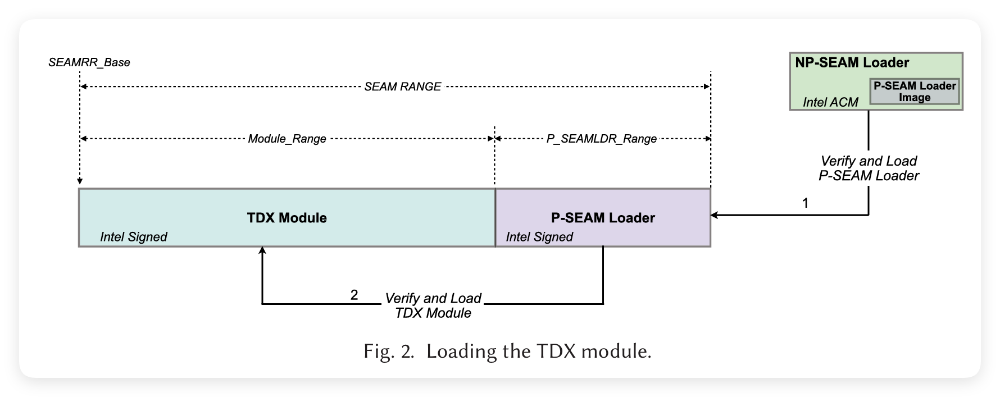

图 2 展示了 TDX 模块的两阶段加载过程。该过程始于加载 Intel 的非持久 SEAM 加载器（NP-SEAM Loader），这是一种 Intel 认证代码模块（ACM）。ACM 是由 Intel 签名的模块，运行在处理器的内部 RAM 中。NP-SEAM Loader 通过 Intel 可信执行技术（TXT）中的 GETSEC[ENTERACCS] 函数进行**身份验证并加载**。NP-SEAM Loader 包含了 Intel 的持久 SEAM（P-SEAM）加载器的镜像，后者会被 NP-SEAM Loader 验证并加载。接着，**P-SEAM 加载器负责安装或更新 TDX 模块**。

需要注意的是，P-SEAM 加载器和 TDX 模块都被加载到 SEAM 范围（SEAM Range）内，这是**由 UEFI/BIOS 保留的一部分系统内存**。范围的基地址和大小通过 IA32_SEAMRR_PHYS_BASE 和 IA32_SEAMRR_PHYS_MASK MSR（模型特定寄存器）来指定。此范围被划分为模块范围（Module_Range）用于 TDX 模块，以及 P_Seamldr_Range 用于 P-SEAM 加载器。**两个模块都在 SEAM VMX 根模式下运行，并使用 SEAMCALL / SEAMRET 来与外部软件交互**。NP-SEAM 加载器、P-SEAM 加载器和 TDX 模块均由 Intel 提供并签名，形成了用于启动 TDX 模块的信任链。

P-SEAM 加载器提供了一个 SEAMCALL 接口函数 seamldr_install 用于加载 TDX 模块。TDX 模块的镜像被预加载到一个内存缓冲区（不在 SEAM 范围内）。缓冲区的物理地址和 seam_sigstruct（TDX 模块的签名）被作为参数传递给 seamldr_install。seam_sigstruct 包含 TDX 模块的哈希值和安全版本号 (SVN)、每个逻辑处理器的堆栈页面数量、每个逻辑处理器的数据页面数量，以及全局数据页面的数量。seamldr_install 使用这些数字来确定 TDX 模块的各个内存区域的物理/线性地址和大小。

seamldr_install 必须在所有逻辑处理器上顺序调用。当它在第一个逻辑处理器上调用时，安装会话启动。在每个逻辑处理器上，seamldr_install 检查当前逻辑处理器是否已经处于另一个逻辑处理器启动的安装会话中，并清除逻辑处理器的 VMCS 缓存。当 seamldr_install 在最后一个逻辑处理器上被调用时，它执行以下操作：

1. 检查 seamldr_install 的参数，
2. 验证 TDX 模块的签名，
3. 检查即将加载的镜像的 SVN，并与已存在的 TDX 模块进行比较，
4. 确定 SEAM 范围内的 TDX 模块各个内存区域的物理和线性地址及大小：代码区、数据区、堆栈区、页表、Sysinfo_Table、Keyhole 和 Keyhole-Edit（第 7.2 节），
5. 映射这些区域的物理地址到其线性地址（第 7.2 节），
6. 将 TDX 模块的二进制镜像加载到 SEAM 范围内，测量镜像，并计算和验证 TDX 模块的哈希值，
7. 设置 TDX 模块的 Sysinfo_Table，
8. 在每个逻辑处理器上设置 SEAM 传输 VMCS（第 7.5 节），
9. 将 TDX 模块的哈希值、SVN 记录到 P-SEAM 加载器的数据区。

除了用于安装 TDX 模块的 SEAMCALL，P-SEAM 加载器还提供了其他接口函数，用于关闭自身以及检索加载器的系统信息。

**7.2 TDX 模块的内存布局**

这里我们分别讨论 TDX 模块的物理和线性内存布局。

**物理内存布局** 

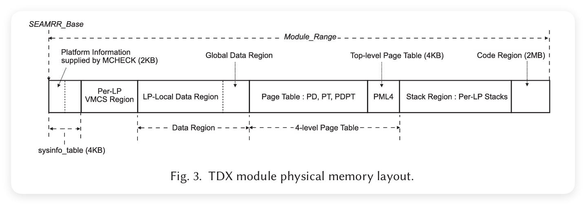

图 3 显示了 TDX 模块在 Module_Range 中的物理内存布局。布局以一个 4 KB 页面开始，该页面包含 TDX 模块的 Sysinfo_Table。Sysinfo_Table 由 NP-SEAM Loader 填充的 2 KB 平台信息和由 P-SEAM Loader 填充的 2 KB 模块信息组成，包括 SEAM 范围的基地址和大小、各个内存区域的线性地址基址、逻辑处理器数量以及私有 HKID 的范围。在 Sysinfo_Table 之后，是每个逻辑处理器的 VMCS 区域。每个逻辑处理器都有一个 4 KB 的 SEAM 传输 VMCS（参见第 7.5 节）。

> VMCS（**Virtual Machine Control Structure**，虚拟机控制结构）是 Intel 虚拟化技术（Intel VT-x）中的一个关键数据结构。
>
> VMCS 使得处理器能够高效地在虚拟机（VM）和虚拟机监控器（VMM，通常是 hypervisor）之间切换。

在每个逻辑处理器的 VMCS 区域之后，是数据区，数据区被划分为每个逻辑处理器的数据区和全局数据区。接着是 TDX 模块的 4 级页表，之后是每个逻辑处理器的堆栈区域，最后是 TDX 模块的可执行代码区。

**线性内存布局** 

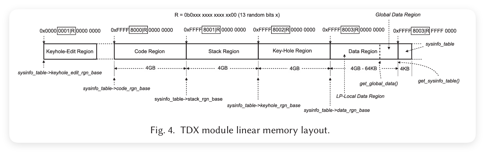

TDX 模块有其自身的线性地址空间，并维护一个页表来进行地址转换。图 4 展示了 TDX 模块的线性地址空间布局，该布局由 P-SEAM 加载器通过构建 TDX 模块的页表来建立。为了防止内存篡改攻击，P-SEAM 加载器将线性地址的第 34 到 46 位进行随机化，这些位在图中以方框表示。所有区域的线性地址和大小都记录在 Sysinfo_Table 的字段中。对于代码、堆栈、数据和 Sysinfo_Table 的页面表项（PTE）可以提前静态填充，无需在运行时更改页面表。然而，Keyhole 区域用于在 TDX 模块执行期间动态映射外部软件传递的数据。这就需要在 Keyhole 区域之外添加 Keyhole-Edit 区域，以允许在运行时编辑 Keyhole 的映射 PTE。Keyhole 和 Keyhole-Edit 区域的详细讨论可以在第 7.6 节找到。

**7.3 TDX 模块的初始化与配置**

在 TDX 模块加载完成后，主机内核负责初始化和配置 TDX 模块。主机内核通过 SEAMCALL[TDH.SYS.INIT] 来全局初始化 TDX 模块。然后，主机内核在每个逻辑处理器上调用 SEAMCALL[TDH.SYS.LP.INIT]，以检查和初始化每个逻辑处理器的参数，如 Keyhole、数据区和堆栈区（第 7.2 节）。接下来，主机内核分配一个全局私有 HKID，并通过 SEAMCALL[TDH.SYS.CONFIG] 将其传递给 TDX 模块，同时初始化信任域内存区域（TDMR）（第 7.7 节）。每个处理器包上的 SEAMCALL[TDH.SYS.KEY.CONFIG] 会生成一个 TDX 全局私钥，并将该密钥与这个 HKID 绑定。此密钥用于加密 PAMT 和每个 TD 的信任域根（TDR）所占据的内存。最后，主机内核多次调用 SEAMCALL[TDH.SYS.TDMR.INIT]，以逐步初始化每个 TDMR 的 PAMT（第 7.7 节）。

**7.4 信任域的元数据**

TDX 模块负责管理整个 TD 的生命周期。因此，它需要为每个 TD 实例维护元数据。TDX 模块确保对元数据应用内存加密，以防止虚拟机管理程序访问或篡改。

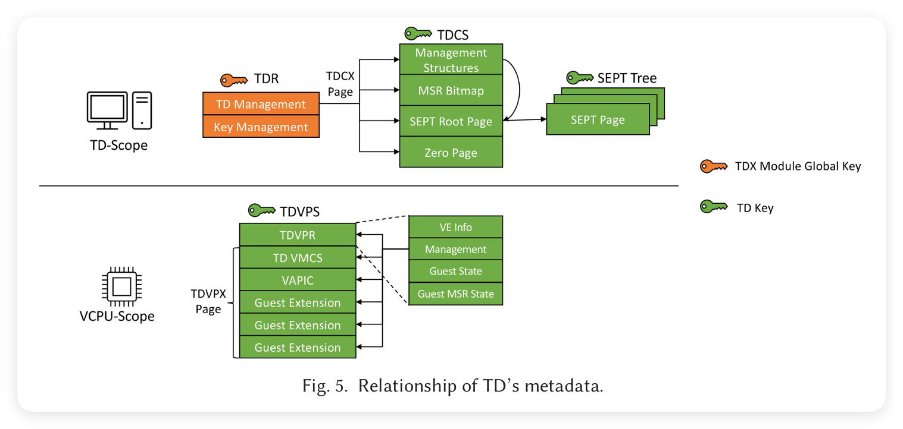

每个 TD 的元数据由以下控制结构组成：信任域根（TDR）、信任域控制结构（TDCS）、信任域虚拟处理器状态（TDVPS）和安全扩展页表（SEPT）。图 5 展示了这些控制结构之间的关系。

- **信任域根 (TDR)**：TDR 是在 TD 创建时生成的初始结构，并在 TD 终止时销毁。在 TD 的整个生命周期中，SEAMCALLs 使用相应 TDR 的物理地址来引用 TD。TDR 包含内存加密的关键信息，以及指向 TDCX 页（用于存储 TDCS 的物理内存页）的引用。由于 TDR 在 TD 私钥生成之前创建，因此它通过 TDX 模块的全局私钥来保护。随后的元数据（TDCS、TDVPS 和 SEPT）及 TD 的内存页面可以通过 PAMT 中的所有者属性与 TDR 关联（第 7.7 节）。

- **信任域控制结构 (TDCS)**：TDCS 是一个控制结构，用于在 TD 范围内管理操作并存储状态。它由四个连续的 TDCX 内存页组成，每个页分配给特定用途，如 TD 的管理结构、MSR 位图、SEPT 根页面和一个特殊的零页。TDCS 通过 TD 私钥加密。

- **信任域虚拟处理器状态 (TDVPS)**：TDVPS 是每个 TD 虚拟 CPU 的控制结构。它由六个内存页组成，起始页为 TDVPR 页面，包含对多个 TDVPX 页的引用。第一个 TDVPR 页面存储 VE 信息、虚拟 CPU 管理、来宾状态和来宾 MSR 状态字段。第二个页面是 TD 传输 VMCS（第 7.5 节），控制 TD 的进入和退出。第三个页面是虚拟 APIC 页面，其后是三个存储来宾扩展信息的页面。与 TDCS 一样，TDVPS 也受 TD 私钥的保护。

- **安全扩展页表 (SEPT)**：对于传统的虚拟机，虚拟机管理程序通过 EPT 管理从 GPA 到 HPA 的地址转换。然而，在 TDX 中，来宾地址转换必须受到不可信虚拟机管理程序的保护。为此，TDX 具有两种类型的 EPT：SEPT 和共享 EPT。SEPT 用于 TD 的私有内存地址的转换，并受 TD 私钥保护。SEPT 和 SEPT 根页面的引用存储在 TDCS 中。另一方面，共享 EPT 用于转换由 TD 明确与虚拟机管理程序共享的内存地址（例如用于虚拟化 I/O 的情况），并由虚拟机管理程序控制。TD 的来宾内核可以通过在 GPA 中设置共享位来决定哪些内存页面要共享。共享内存页面不会通过 TD 私钥进行加密。

**7.5 TDX 上下文切换**

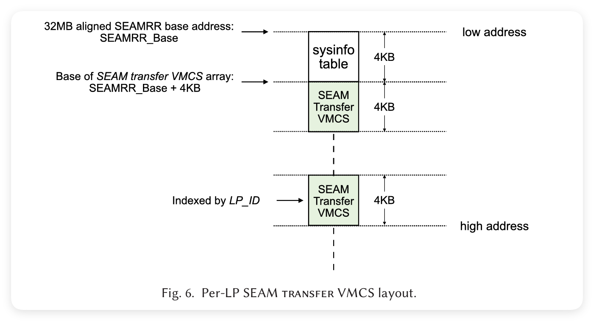

TDX 的设计必须确保在不同安全域之间进行上下文切换时保持数据的机密性和完整性。上下文切换包括来宾 TD 与 TDX 模块之间的切换，以及不同 TD 之间的切换。在切换过程中，TDX 必须防止跨域信息泄漏，并在离开一个域时清除敏感数据。

TD 的上下文由信任域虚拟处理器状态（TDVPS）保存。TDVPS 由几个内存页组成，每个内存页存储来宾虚拟 CPU 的不同部分状态，如 VE 信息、管理字段和扩展状态。TDVPS 通过 TD 私钥加密，以防止未经授权的访问。

在上下文切换期间，逻辑处理器（LP）会从 SEAM VMX 非根模式切换到 SEAM VMX 根模式，并在 SEAM 传输 VMCS 中保存来宾 TD 的状态。SEAM 传输 VMCS 是一个特殊的 VMCS，它驻留在 SEAM 范围内，并通过 TD 私钥加密。每个逻辑处理器都与其专属的 SEAM 传输 VMCS 关联。当 SEAMCALL 指令被执行时，LP 从 SEAM VMX 非根模式切换到 SEAM VMX 根模式，并开始在 TDX 模块上下文中执行。随后，SEAMCALL 执行 SEAMRET 指令，将 LP 切换回 SEAM VMX 非根模式。

**7.6 Keyhole 结构**

由于 TDX 模块不允许直接访问 TD 的私有内存，因此需要一个特殊的机制来对外部软件传递的数据进行加密和解密。Keyhole 区域用于**动态映射外部软件传递的数据，并将其转换为安全内存**。Keyhole 结构包括两个部分：Keyhole 和 Keyhole-Edit。Keyhole 是 TDX 模块的线性地址空间中的一个区域，用于映射外部内存数据，而 Keyhole-Edit 是一个附加区域，用于在运行时编辑 Keyhole 的映射页面表项（PTE）。

**Keyhole 机制**  

外部软件可以通过调用 SEAMCALL 来将数据传递到 TDX 模块。数据被传递到 Keyhole 区域中，并使用 PTE 将其映射到 SEAM 范围内的线性地址。Keyhole-Edit 用于管理和更新这些映射。TDX 模块通过 Keyhole 接收数据并将其加密后存储到安全内存中。在处理完成后，Keyhole 区域会被清除，以防止敏感数据泄漏。

**7.7 TDMR 和 PAMT 管理**

TDX 模块使用信任域内存区域（TDMR）来管理整个 TD 的物理内存。每个 TDMR 由多个物理内存页面组成，这些页面由 TDX 模块负责保护和管理。TDMR 的所有内存页面都受到内存加密保护，只有 SEAM 模式下的代码可以访问这些页面。

**物理地址元数据表（PAMT）存储了每个 TDMR 的页面元数据**。PAMT 包含每个物理页面的所有者、权限和状态信息。每个 TDMR 由多个 PAMT 页面组成，PAMT 通过 TD 私钥加密，防止未经授权的访问和篡改。PAMT 中的每个条目都对应一个物理内存页面，记录页面的状态、所有者信息和加密密钥。**TDX 模块利用 PAMT 来验证每个物理内存页面的合法性和完整性**，确保只有经过授权的页面才能作为安全内存使用。

**7.8 侧信道防护**

TDX 通过多种机制来抵御已知的侧信道攻击，例如时序攻击、缓存攻击和推测执行攻击。以下是 TDX 中的一些关键防护措施：

1. **TLB 刷新和隔离**：在 TD 和非 TD 上下文之间切换时，TDX 模块会刷新翻译后备缓冲区（TLB），防止恶意软件利用 TLB 中的残留信息。
2. **缓存刷新**：在上下文切换过程中，TDX 模块会刷新处理器的缓存，防止缓存攻击。
3. **控制流保护**：TDX 依赖于 Intel 的控制流强制技术（CET）来保护控制流的完整性，防止恶意的控制流劫持。

TDX 模块还采用了其他微架构隔离技术，如分支预测缓冲区隔离和强化的内存随机化，以减少侧信道攻击的风险。对于推测执行漏洞（如 Meltdown 和 Spectre），TDX 依赖于底层处理器的硬件修复措施。

**8. 内存管理的深入分析**

在本节中，我们将深入探讨 TDX 中的内存管理技术，包括 HKID 分配、加密密钥管理、内存完整性保护和内存加密的详细实现。

**8.1 HKID 分配和密钥管理**

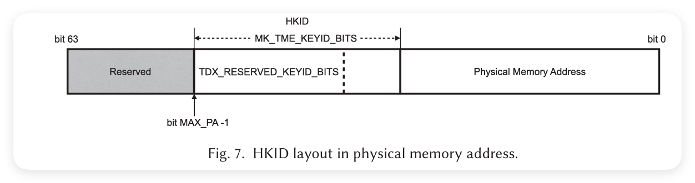

TDX 模块利用多密钥内存加密技术 (MKTME) 来保护 TD 的私有内存。每个 TD 都被分配一个唯一的主机密钥标识符 (HKID)，与之关联的加密密钥用于保护 TD 的内存数据。HKID 是物理地址的高位比特，用来标识特定的加密密钥。

在系统初始化过程中，TDX 模块通过调用**处理器的内置密钥管理功能**来生成密钥。**MKTME 提供的密钥引擎负责生成并管理这些密钥**，并将其与对应的 HKID 关联。处理器通过**内存控制器上的加密引擎来执行加密和解密操作**，密钥永不离开处理器。每个 HKID 代表一个特定的加密密钥，因此多个 TD 之间的加密隔离通过唯一的 HKID 实现。

**8.2 内存完整性保护**

TDX 提供两种内存完整性保护机制：逻辑完整性 (Li) 和加密完整性 (Ci)。Li 通过使用内存的 TD 所有者位来防止未经授权的软件写入。Ci 则通过在写入内存时生成消息认证码 (MAC) 来防止数据篡改。

当一个 TD 被创建时，TDX 模块会为每个物理页面设置所有者信息，并使用 PAMT 来管理这些元数据。PAMT 存储每个物理页面的状态信息，如页面的所有者、加密状态和权限。TDX 模块会根据 PAMT 中的所有者信息和 TD 所有者位来验证对页面的访问。

在进行内存操作时，如果检测到任何不符合权限或所有者属性的访问尝试，内存控制器会触发完整性检查异常。对于 TD 的私有内存，所有读写操作都会经过内存加密引擎的处理，防止未经授权的数据篡改或信息泄漏。

**8.3 内存加密的实现**

TDX 依赖 MKTME 提供的内存加密功能来保护 TD 的私有内存。**每个物理页面的 HKID 被嵌入到其物理地址中**，当处理器将数据写入内存时，MKTME 加密引擎会根据 HKID 来选择相应的加密密钥。**MKTME 使用 AES-128 XTS 算法**来对缓存行进行加密和解密。

HKID 是 MKTME 内存控制器的一部分，由处理器的内存控制器负责解码。处理器为每个 TD 分配一个唯一的私有 HKID，并使用该 HKID 对 TD 的私有内存进行加密。由于每个 TD 都使用不同的加密密钥，因此即使在物理上共享相同的内存区域，也不会出现跨域数据泄露的情况。

**8.4 内存随机化和隔离**

TDX 模块还使用内存地址随机化技术来增强内存隔离。通过在初始化时随机化线性地址的高位，TDX 减少了恶意软件预测和访问 TD 内存的风险。每个 TD 的内存区域在创建时都会进行随机化映射，防止恶意软件利用固定的内存地址进行攻击。

TDX 模块进一步通过刷新缓存和 TLB 来确保内存隔离。每当在 SEAM 模式和非 SEAM 模式之间切换时，TDX 模块都会执行缓存和 TLB 刷新，以防止恶意软件利用缓存中的残留数据。

**9. 远程认证**

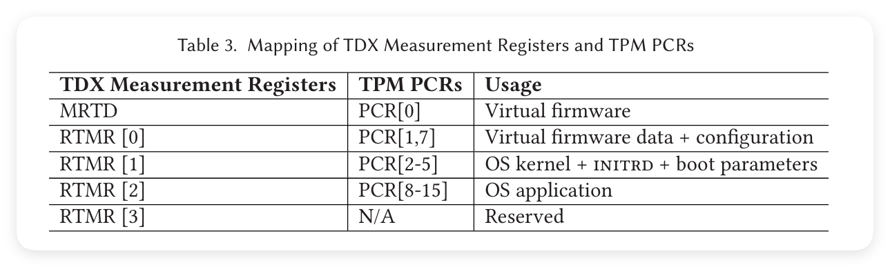

远程认证是 TDX 的一个关键功能，允许外部质询方验证 TDX 平台和 TD 的可信性。远程认证依赖于 SGX 架构中的引用飞地 (QE) 来生成认证引用 (Quote)。以下是远程认证的详细过程。

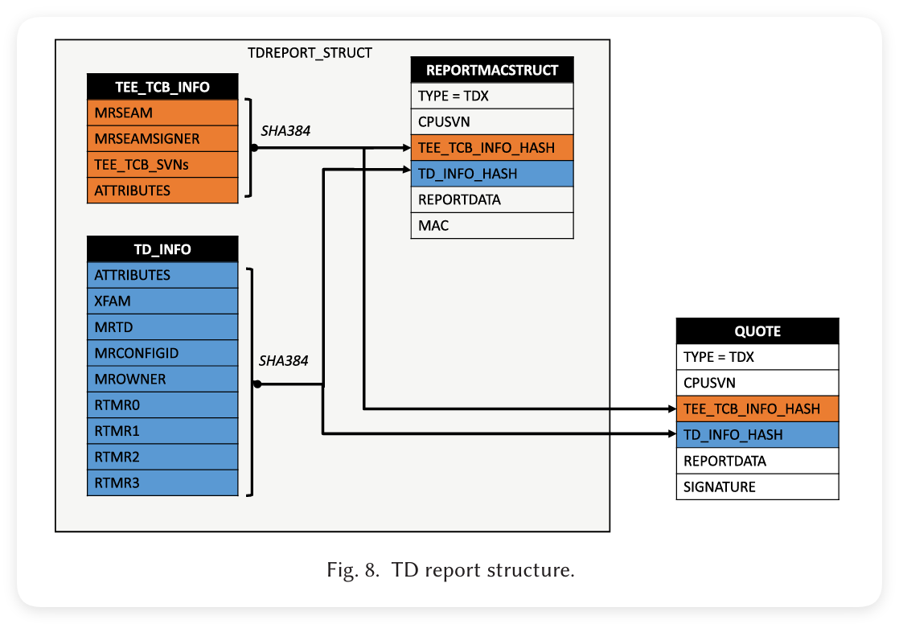

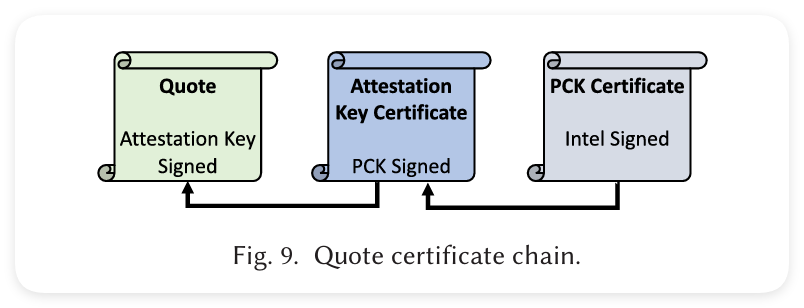

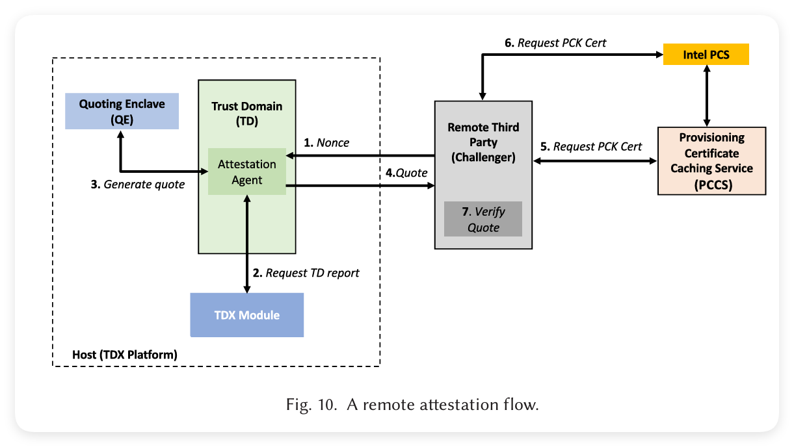

1. **平台认证**：TDX 模块首先与 QE 进行本地认证。**QE 验证 TDX 模块的哈希值和签名，以确认其在合法的 TDX 模块上运行**。认证成功后，**TDX 模块生成一份包含 TD 测量值的报告，并发送给 QE**。

2. **生成引用 (Quote)**：QE 收到报告后，使用认证密钥对其进行签名，生成一个包含 TDX 平台和 TD 的认证引用。引用包括 TD 的测量值、TCB 级别和平台的可信状态。

3. **质询方验证**：远程质询方接收到引用后，**通过检查引用中的数字签名和测量值来验证 TD 的可信性**。质询方还可以通过与 Intel 提供的参考数据进行对比，来确认平台的 TCB 状态。

4. **建立安全通道**：一旦认证成功，**质询方可以与 TD 进行安全通信**。质询方可以选择向 TD 发送敏感数据或授权密钥，以便 TD 内的应用程序继续执行任务。

--------------------

**10. 实验评估**

为了评估 TDX 的性能和安全性，我们设计了一系列实验，涉及以下几个方面：TDX 的创建和销毁开销、TD 执行开销、内存保护性能、上下文切换开销以及认证过程的性能。我们使用支持 TDX 的 Intel 第四代 Xeon 处理器来进行实验。

**10.1 TDX 创建和销毁开销**

我们测量了创建和销毁 TD 的开销，这包括初始化 SEAM 模式、加载和配置 TDX 模块、为 TD 分配内存以及执行 TDX 的安全检查。实验表明，创建一个 TD 的时间主要取决于所分配的内存大小和 TDX 模块的配置复杂度。销毁 TD 的开销相对较小，因为它只需释放已分配的资源并清除元数据。

在实验中，我们观察到，创建一个包含 2 GB 内存的 TD 大约需要 200 毫秒，而销毁同样大小的 TD 则仅需 20 毫秒。这些开销在大规模云环境中是可以接受的，因为 TD 的生命周期通常较长，并且这些操作不会频繁发生。

**10.2 TD 执行开销**

我们还评估了 TD 执行开销，即 TD 运行常规应用程序时的性能影响。我们选用了多种基准测试，包括计算密集型任务、内存密集型任务和 I/O 密集型任务。我们将这些任务分别在传统虚拟机和 TD 中运行，并比较其性能。

实验结果表明，在计算密集型任务中，TD 的性能几乎与传统虚拟机相同，性能开销在 2% 以内。这是因为 TDX 对 CPU 执行路径的影响非常小。然而，对于内存密集型任务，TD 的性能开销略有增加，约为 5%。这是由于 TDX 的内存加密和完整性检查引入了一定的开销。对于 I/O 密集型任务，由于 TD 需要将 I/O 缓冲区映射为共享内存，额外的内存映射操作带来了约 7% 的性能开销。

**10.3 内存保护性能**

我们测量了 TDX 内存保护的性能影响，包括内存加密和完整性检查的开销。实验表明，MKTME 引入的加密开销对于大多数内存操作来说是微乎其微的。我们在内存密集型基准测试中观察到，内存加密带来的性能影响约为 2%，主要源于 AES-128 XTS 加密算法的硬件实现。

加密完整性检查（Ci）则引入了更高的开销。实验表明，对于频繁的内存写入操作，Ci 的开销约为 5% 至 8%。然而，这种开销可以通过调整应用程序的内存访问模式来缓解。

**10.4 上下文切换开销**

上下文切换是虚拟化环境中的常见操作，因此我们对不同安全域之间的上下文切换开销进行了评估。实验结果显示，从 TD 切换到 TDX 模块或从 TD 切换到其他 TD 所引起的上下文切换开销约为 30 微秒。TDX 模块必须在每次上下文切换时清除缓存和 TLB，并刷新 SEAM 范围内的状态，以防止跨域信息泄漏。

相比之下，传统虚拟机之间的上下文切换开销通常在 10 微秒左右。TDX 上下文切换的额外开销主要源于增加的安全隔离和数据保护措施。

**10.5 认证性能**

我们还对 TDX 认证过程的性能进行了评估。实验显示，生成和验证 TD 引用的时间分别约为 15 毫秒和 5 毫秒。这个开销与 SGX 认证过程的开销相当。认证过程的性能主要取决于处理器的认证密钥生成和引用飞地（QE）的签名操作。

**11. 总结**

Intel TDX 是一个为虚拟化环境设计的保密计算技术，它提供了加密隔离、内存保护和远程认证等安全功能。通过引入 TDX，云服务提供商可以将特权软件和管理员从可信计算基（TCB）中排除，从而减少潜在的攻击面。本文采用自上而下的方法，对 TDX 的体系结构、内存保护机制、I/O 模型和认证过程进行了详细分析，并与其他保密计算技术进行了比较。

我们的实验评估表明，TDX 在提供高级安全保护的同时，仅引入了较小的性能开销。未来，随着 TDX 实现实时迁移和可信 I/O 等功能，它在云计算和安全数据托管中的应用前景将更加广阔。
