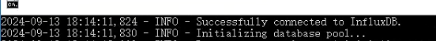

# influxdb连接问题

最近之前实习的嵌入式公司修改了他们产品原有的数据库结构，从mysql转移到了influxdb，在接触influxdb的过程中也遇到了一些问题，现在汇总如下：

### token401问题

#### 登录401

一开始拿到公司的token测试连接

```ini
[InfluxDB]
Token = ***
ServerUrl = http://localhost:8086
Bucket = ***
```



发现可以正常连接，这意味着token本身没有问题，但是想要执行查询时，会报错401

```shell
2024-09-13 18:14:47,261 - ERROR - Error querying InfluxDB: (401)
Reason: Unauthorized
HTTP response headers: HTTPHeaderDict({'Content-Type': 'application/json; charset=utf-8', 'X-Influxdb-Build': 'OSS', 'X-Influxdb-Version': 'v2.7.8', 'X-Platform-Error-Code': 'unauthorized', 'Date': 'Fri, 13 Sep 2024 09:44:47 GMT', 'Content-Length': '55'})
HTTP response body: b'{"code":"unauthorized","message":"unauthorized access"}'
```

上网搜索发现许多人遇到过这个问题，最终在一个评论区找到思路


于是把ini文件改为

```ini
[InfluxDB]
Username = ***
Password = ***
Org = ***
ServerUrl = http://localhost:8086
Bucket = ***
```

发现可以正常读取了

#### 过期401

后面在公司测试时又发现了401问题，还是同样的报错，重启程序发现又可以查询了，猜测可能是连接有时间限制

于是修改建立连接的方式，改为每次要查询前建立连接，问题得到解决

```python
# 动态建立 InfluxDB 连接的函数
def get_influxdb_client():
    try:
        client = InfluxDBClient(url=influxdb_url, username=influxdb_username, password=influxdb_password, org=influxdb_org)
        logger.info("Successfully connected to InfluxDB.")
        return client
    except Exception as e:
        logger.error(f"Failed to connect to InfluxDB: {str(e)}")
        return None
```

### 数据读取问题

原本的数据库为mysql，查询语句如下

```python
def fetch_device_events(cursor, f_device_id, start_date, end_date):
    """
    获取设备事件数据
    """
    query = f"""
    SELECT
        f_dtc_index, f_notify, f_create_time, f_report_time, f_channel, f_desc
    FROM
        t_mqtt_event 
    WHERE
        f_device_id = '{f_device_id}' AND f_report_time BETWEEN '{start_date}' AND '{end_date}'
    ORDER BY f_id DESC
"""

    cursor.execute(query)
    return cursor.fetchall()
```

现在要修改为influxdb的查询语句，influxdb有自己的查询语法，这里的难点在于理解influxdb的数据是如何存取的。

我个人的理解为，这里的field是一列，每个field是一个表，这里的查询返回的是所有field的行，但是每行只有一个field以及对应的值。

这样会产生一个问题，就是我们要合并数据。原有的mysql查询语句是每行有多列的内容，这里我们要根据时间戳去合并所有field来达到同样的效果

```python
def fetch_device_events(influxdb_client, f_device_id, start_date, end_date):
    """
    从 InfluxDB 获取设备事件数据并以元组形式输出
    """
    # 定义中国时区
    cst_tz = pytz.timezone('Asia/Shanghai')

    # 确保传入的 start_date 和 end_date 是 datetime 对象
    if isinstance(start_date, str):
        start_date = datetime.fromisoformat(start_date)
    if isinstance(end_date, str):
        end_date = datetime.fromisoformat(end_date)

    # 将时间从中国时区转换为 UTC
    start_date = cst_tz.localize(start_date).astimezone(pytz.utc)
    end_date = cst_tz.localize(end_date).astimezone(pytz.utc)

    # 将 datetime 转换为符合 RFC 3339 格式的字符串 (UTC 时间)
    start_date_rfc3339 = start_date.strftime("%Y-%m-%dT%H:%M:%SZ")
    end_date_rfc3339 = end_date.strftime("%Y-%m-%dT%H:%M:%SZ")

    query = f'''
    from(bucket: "***")
      |> range(start: {start_date_rfc3339}, stop: {end_date_rfc3339})
      |> filter(fn: (r) => r["guid"] == "{f_device_id}")
      |> filter(fn: (r) => r._measurement == "device_history")
      |> filter(fn: (r) => r["_field"] == "fqIndex" or 
                           r["_field"] == "code" or 
                           r["_field"] == "reportTime" or 
                           r["_field"] == "channel" or 
                           r["_field"] == "desc")
      |> sort(columns: ["_time"], desc: true)
    '''
    
    try:
        result = influxdb_client.query_api().query(query, org="shike")
        events = {}
        for table in result:
            for record in table.records:
                # 获取当前记录的时间戳
                timestamp = record.get_time()

                # 如果当前时间戳还没有对应的事件，创建一个新的事件
                if timestamp not in events:
                    events[timestamp] = {
                        "fqIndex": None,
                        "code": None,
                        "reportTime": None,
                        "channel": None,
                        "desc": None,
                        "f_create_time": timestamp  # 入库时间
                    }

                # 根据 _field 来提取 _value 的值
                field_name = record.get_field()
                field_value = record.get_value()

                # 更新事件的相应字段
                if field_name == "fqIndex":
                    events[timestamp]["fqIndex"] = field_value
                elif field_name == "code":
                    events[timestamp]["code"] = field_value
                elif field_name == "reportTime":
                    events[timestamp]["reportTime"] = field_value
                elif field_name == "channel":
                    events[timestamp]["channel"] = field_value
                elif field_name == "desc":
                    events[timestamp]["desc"] = field_value

        # 将事件转换为所需的元组格式
        event_list = []
        for timestamp, event in events.items():
            event_list.append((
                event["fqIndex"],  # f_dtc_index
                event["code"],  # f_notify
                event["f_create_time"],  # f_create_time (入库时间)
                datetime.fromtimestamp(event["reportTime"] / 1000) if event["reportTime"] else None,  # f_report_time (上报时间)
                event["channel"],  # f_channel
                event["desc"]  # f_desc
            ))

        return event_list
    except Exception as e:
        logger.error(f"Error querying InfluxDB: {e}")
        return []
```

### 其他问题

上面的代码衍生出了一个问题就是influxdb的时间戳时区设置，听公司的前辈说时间戳要设为UTC，否则会出现一些很多问题，于是在查询语句前新增了时区转换。

此外influxdb不支持int索引。


