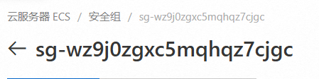

## 阿里云服务器

### 配置安全组



#### 安装Docker

1. 运行以下命令，添加docker-ce的dnf源。

   ```shell
   sudo dnf config-manager --add-repo=https://mirrors.aliyun.com/docker-ce/linux/centos/docker-ce.repo
   ```

2. 运行以下命令，安装Alibaba Cloud Linux 3专用的dnf源兼容插件。

   ```shell
   sudo dnf -y install dnf-plugin-releasever-adapter --repo alinux3-plus
   ```

3. 运行以下命令，安装Docker。

   ```shell
   sudo dnf -y install docker-ce --nobest
   ```

4. 启动与设置docker

   ```shell
   sudo systemctl start docker     #运行Docker守护进程
   sudo systemctl stop docker      #停止Docker守护进程
   sudo systemctl restart docker   #重启Docker守护进程
   sudo systemctl enable docker    #设置Docker开机自启动
   sudo systemctl status docker    #查看Docker的运行状态
   ```

5. **换源**并重启docker

   注册一个阿里云账号，拿到阿里云的加速地址

   使用以下指令打开docker的配置文件

   ```bash
   sudo gedit  /etc/docker/daemon.json
   ```

   在编辑器中添加以下内容，并保存

   ```json
   {
       "registry-mirrors": [
           "https://8endfxhv.mirror.aliyuncs.com"
       ]
   }
   ```

   重启docker，注意由于走的是守护程序daemon，所以daemon进程也需要重启

   ```bash
   sudo systemctl daemon-reload		#重启daemon进程
   sudo systemctl restart docker		#重启docker
   ```

   使用以下指令查看输出

   ```
   docker info
   ```

#### 安装**docker-compose**

1. 安装 `pip`

```shell
sudo yum install -y python3-pip
```

2. 运行以下命令，安装setuptools。

```shell
sudo pip3 install -U pip setuptools
```

3. 运行以下命令，安装docker-compose。

```shell
sudo pip3 install docker-compose
```

4. 运行以下命令，验证docker-compose是否安装成功。 

```shell
docker-compose --version
```

#### 部署

```
docker-compose build
docker-compose up
docker-compose ps
docker-compose logs
docker-compose down
```
